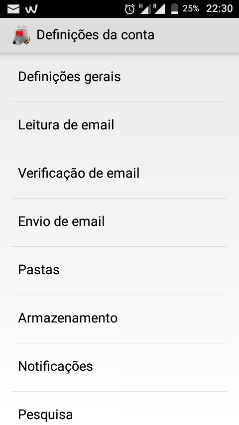
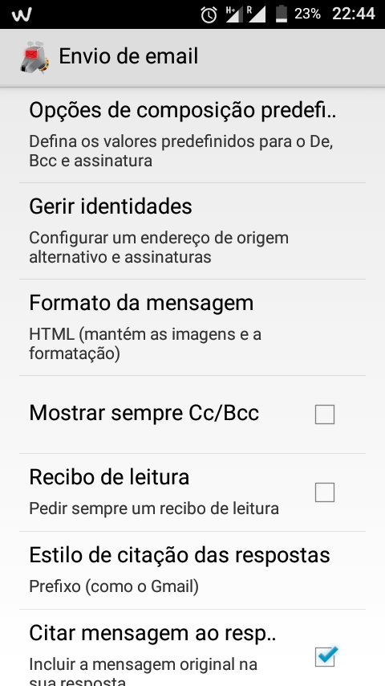
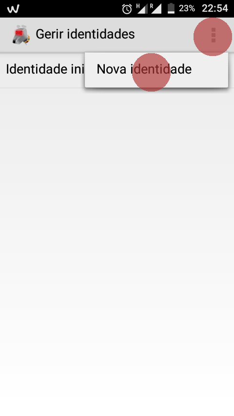
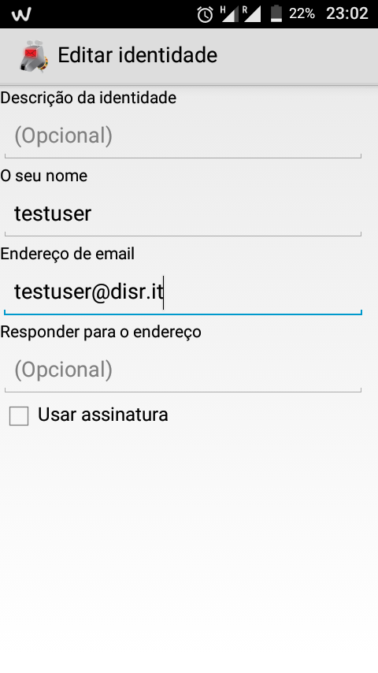
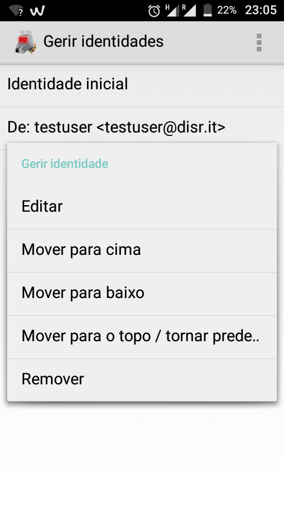

## Configuração
Primeiro, abra a aplicação K-9 e vá a **"Definições"** e depois **"Definições da conta"**

Quando estiver nas definições da conta, vá a **"Envio de email"** e carregue em **"Gerir Identidades"**.

Selecione **"Nova Identidade"** carregando no botão com três pontinhos no canto superior direito. *(Cada utilizador do Disroot tem por defeito um alias que pode utilizar nome_de_utilizador@disr.it alias he can use)*

Preencha com as informações do alias de email.

## Colocar alias como identidade predefinida
Para alterar a identidade predefinida enquanto ainda está em **"Gerir Identidades"** basta carregar durante uns segundos na identidade que quer como predefinida e selecionar **"MOver para o topo / tornar predefinição"** option.

## Enviar email
Para enviar um email com o seu alias carregue no campo **"De:"** quando estiver a compor o email e escolha o alias que quer utilizar.
