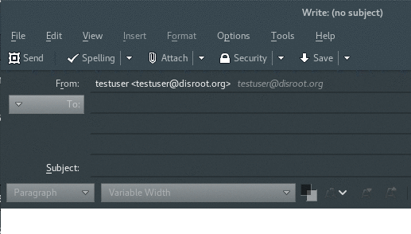

## Configuración
Primero, inicia Thunderbird y ve a las configuraciones de cuenta haciendo click derecho sobre tu cuenta.

Sobre el extremo inferior derecho de la ventana de configuraciones tienes el botón "**Administrar Identidades...**".

Una vez en el administrador de identidades, puedes agregar un nuevo alias presionando el botón "**Agregar…**" y completando el formulario:

## Establecer como predeterminado
Si deseas establecer un nuevo alias de correo como tu predeterminado, sólo selecciona el alias y haz click en el botón "**Establecer como predeterminado**".

## Enviar correo
Para enviar correo con tu nuevo alias, sólo haz click en el campo "**De**" y selecciona el alias que desees utilizar desde el menú desplegable, cuando estés redactando un correo.

