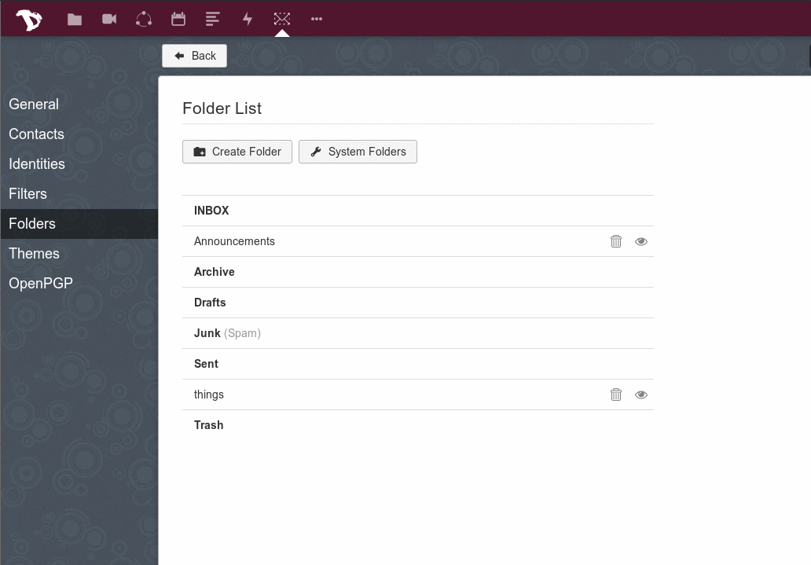

## Configuration
Tout d'abord, connectez-vous à votre webmail et accédez à vos paramètres de messagerie (icône en bas à gauche)

Dans Paramètres, allez dans l'onglet **"Identités"**, cliquez sur "**Ajouter une identité"** et remplissez le formulaire. Une fois terminé, appuyez sur le bouton **"Ajouter"**.
(Chaque utilisateur Disroot a par défaut un alias username@disr.it qu'il peut utiliser)*

## Définir par défaut
Vous pouvez gérer l'identité par défaut, en faisant simplement glisser l'identité vers le haut de la liste.

## Envoyer un email
Pour envoyer un courriel avec votre nouvel alias, cliquez simplement sur le champ **"De"** et sélectionnez l'alias que vous voulez utiliser dans le menu déroulant, lors de la composition de votre courrier.

