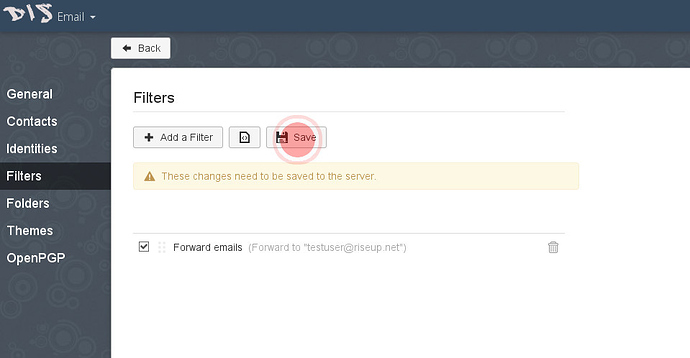

Entendemos que no todos quieran utilizar el correo de Disroot como su cuenta de todos los días. La gente tiene sus cuentas de correos desde hace años y es difícil, poco o nada práctico y, en algunos casos, incluso imposible, cambiar a otro proveedor como Disroot.

Sin embargo, hay información importante que deberías tener presente.

 - Recepción de notificaciones de foros y Nextcloud. Esos servicios están ligados al correo de Disroot y no puedes cambiarlo.
 - Estar al día respecto a lo que sucede en Disroot. Cada tres a seis semanas, enviamos un correo a todos los usuarios informándolos acerca de desarrollos recientes o en curso, nuevas características y servicios. También enviamos información sobre bajas programadas de servicios, si su duración fuera mayor a 20 minutos. Nuestra intención no es generar spam con demasiada información, así que no hay por qué preocuparse.

En este este breve manual, nos gustaría mostrarte cómo reenviar tus correos de Disroot a tu dirección de correo preferida (no debería tomarte más de 3 minutos hacerlo).

## Steps needed to forward your mail

1. **Login to webmail** (https://mail.disroot.org)

2. **Go to Settings** (hit the 'gear' icon on bottom left of the window)

3. Once in Settings **Hit Filter Tab.**
Filters help you manage your emails. Based on your filer conditions, you can move, copy, forward any email automatically. This is quite straight forward so if you want to setup some extra filters just look around. Here I'll show you how to setup forwarding filter for all your mail.

4. **Click on 'Add new Filter" icon.**
You will be presented with dialog window that guides you through the setup.

5. **Fill in your filter rule.**

 - Give your filter a name
 - If no conditions specified, filter will apply to all incoming emails, which is what we want, so **do not add any conditions** for that filter.
 - From "**Action**" Dropdown menu select "**Forward to**" option, and add email address you want all emails to be forwarded to.
 - Once you are done, hit the "**Done**" button.
 - In order for the filter to be set to active you need to "**Save**" it.

###Viola! From now on all your emails to disroot account will be forwarded to your preferred email address. If you ever decide to actually switch to disroot mail as your main email address just simple remove that rule or alter it to your liking.
