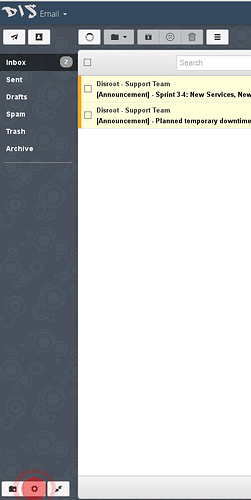

Compreendemos que nem toda a gente queira usar o seu email do Disroot como a sua conta de email principal. As pessoas tem as suas contas de email há muito tempo e por vezes é pouco prático mudar de conta de email para outro fornecedor de email como por exemplo o Disroot.

No entanto há informações importantes que não deve perder.

 - Receber notificações do fórum e da sua conta de cloud. Esses serviços estão ligados à sua conta de email do Disroot e isso não pode ser alterado.
 - Estar a par do que se passa com o Disroot. Cada três a seis semanas enviamos emails a todos os nossos utilizadores com informações sobre novos desenvolvimentos, novos serviços adicionados ao Disroot. Também enviamos informação acerca de períodos de manutenção, que normalmente não excedem os 20 minutos.
 Não temos a intenção de o spamar com demasiada informação, não precisa de se preocupar com isso.

Neste pequeno tutorial gostaríamos de lhe mostrar como pode reencaminhar automaticamente os emails da sua conta Disroot para outra conta de email (não deve demorar mais do que três minutos paa configurar).

## Passos necessários para reencaminhar automaticamente o seu email

1 - **Fazer login no [webmail](https://mail.disroot.org)**

 

2 - **Ir a definições** (carregue no ícone 'roda dentada' no canto inferior esquerdo da janela)

3 - Quando estiver em "Settings" carregue em **Filter Tab.**
Filtros ajudam-no a gerir os seus emails. Dependendo das condições que colocou, você pode, mover, copiar reencaminhar automaticamente o seu email. Isto é bastante simples de fazer por isso se quiser fazer filtros extra basta procurar. Aqui iremos mostrar-lhe como fazer reencaminhamento automático das suas mensagens de email para outro endereço de email.

4 - **Carregue no ícone "Add new Filter".**
Iŕa aparecer-lhe uma janela que o irá guiar através deste processo.

5 - **Preencha as regras do seu filtro.**

 - Dê um nome ao seu filtro
 - Se não especificar nenhumas condições o filtro irá aplicar-se a todos os emails que receber, que neste caso é o que queremos, por isso **não adicione nenhumas condições** para este filtro.
 - No menu "**Action**" selecione a opção "**Forward to**" e adicione o endereço de email para o qual quer que os seus emails sejam reencaminhados.
 - Assim que tiver terminado carregue no botão "**Done**".
 - Para o filtro ficar ativo precisa de carregar em  "**Save**".

### Violá!
A partir deste momento todos os emails da sua conta do Disroot serão encaminhados para a sua conta de email preferida. Se algum dia decidir passar a utilizar a sua conta de email do Disroot como a sua conta de email principal basta remover ou alterar os filtros que criou.
