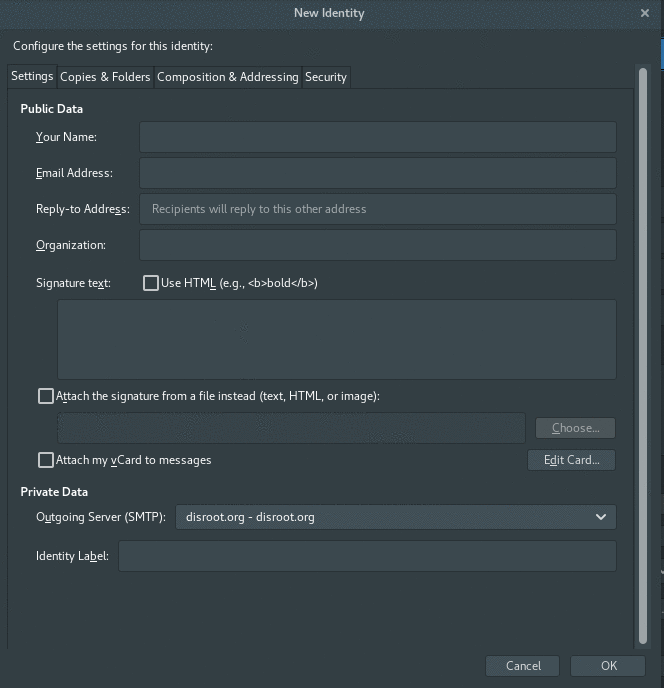

# Setup
First of, start **Thunderbird** and go to account settings by right-clicking on your account.

On the bottom right of the settings window, you have **"Manage Identities..."** settings button.

Once in the Identity manager, you can add new alias by pressing **"Add..."** button and filling in the form:

# Set default
If you want to set new email alias as your default one, just select the mail alias and click **"Set Default"** button.

# Send email
To send email with your new alias, just click on the **"Form"** field and select alias you want to use from the dropdown menu, when composing your mail.

