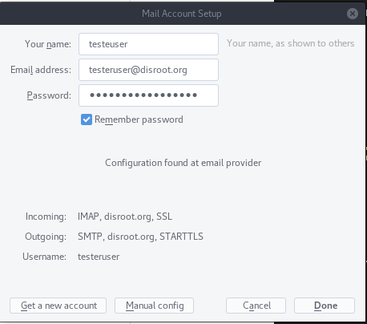

|```Meta information```|
|:--:|
|```This howto was last updated on``` April, 2019 ```and it reffers to:```<br>**- Thunderbird: version - 60.6.1 For Manjaro Linux**|

**NOTE:**```If the howto reffers to an older software version than the provided by``` **Disroot**,```or the one you're using in your device, there could be missing features or small parts of the information that may have changed.```<br> **Disroot's** ```how-to documentation is a community driven procces. We try to keep it as updated as we can.```

---

Thunderbird is a powerful open-source email client, calendar and RSS-Feed manager.

1. **Install Thunderbird.**
If you don't have thunderbird yet, got to  https://www.mozilla.org/en-US/thunderbird/all/ and choose your language and Operating System.  
**!Note** For linux users we recommend using your distribution package manager to get the latest and updatable version of thunderbird.

2. **Open thunderbird**
If it's the first time you run thunderbird you will be directly greeted with account setup and skip directly to **step 3**.  
If you  are using thunderbird already and have some accounts setup just select "**New Account**" icon in the root view.


3. **Fill in your account information**


 - **Your name:** *Name that will be displayed in "from" field*
 - **Email address:** *yourusername@disroot.org*
 - **Password:** *your_super_secret_password*
 - **Remember Password?** - If you want thunderbird to remember your password for you and not prompt you for it every time you start thunderbird, select it.
 - Click "**Continue**" button once you're done and verified everything is correct..

4. Thunderbird now should auto-detect the needed settings like this:



**Done** \o/


