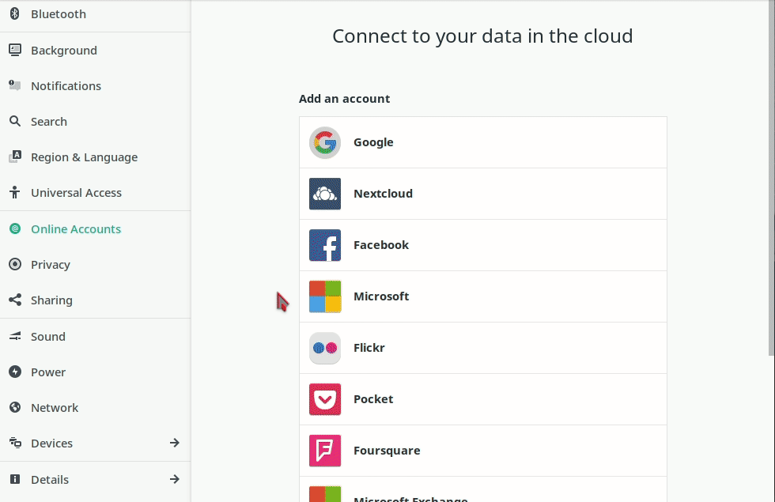

|```Meta information```|
|:--:|
|```This howto was last updated on``` April, 2019 ```and it reffers to:```<br>**- Gnome: version - 3.30.2 For Manjaro Linux**|

**NOTE:**```If the howto reffers to an older software version than the provided by``` **Disroot**,```or the one you're using in your device, there could be missing features or small parts of the information that may have changed.```<br> **Disroot's** ```how-to documentation is a community driven procces. We try to keep it as updated as we can.```

---
Gnome is a very popular, slick, modern and easy to use graphical desktop environment for Linux. It also have an awesome integration with Disroot's services.

Integration with desktop environment means, you no longer need to login to Disroot's cloud via the browser, every time you need to add or lookup information. It means everything you need is available to you directly from your desktop. Furthermore it makes it look and feel unified with all other apps you use while you work. It's definitely **THE** way to get things done.

In this tutorial we would like to show you how easy and handy it is to integrate your mails on your computer. Setup procedure should take no longer then few minutes of your time.

-------
# Set Online accounts

In order to get up and running, all you need to do is:

 - Go to Gnome **Settings** (eg. type settings in the dashboard search)
 - Open **"Online Accounts"**
 - Select **"Other"**(or 3dots) --> **"IMAP and SMTP"**
 - Follow instructions to fill in all your credentials:  
  - For Email and Name:
      - **E-mail:** *yourusername@disroot.org*
      - **Name:** *The Name You Want To Show*
    - For IMAP:
      - **IMAP Server:** *disroot.org*
      - **Username:** *yourusername*
      - **Password:** *your_super_secret_password*
      - **Encryption:** *SSL on a dedicated port*
    - For SMTP:
      - **SMTP Server:** *disroot.org*
      - **Username:** *yourusername*
      - **Password:** *your_super_secret_password*
      - **Encryption:** *STARTTLS after connecting*

If you did that correctly now you open Evolution and start syncing your mails. If you sync your Calendars and Contacts you will have it all together in one place.


---

 <center><a rel="license" href="http://creativecommons.org/licenses/by- sa/4.0/"></a><br />This work is licensed under a <br><a rel="license" href="http://creativecommons.org/licenses/by-sa/4.0/">Creative Commons Attribution-ShareAlike 4.0 International License</a>.</center>

---
