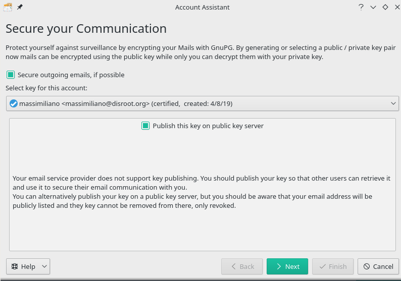
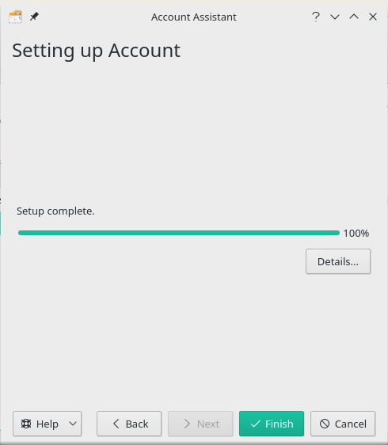

|```Meta information```|
|:--:|
|```This howto was last updated on``` April, 2019 ```and it reffers to:```<br>**- KDE Plasma: version - 5.15.2 For Manjaro Linux**<br>**- KMail: version - 18.12.3-2 For Manjaro Linux**|

**NOTE:**```If the howto reffers to an older software version than the provided by``` **Disroot**,```or the one you're using in your device, there could be missing features or small parts of the information that may have changed.```<br> **Disroot's** ```how-to documentation is a community driven procces. We try to keep it as updated as we can.```

---
KMail is KDE default mail client.
The advantage of using KMail is that it integrates with your desktop and [Kaddressbook](/cloud/apps/contacts/desktop/kde-desktop-integration). Use a package manager to install KMail if it is not installed by default on your favourite distro.  

The client will ask you to add an account the first time you will launch KMail.
 - Follow instructions to fill in all your credentials:
   - **Full name:** *Name that will be displayed in "from" field*
   - **E-mail:** *yourusername@disroot.org*
   - **Password:** *your_super_secret_password*
   - Click "**Next**" button once you're done and verified everything is correct...


 - On the Next screen you will be asked if you want to secure your communication. You are free to choose if you want it or not but it is recommended to encrypt your communication.
   - Click "**Next**" button once you're done.
 

 - On the final screen you will be shown that the setup is completed.
 - Just click on Finish and you are **Done** \o/.
 

---

 <center><a rel="license" href="http://creativecommons.org/licenses/by- sa/4.0/"></a><br />This work is licensed under a <br><a rel="license" href="http://creativecommons.org/licenses/by-sa/4.0/">Creative Commons Attribution-ShareAlike 4.0 International License</a>.</center>

---
