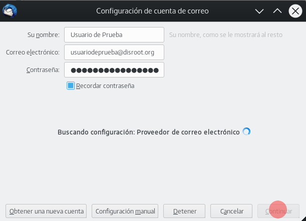
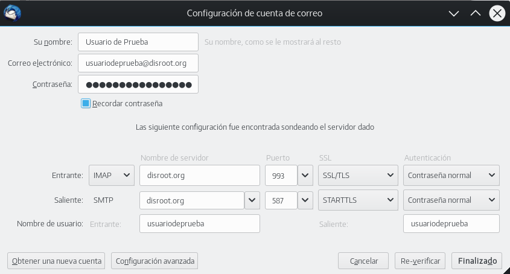
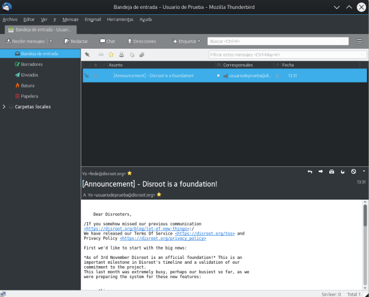

Thunderbird es un poderoso cliente de correo, calendario y administrador de RSS-Feed de código abierto.

1. **Instalar Thunderbird.**
Si aún no tienes Thunderbird, ve a https://www.mozilla.org/en-US/thunderbird/all/ y selecciona tu idioma y Sistema Operativo. **Nota:** Para usuarios de GNU/Linux recomendamos utilizar el administrador de software de tu distribución para obtener la última y actualizable versión de Thunderbird.

2. **Abre Thunderbird**
Si es la primera vez que ejecutas Thunderbird, serás recibido directamente con la configuración de cuenta. Por favor, saltea la sugerencia de la compañía y pasa directamente a la configuración.

Si ya estás utilizando Thunderbird y tienes algunas cuentas configuradas sólo selecciona el icono de **Nueva Cuenta** en la vista de raíz.

3. **Completa la información de la cuenta**

- **Su nombre:** Nombre que será mostrado en el campo "de"
- **Correo electrónico:** Tu dirección de correo de disroot. Ej. usuariodeprueba@disroot.org
- **Contraseña:** Tu contraseña
- **Recordar contraseña:** Si quieres que Thunderbird recuerde tu contraseña y no te la solicite cada vez que ejecutas el cliente, selecciónalo.
- Click en el botón "**Continuar**" una vez que has terminado y verificado que todo está correcto.

4. Thunderbird debería ahora auto-detectar la configuración necesaria, algo como esto:

**¡Hecho!** \o/

