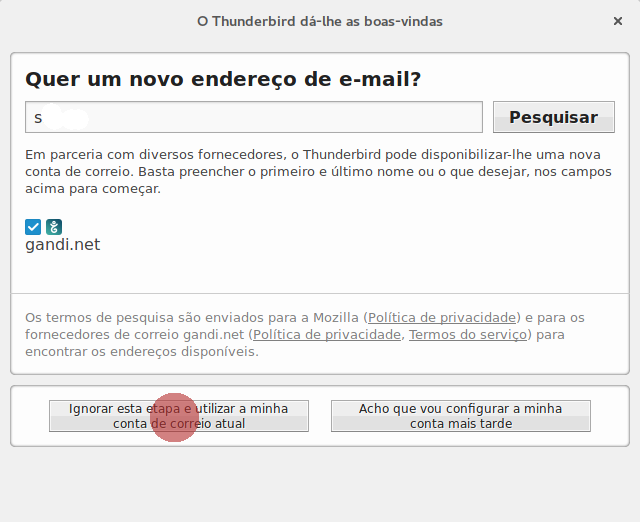
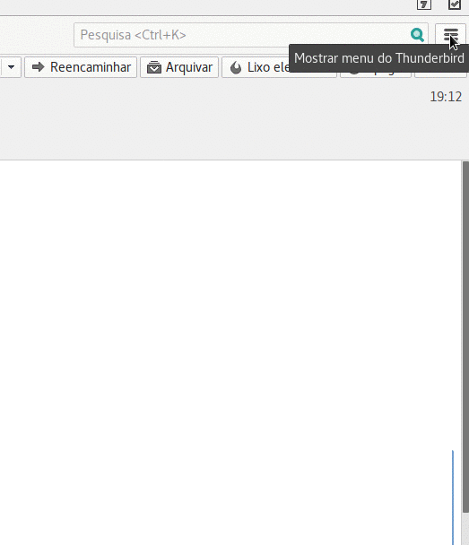
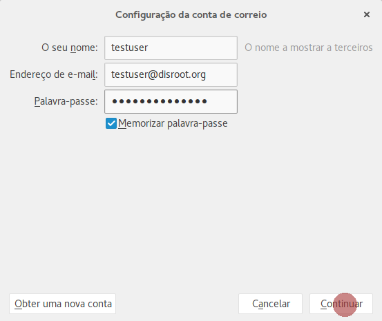
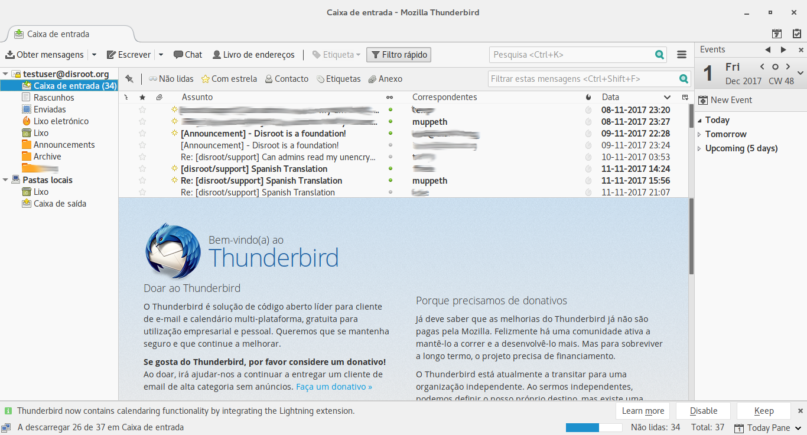

O Thunderbird é um cliente open-source de email, calendário, tarefas e gestor feed de RSS bastante poderoso.

1. **Instalar o Thunderbird.**
Se ainda não tem o Thunderbird, vá a https://www.mozilla.org/en-US/thunderbird/all/ e escolha a língua e sistema operativo que quer.
**Nota:** Para utilizadores de linux nós recomendamos que utilize o gestor de pacotes ou a loja de aplicações da sua distribuição para obter a versão mais recente e atualizada do Thunderbird.

2. **Abrir o Thunderbird**
Se for a primeira vez que abre o Thunderbird irá aparecer automaticamente o painel para configurar a sua conta de email. Por favor salte a sugestão de parceria  e vá diretamente à configuração.

Se já está a utilizar o Thunderbird e já tem algumas contas de email, então selecione "**Nova Mensagem**" e "**Conta de email existente**"

3. **Preencha as informações da sua conta**

 - **O seu nome** O nome que aparecerá no campo "de"
 - **Endereço de E-mail** O seu endereço de emails do Disroot ex: testuser@disroot.org
 - **Palavra-passe** A sua password
 - **Memorizar palavra-passe** - Caso não queira que o Thunderbird lhe peça a password do seu e-mail sempre que o iniciar
 - Carregue em "**Continuar**" assim que verificar que tudo está correto.

4. O Thunderbird deve auto-detetar as configurações necessárias:

Carregue em "**Terminar**" e está feito! \o/

