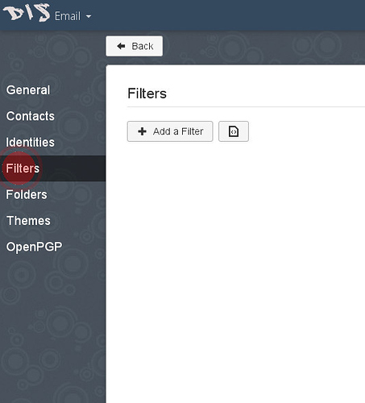
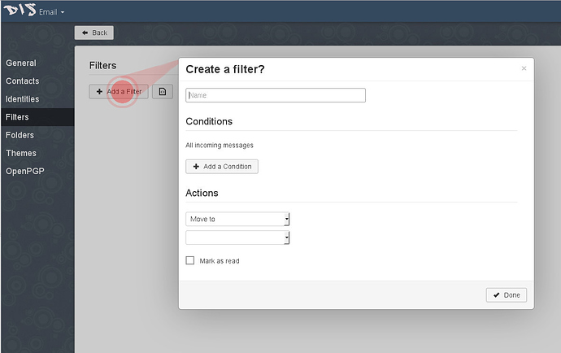

Nous comprenons que tout le monde ne veut pas utiliser le courrier Disroot comme email quotidien. Les gens ont leur compte de courrier depuis des années et il est difficile, pas pratique ou dans certains cas même impossible pour eux de passer à un autre fournisseur d'accès, comme par exemple Disroot.

Cependant, il y a des informations importantes à ne pas manquer.

- Obtenir des notifications pour le forum et Nextcloud. Ces services sont associés à l'email Disroot et vous ne pouvez pas le modifier.
- Pour être au courant de ce qui se passe sur Dirsoot. Toutes les trois ou six semaines, nous envoyons un courriel à tous les utilisateurs pour les informer des derniers développements, des nouvelles fonctionnalités et des nouveaux services. Nous envoyons également des informations sur le temps d'arrêt programmé des services s'ils durent plus de 20 minutes. Nous n'avons pas l'intention de vous envoyer des spams avec trop d'informations, alors ne vous inquiétez pas.

Dans ce court guide je voudrais vous montrer comment rediriger vos mails de Disroot vers votre adresse email préférée
(cela ne devrait pas vous prendre plus de 3 minutes pour obtenir cette configuration).

## Étapes à suivre pour faire suivre votre courrier

1. **Connectez-vous au webmail** (https://mail.disroot.org)

2. **Aller dans les Paramètres** (appuyer sur l'icône "roue crantée" en bas à gauche de la fenêtre)

3. Une fois dans Paramètres **Appuyer sur l'onglet Filtre.**
Les filtres vous aident à gérer vos courriels. En fonction des conditions de votre filtre, vous pouvez déplacer, copier, transférer n'importe quel email automatiquement. C'est assez simple, donc si vous voulez installer des filtres supplémentaires, cherchez. Ici je vais vous montrer comment configurer le filtre de transfert pour tous vos mails.

4. **Cliquez sur l'icône "Ajouter un nouveau filtre".**
La fenêtre de dialogue qui vous guidera à travers la configuration s'affiche.

5. **Remplissez votre règle de filtrage.**

- Donnez un nom à votre filtre
- Si aucune condition n'est spécifiée, le filtre s'appliquera à tous les e-mails entrants, ce qui est ce que nous voulons, donc **n'ajoutez pas de conditions** pour ce filtre.
- Dans le menu déroulant "**Action**", sélectionnez l'option "**Transférer à" et ajoutez l'adresse e-mail vers laquelle vous voulez que tous les courriels soient transférés.
- Une fois que vous avez terminé, cliquez sur le bouton "**Terminé**".
- Pour que le filtre soit activé, vous devez "**Enregistrer**".

###Viola! A partir de maintenant, tous vos emails vers votre compte Disroot seront redirigés vers votre adresse email préférée. Si vous décidez un jour de passer à l'adresse email principale, il vous suffit de supprimer cette règle ou de la modifier à votre guise..
