|```Meta information```|
|:--:|
|```This howto was last updated on``` June, 2019 ```and it reffers to:```<br>**Rainloop Webmail [Community Edition] version - 1.12.1**|

**NOTE:**```If the howto reffers to an older software version than the provided by``` **Disroot**,```or the one you're using in your device, there could be missing features or small parts of the information that may have changed.```<br> **Disroot's** ```how-to documentation is a community driven procces. We try to keep it as updated as we can.```

---

||
|:--:|
|**Rainloop Webmail** is the free and open source webmail client solution implemented by **Disroot** for our email service. It has modern user interface, can handle large number of email accounts, supports both SMTP and IMAP protocols and it's easy to use and configure.|
---
# Disroot Webmail
# Accesing the account

Go to [https://mail.disroot.org](https://mail.disroot.org) and enter your **Disroot** username and password.

|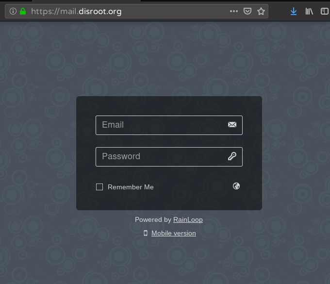|
|:--:|
|**Email**: ``your_disroot_username``<br>**Password**: ``your_disroot_password``|

# User interface
After logging in, you will access the main screen, where you'll find:
1. the basic operations of mail management (compose, send, receive, etc.);
2. the default mail folders (sent, drafts, spam, etc.);
3. the mail viewer;
4. and the account settings

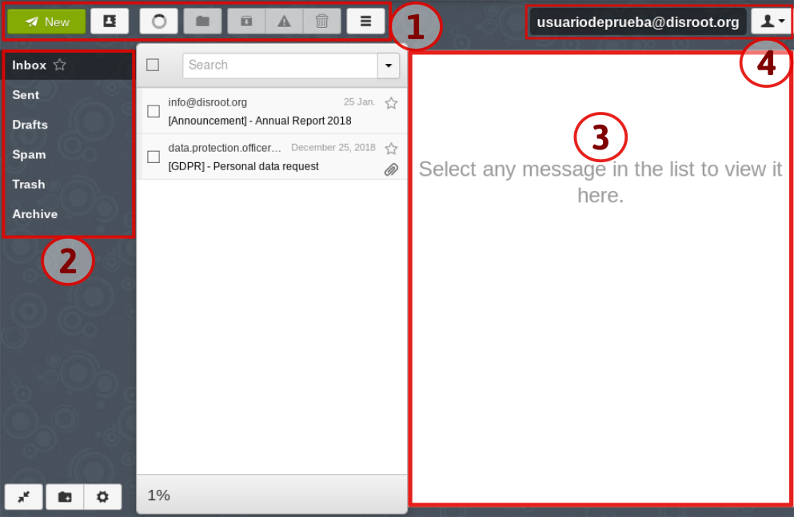

# Settings
Above right is the user settings. This is where you access the options for setting up your account.

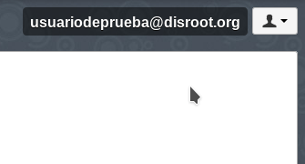

## General settings

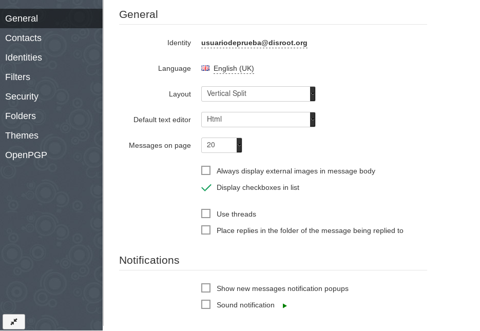

In the general settings, you can manage and modify account identities, language, editor layout and messages, and notifications.

### Identity
By clicking on the email address, you access the Identity and signature options.

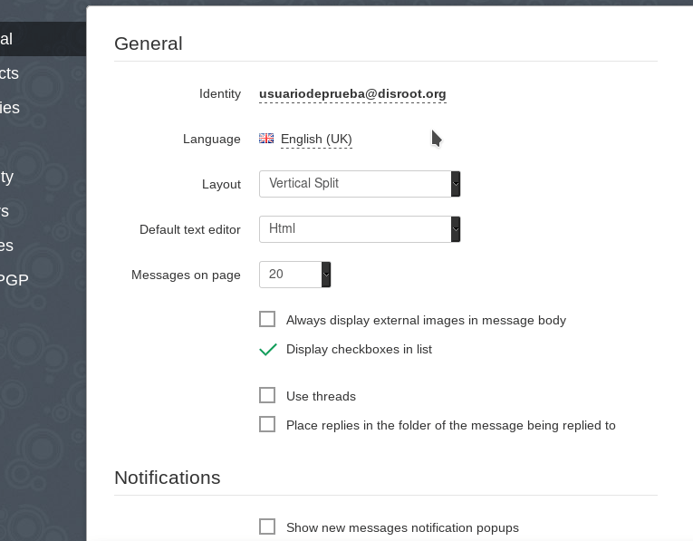

|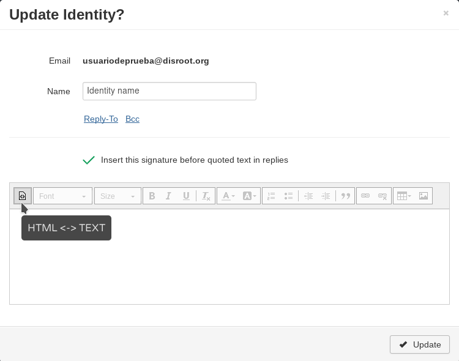|
|--|
|As shown in the image above, here you can assign a name to your account, an email to send replies to or if you want the emails to go with BCC to another address.<br>By clicking on the layout icon, you can choose between plain text or html. Selecting the latter enables the editor.|
|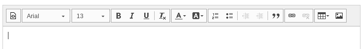|

| **NOTE**|
|:--:|
|Remember save the changes by clicking the Update button|

## Contacts
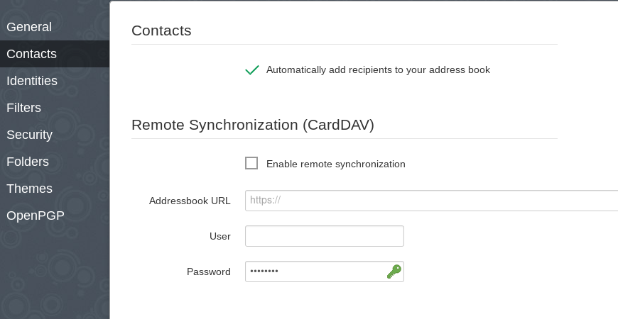

In this section you can configure if the client will automatically add the addresses to the address book. You can also add an address book stored in the cloud to synchronize on all your devices.

The procedure is pretty simple.
1. Enable remote synchronization
2. Enter the address of the Address book you want to synchronize
3. Enter the username and password of the service in which the address book is stored. In our case it would be `your_disroot_username` and `your_disroot_password`

And that's it.

## Identities
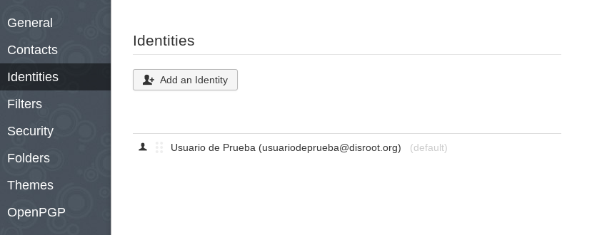

**Identities** allow the sender to create and associate a set of sending properties such as email address, reply address and signatures.<br>
To learn more about configuring Identities, please check this [**howto**](/communication/email/alias/webmail).

## Filters
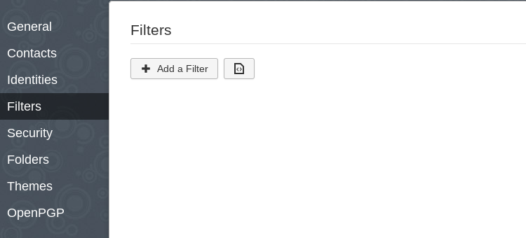

The filters allows users to manage incoming mails in automated fashion such as moving incoming mail to a directory based on certain criteria, setting up out-of-office/holiday autoreply, automatically reject or forward emails etc.

To create a filter click on the **+ Add a Filter** button.

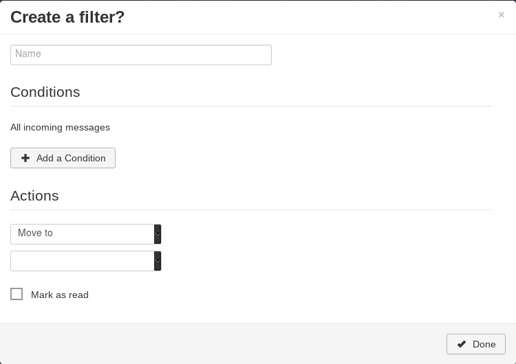

A filter is a set of conditions used to organize incoming mail. The filter editor comes with a set of basic conditions and actions that combined are useful for this task.

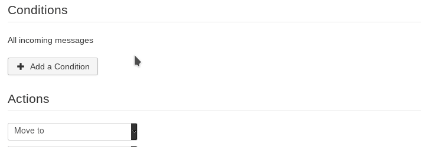

To see a more detailed example of how it works and some of its uses, you can check this [howto](/communication/email/filters/) about setting a filter.

## Security
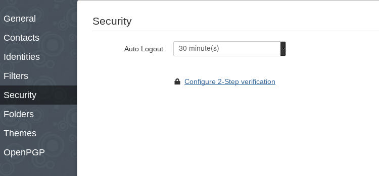

At **Security** you'll find the option to enable two-factor authentication (2FA) and add an extra layer of security to your account. It is advisable to be sure you understand how **2FA** works and the precautions you need to take in order not to lose access to your account.

Click on **Configure 2-Step verification** to activate the **2FA** and then **Activate**.

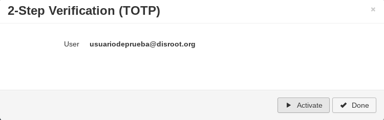

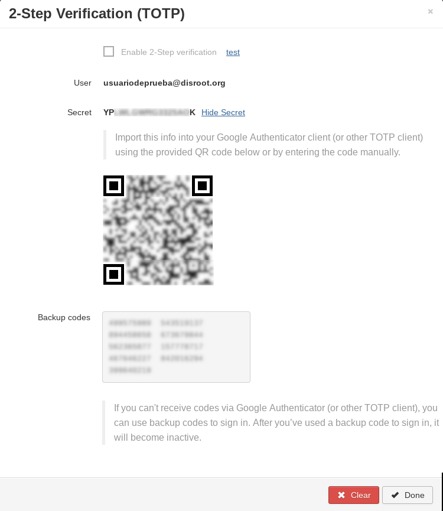

For most **OTP** (One-Time Password) applications, the procedure is as follows:

1. Scan the QR code previously generated
2. The program will then display a six digit code.<br> **This is the code you will need to sign in to your account**

Now, back at the **2-Step Verification** settings, you'll find a link that says **test**, right next to the *Enable 2-step verification* box.

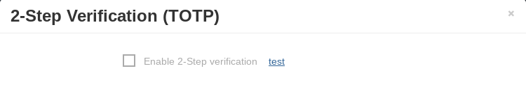

Click it.

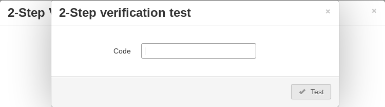

Enter the six digit code generated on your phone app then press **Test**.

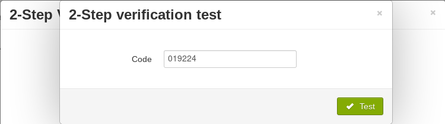

If verification is ok, the button will turn into green. Close the test by clicking the **x** on that window.

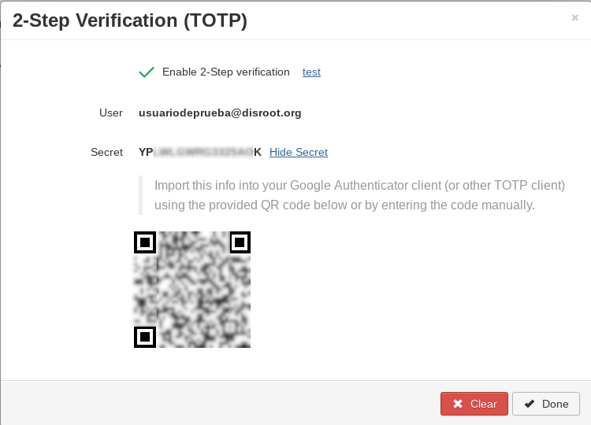

Check the *Enable 2-Step verification* box and finally press **Done**.

After that, every time you sign into **Disroot** Webmail, you'll need to generate the six digit code in your **OTP** application and enter it along with your username and password combination.

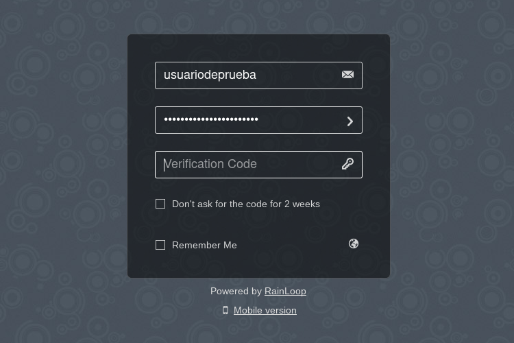

| **NOTE**|
|:--:|
|Remeber to back up the codes in a safe place **other than your phone**. Really.<br>Because if, let's say, you lose or break it and you can't recover the codes, there's no way to regain access to the account.

## Folders
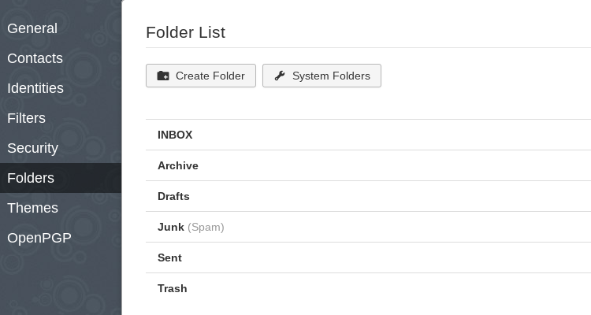

At the Folders settings you'll find the options to create new folders or to change the system ones.
It's the place where you can organize your mails by creating folders per category, for example a SPAM folder, a Work related folder, etc.

To create a new folder, just click on the **Create Folder** button, give it a name and select under which System folder it will be located.

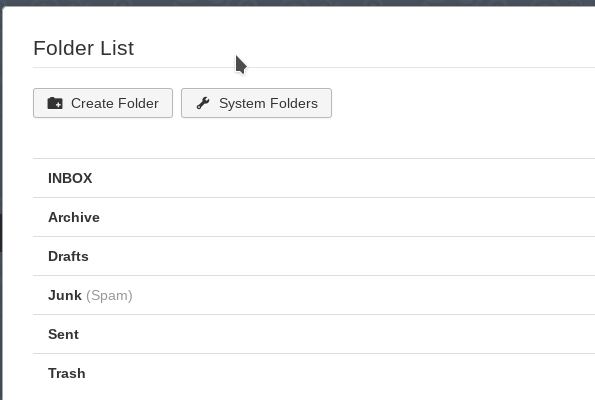

By clicking on the **System Folders** button, a settings windows will open and you'll be able to change the default location of the system folders.

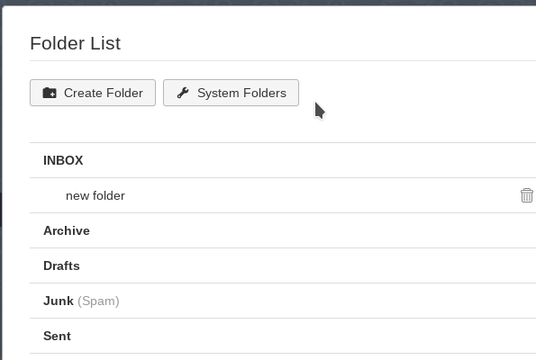

## Themes
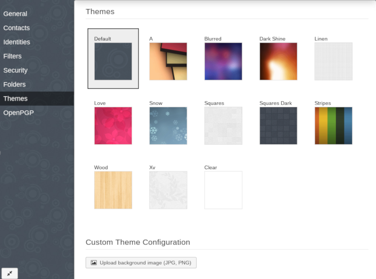

At the Theme section you can change the default theme as well as set a custom background image.

## OpenPGP
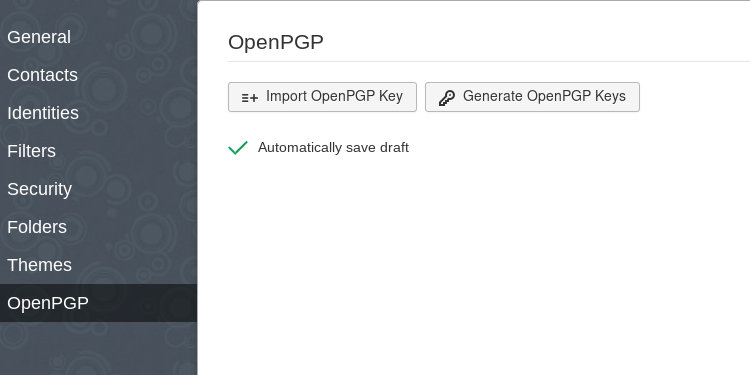

To be able to sign and encrypt your email, you must either import your **PGP** key or generate a new one.

### Importing a PGP key
Click on **Import OpenPGP Key** (if you already have one), paste your key and click **Import**.

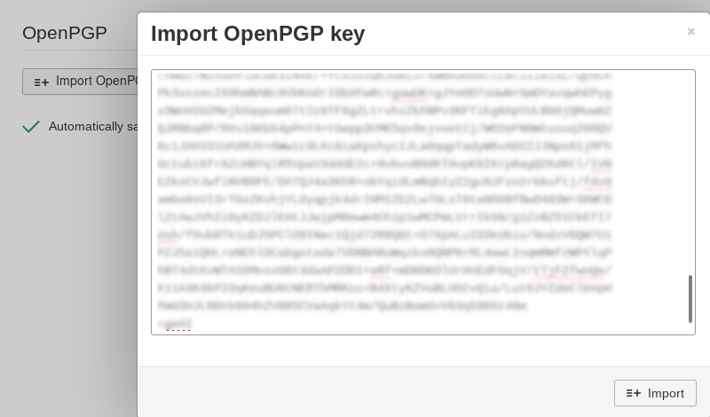

The **PGP** key is now added to your account.

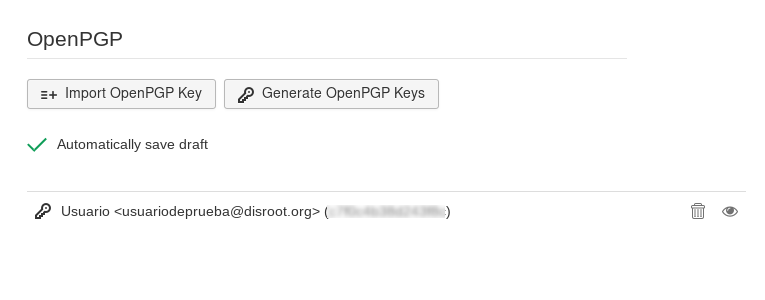

### Generating a new pair of PGP keys

To generate a new pair of keys, just click on the **Generate OpenPGP Keys**.

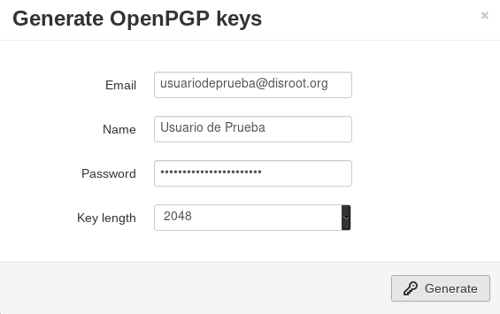

Complete the information requested, select the lenght of the key and click **Generate**.

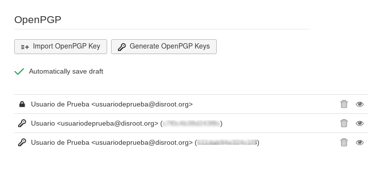

Now you have your new **PGP** keys added to your account.

----

## Composing email
To write and send and email, just click on the **New** button.

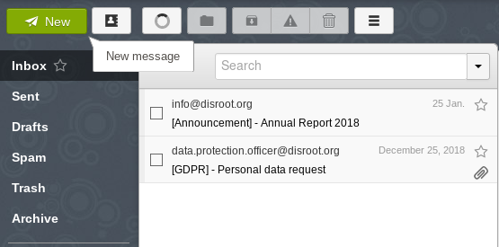

The editor will open.

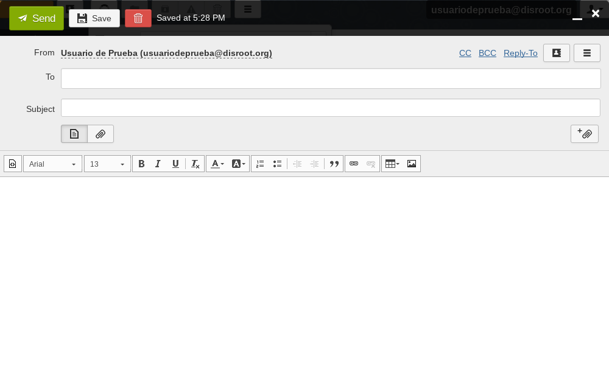

From this point on, we assume you know the basics of mail management:

- **From**: If you didn't create a new email identity, your default identity will appear. *To learn more about configuring Identities, please check this* [**howto**](/communication/email/alias/webmail).
- **To**: the recipient's address (you can choose to send a copy of the email to others by clicking **CC** or **BCC**)
- **Subject**: usually, the reason of the email or a descriptive title.
- To attach a file just click on the **clip** button at the right, under the Subject.
- The editor has the basic options to format your email.

---

 <center><a rel="license" href="http://creativecommons.org/licenses/by- sa/4.0/"></a><br />This work is licensed under a <br><a rel="license" href="http://creativecommons.org/licenses/by-sa/4.0/">Creative Commons Attribution-ShareAlike 4.0 International License</a>.</center>

---
