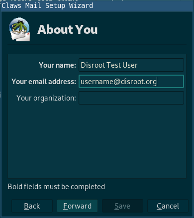
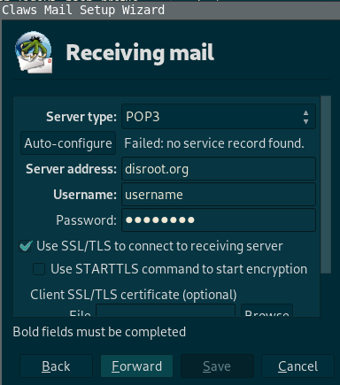
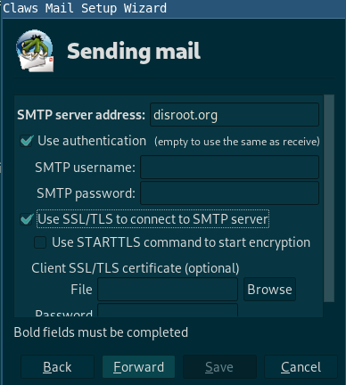
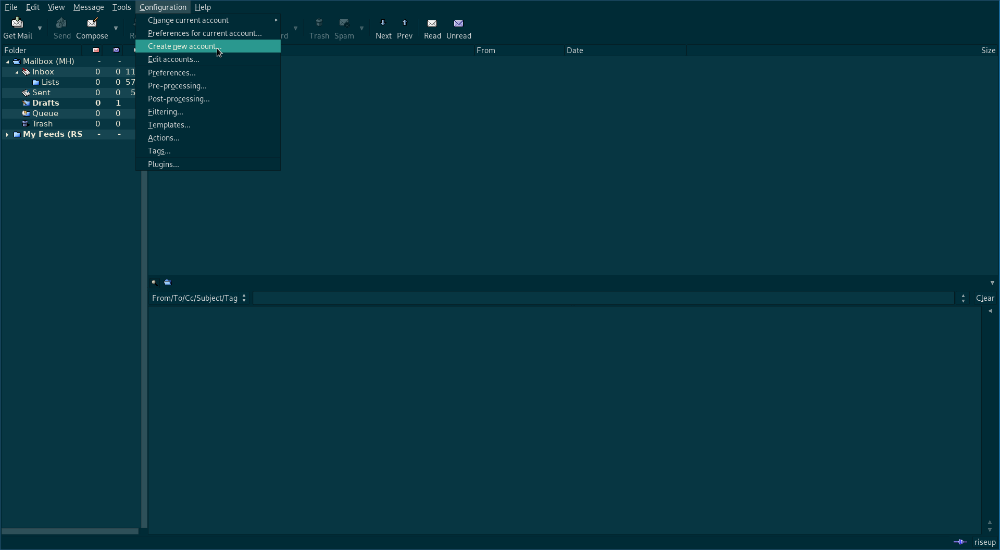
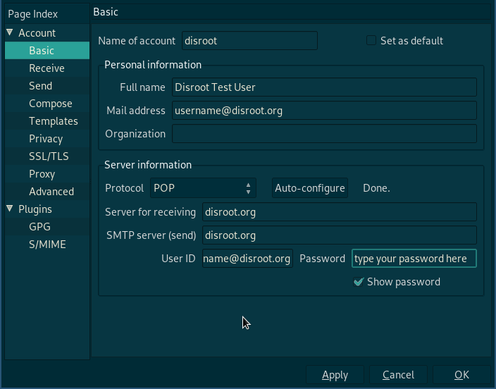

|```Meta information```|
|:--:|
|```This howto was last updated on``` June, 2019 ```and it reffers to:```<br>**Claws Mail: version - 3.17.3 on Arch Linux**|

**NOTE:**```If the howto reffers to an older software version than the provided by``` **Disroot**,```or the one you're using in your device, there could be missing features or small parts of the information that may have changed.```<br> **Disroot's** ```how-to documentation is a community driven procces. We try to keep it as updated as we can.```

---

||
|:--:|
|**Claws Mail** is a free and open-source, GTK+-based email and news client. It's user-friendly, lightweight, and fast.|

If you're setting this up for the first time then follow from `Installation`, otherwise skip to `Existing users`.

---

# Installation

Goto **Claws Mail** [download page](https://claws-mail.org/downloads.php) and download the latest setup for your operating system. If you use a **GNU/Linux** system then you should install it with your package manager.

# Configuration

1. You will be greeted with this wizard on startup...
<br>

<br>

2. Click *Forward* and fill the details **Claws Mail** asks for in the next window...
<br>

<br>

3. Then configure Receiving server:
<br>

<br>

You can chose **POP** or **IMAP** (if you want to know more about the difference between IMAP and POP, you can check this [article](https://en.wikipedia.org/wiki/IMAP#Advantages_over_POP))

4. Now configure the Sending server
<br>

<br>

|For both, **IMAP** and **POP**|
|--|
|**Receiving server**: disroot.org|
|**Sending server**: disroot.org|

| Note|
|:--:|
|Don't forget to enable **SSL/TLS** for both, receiving and sending server.|

Done! \o/

---
# Existing Users

If you're already using **Claws Mail** with other email accounts then follow this steps.

1. Click on `create new account` under configuration
<br>

<br>

2. Fill in the details
<br>

<br>

3. Go to Send section and tick `SMTP authentication`

|For both **IMAP** and **POP**)
|--|
|**Receiving server**: disroot.org|
|**Sending server**: disroot.org|

| Note|
|:--:|
|Don't forget to enable **SSL/TLS** for both, receiving and sending server.|

Done! \o/

---
**Claws Mail** is light but a powerful client, you can play with options and if you are stuck join this [mailing list](https://lists.claws-mail.org/cgi-bin/mailman/listinfo/users).

---

 <center><a rel="license" href="http://creativecommons.org/licenses/by- sa/4.0/"></a><br />This work is licensed under a <br><a rel="license" href="http://creativecommons.org/licenses/by-sa/4.0/">Creative Commons Attribution-ShareAlike 4.0 International License</a>.</center>

---
