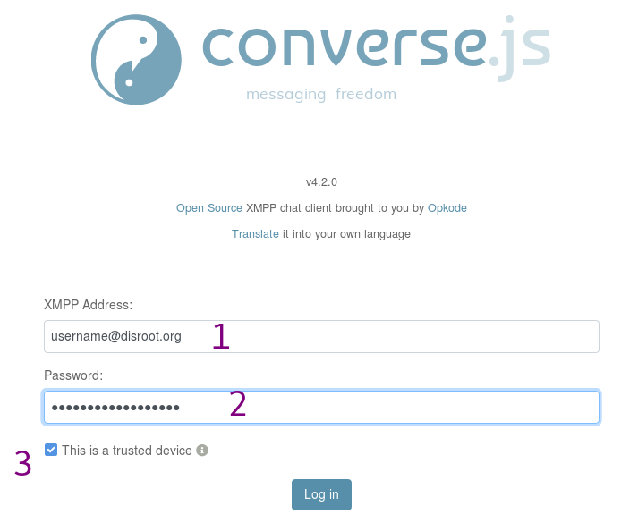
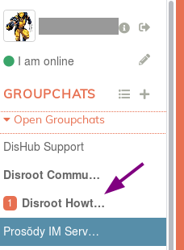
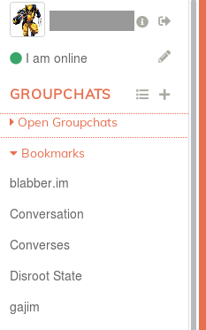
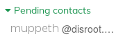
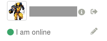

|```Meta information```|
|:--:|
|```This howto was last updated on``` **2019-04-11** ```and it reffers to:```<br>**Converse.js: version v4.2.0**<br>

**NOTE:**```If the howto reffers to an older software version than the provided by``` **Disroot**,```or the one you're using in your device, there could be missing features or small parts of the information that may have changed.```<br> **Disroot's** ```how-to documentation is a community driven procces. We try to keep it as updated as we can.```

---

**[webchat.disroot.org](https:webchat.disroot.org)** provides a way to connect to your XMPP account directly from your web browser.

# Connexion
Open your favorite web browser and go on **[webchat.disroot.org](https://webchat.disroot.org)**


1. **XMPP Address**: *Your_Disroot_email*
2. **Password:** *Your_super_secret_Disroot_password*
3. **This is a trusted device**: Uncheck this box if you're not on your own computer.

# User Interface
Once you're logged in, here is what you may see:

1. Your personnal details
2. The list of chat rooms you're logged in and your bookmarked rooms
3. The current room information
4. The current room participants
5. The current room features/configuration
6. The current room on-going discussion
7. The message editor


# Rooms
You can participate in group discussions, also called groupschats or rooms.

## Enter into a room

1. Click on this button to join or create a room.
2. **Groupchat address**: Enter the address of the room you want to join. It can be a room from any XMPP server that federates. For example, if you want to join a room on **Disroot** server, add *chat.disroot.org* after the room name. In this image, the user is trying to join the room called *mytestroom* on *chat.disroot.org* XMPP server.
3. **Nickname**: you are free to enter whatever username you wish, it doesn't have to be your real **Disroot** username. You can then have a different username on each room you're in if you want.
4. **Join** the room by clicking here.

## Send a message

1. Type your message here.
2. With two buttons, you can add either add an emoji or join a file (it can be any type of file, maximum size being 10MB)
3. Click on **Send** when you're done writing your message.

Note: Shift + Enter will allow you to add a line break.

You can mention people in your message so that they get a notification. Just click on their nickname in the participants list, or add it manually if you know it. You can also start to write its first letters and tap on the tab key of your keyboard to have a suggestion list of nicknames.


Here, we can see the user is actually reading stuff from the Prosody room (blue background) and get a message with its username in the Disroot Howto room.


## Edit a message
If you want to correct a message, you have sent, mouse over the message. A pencil appears on the right. Click on it. Correct your message and send it again.


## Leave a room
To leave a room, simply click on the arrow icon you can find on the top-right corner of the room page.


You can also mouse over the room's name in the Groupchats list in the left pannel. Click on the arrow icon that appears (3rd icon).


## Bookmark a room
You can bookmark rooms in order to join them in easily and to keep them from one client to another.

To do so, simply click on the flag icon you an find on the top-right corner of the room page.


You can also mouse over the room's name in the Groupchats list in the left pannel. Click on the flag icon that appears (1st icon).


You can find your bookmarked rooms in the left menu.


## Find details about the room
If you want to know more about the room, simply click on the "i" icon you an find on the top-right corner of the room page.


## Find a public room
You can search for public rooms (and only for public ones):

1. Click on this button to open the *Search* window.
2. Enter the server address of the server you want to search public rooms on. For example, that can be *chat.disroot.org*
3. Click on "Show groupchats"
4. You then get a list of public rooms. Just click on the one you want to join.


## Create a room
The process is a lot similar to enter into an existing room.


1. Click on this button to join or create a room.
2. **Groupchat address**: Enter the address of the room you want to create. It can only be a room on **Disroot** XMPP server. So something like *mytestroom@chat.disroot.org*.
3. **Nickname**: you are free to enter whatever username you wish, it doesn't have to be your real **Disroot** username. You can then have a different username on each room you're in if you want.
4. **Join** the room by clicking here. If the room already exists, then you'll join in if it is public. Otherwise, you'll need to find another room name.

You have a message at the top of the room saying that you just succeeded in creating your room:


Here are the default features of your room when you first create it:


As you are the creator of the room, you're its owner, it's admin. So you can change those features as you wish. Click on the tool icon you an find on the top-right corner of the room page.


You then get this page:


# Direct (1:1) conversation
You can also discuss with someone in private, in a 1:1 discussion with only the two of you participating.

## Add a contact
You first need to add a contact before you can talk to him/her.

1. Click on this button to add a contact.
2. **XMPP Address**: *Your_Contact_XMPP_address*. It can be any XMPP server address, as long as it federates.
3. **Optional nickname**: it can be anything you want.
4. **Add**: click there when you'r done.

The contact has been informed that you have added you in your Contacts list. Until he/she approves it, this contact can be found in your pending list:


## Talk to a contact
When the contact has been added, you can simply click on its name in the Contacts list to start a private discussion.


## Remove a contact
To remove a contact from you Contacts list, click on the trash bin next to his/her name.


## Contact details
To have more information about your contact, click on the ID card icon on the top-right corner of the conversation page.


## Encrypt conversation
If you want your conversation to really be secured, make sure that OMEMO is activated. To do so, check the lock icon. If it looks like this: , the conversation is not enrypted.

It should look like this:


# Personnal details
## Change name, avatar, etc.
To change your personnal details, click on your avatar in the top-left corner. Here is what you can add, if you want:


If you click on your avatar, you'll be able to change it.

## Change status
You can change your status by clicking on the pencil next to your actual status: 


# Log out
To log out from [webchat.disroot.org](https://webchat.disroot.org), click on the arrow icon next to your username, on the top-left corner.


# Converse.js
To know more about the software used, check [converse.js](https://conversejs.org/) website

---

 <center><a rel="license" href="http://creativecommons.org/licenses/by- sa/4.0/"></a><br />This work is licensed under a <br><a rel="license" href="http://creativecommons.org/licenses/by-sa/4.0/">Creative Commons Attribution-ShareAlike 4.0 International License</a>.</center>

---
