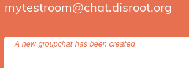
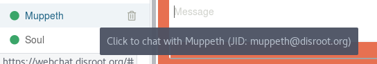
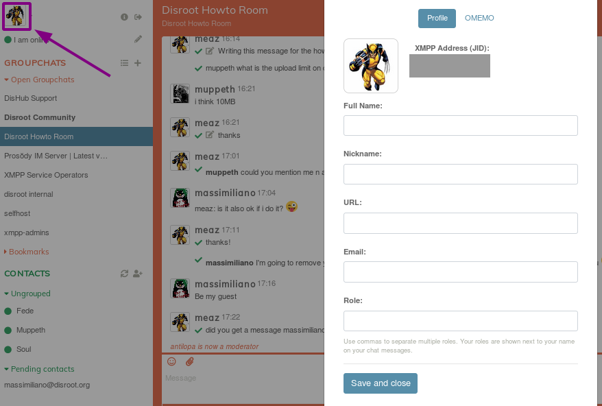
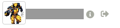

|```Meta information```|
|:--:|
|```This howto was last updated on``` **2019-04-11** ```and it refers to:```<br>**Converse.js: version v4.2.0**<br>

**NOTE:**```If the howto refers to an older software version than the provided by``` **Disroot**,```or the one you're using in your device, there could be missing features or small parts of the information that may have changed.```<br> **Disroot's** ```how-to documentation is a community driven procces. We try to keep it as updated as we can.```

---
||
|:--:|
|Converse is a free and open-source XMPP chat client that runs in a web browser and<br>**[webchat.disroot.org](https://webchat.disroot.org)** provides a way to connect to your XMPP account through it.|

# Connecting
Open your favorite web browser and go to **[webchat.disroot.org](https://webchat.disroot.org)**

||
|--|
|1. **XMPP Address**: *Your_Disroot_email*<br>2. **Password:** *Your_super_secret_Disroot_password*<br>3. **This is a trusted device**: Uncheck this box if you're not on your own computer.|

# User Interface
Once you've logged in, you may see something like this:

||
|--|
|1. Your personnal details<br>2. The list of chat rooms you're logged in and your bookmarked rooms<br>3. The current room information<br>4. The current room participants<br>5. The current room features/configuration<br>6. The current room on-going discussion<br>7. The message editor|

# Rooms
You can participate in group discussions, also called groupschats or rooms.

## Entering a room

||
|--|
|1. Click on this button to join or create a room.<br>2. **Groupchat address**: Enter the address of the room you want to join. It can be a room from any XMPP server that federates. For example, if you want to join a room on **Disroot** server, add ```chat.disroot.org``` after the room name. In this image, the user is trying to join the room called ```mytestroom``` on *chat.disroot.org* XMPP server.<br>3. **Nickname**: you are free to enter whatever username you wish, it doesn't have to be your real **Disroot** username. You can then have a different username on each room you're in if you want.<br>4. **Join** the room by clicking here.|

## Sending messages

||
|--|
|1. Type your message here.<br>2. With two buttons, you can add an emoji or share a file (it can be any type of file, maximum size being 10MB)<br>3. Click on **Send** when you're done writing your message.

**Note:** Shift + Enter will allow you to add a line break.

You can mention people in your message so they get a notification. Just click on their nickname in the participants list, or add it manually if you know it. You can also start to write its first letters and tap on the tab key of your keyboard to have a suggestion list of nicknames.


|Here, we can see the user is actually reading stuff from the Prosody room (blue background) and get a message with its username in the Disroot Howto room.||
|--|--|


## Editing messages
If you want to correct a message you have sent, mouse over it and a pencil will appear on the right. Click on it, correct your message and send it again.


## Leaving a room
To leave a room, simply click the arrow icon on the top-right corner of the room page. 

You can also mouse over the room's name in the Groupchats list at the left pannel and click on the arrow icon that appears there (3rd icon).


## Bookmarking a room
You can bookmark rooms in order to join them in later easily and to keep them from one client to another.

To do so, simply click on the flag icon on the top-right corner of the room page. 

You can also mouse over the room's name in the Groupchats list at the left pannel and click on the flag icon that appears there (1st icon).


You can find your bookmarked rooms in the left menu.


## Room details
If you want to get more information about the room, just click on the "i" icon on the top-right corner of the room page.


## Finding a public room
You can search for public rooms (and only for public ones):

||
|--|
|1. Click on this button to open the *Search* window.<br>2. Enter the address of the server you want to search public rooms on. For example, could be *chat.disroot.org*<br>3. Click on "Show groupchats"<br>4. You'll then get a list of public rooms. Just click on the one you want to join.|


## Creating a room
The process is quite similar to enter an existing room.

||
|--|
|1. Click on this button to join or create a room.<br>2. **Groupchat address**: Enter the address of the room you want to create. It only can be a room on **Disroot** XMPP server. For example, something like *mytestroom@chat.disroot.org*.<br>3. **Nickname**: you're free to enter whatever username you wish, it doesn't have to be your real **Disroot** username. You can then have differents usernames on each room you're in if you want.<br>4. **Join** the room by clicking here. If the room already exists, then you'll join in if it is public. Otherwise, you'll need to find another room name.|

You'll get a message at the top of the room saying that you just succeeded in creating your room:


Here are the default features of your room when you first create it:


As you've created the room, you're the owner and it's admin. So you can change those features as you want. Click on the tool icon on the top-right corner of the room page. 

You'll then get this page:


# Direct chat: 1 to 1 conversation
You can also chat with someone in private, in a 1:1 discussion with only the two of you participating.

## Adding a contact
First you'll need to add a contact before you can talk to the user.

||
|--|
|1. Click on this button to add a contact.<br>2. **XMPP Address**: *Your_Contact_XMPP_address*. It can be any XMPP server address, as long as it federates.<br>3. **Optional nickname**: it can be anything you want.<br>4. **Add**: click on the button once you're done.|

The contact will be informed that you have added him/her to your Contacts list. Until the user approves it, this contact can be found in your pending list:


## Talking to a contact
Once the contact has been added, you can simply click on its name in the Contacts list to start a private conversation.



## Removing a contact
To remove a contact from you Contacts list, click on the trash bin icon next to the user name.


## Contact details
To have more information about your contact, click on the ID card icon on the top-right corner of the conversation page.


## Encrypting a conversation
If you want your conversation to be really secure, make sure that **OMEMO** is activated. To do so, check the lock icon. If the lock looks open, then the conversation is not enrypted. <br>
If the chat is encrypted then it should look like this: 


# Personnal details

## Changing name, avatar, etc.
To change your personnal details, click on your avatar on the top-left corner.<br>
You can add the following information:


Whenever you want to change it, just click on your avatar and you'll be able to do it.

## Changing status
You can change your status by clicking on the pencil next to your actual status:


# Logging out
To log out from [webchat.disroot.org](https://webchat.disroot.org), just click on the arrow icon next to your username, on the top-left corner.



# Converse.js
To know more about the software used, check [converse.js](https://conversejs.org/) website

---

 <center><a rel="license" href="http://creativecommons.org/licenses/by- sa/4.0/"></a><br />This work is licensed under a <br><a rel="license" href="http://creativecommons.org/licenses/by-sa/4.0/">Creative Commons Attribution-ShareAlike 4.0 International License</a>.</center>

---
