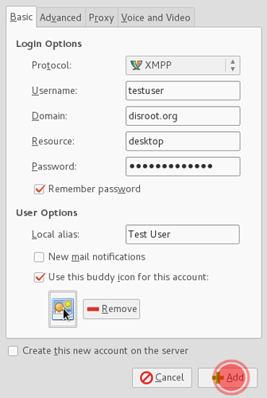

||
|:--:|
|Pidgin is multi-platform (runs on most operating systems) and multi-protocol messaging application. It supports a lot of different messaging protocols such as: xmpp, skype, AIM, TOX, Whatsapp, facebook etc, so you can have all your messaging done with just one app.|

To setup disroot chat on pidgin, follow those easy steps:

1. **Install Pidgin.**
If you use windows/macos check [pidgin's website](http://pidgin.im/download/) and download a version for you.
If you are a linux user, check your package repository and get it. (check for some additional plugins while you're at it.

2. **Fire it up.**
You will be greeted with a welcome message like this:

To Proceed, we need to **add an account**.
If it's not the first time you run pidgin you should use menu:

3. **Setup account.**
First of, choose xmpp protocol from the drop-down list:

Next fill in the information needed:

!Note! If you wish to use avatar (optional) you can select "Use this buddy icon for this account" and browse your local filesystem (computer) for the picture you want to use.

4. Hit "**Add**" and you are done!
Now you are ready to start preaching people to ditch corporate evil apps and jump on the federation *Starship*.

**All your contacts are synced between all the clients, so you can use disroot chat on all the devices at the same time.**
