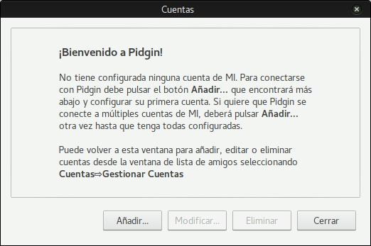
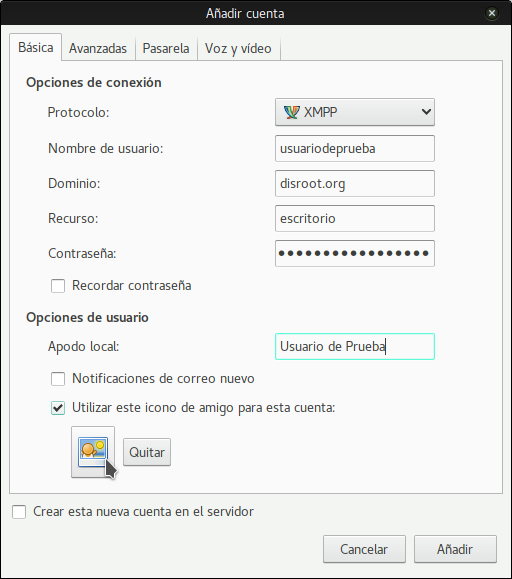

||
|:--:|
|Pidgin es un programa de mensajería multi-plataforma (funciona en la mayoría de los sistemas operativos) y multi-protocolo. Soporta un montón de protocolos de mensajería diferentes como: XMPP, Skype, AIM, TOX, Whatsapp, Facebook, etc. Así que puedes tener toda tu mensajería en una sola aplicación.|

1. **Instala Pigdin.**
La mayoría de los usuarios de GNU/Linux, debería poder encontrarlo en los repositorios de sus distribuciones y descargarlo (mientras buscas, mira si hay algunos plugins adicionales).

2. **Inicialo.**
Serás recibido con un mensaje de bienvenida como este:

Para continuar, necesitamos **añadir una cuenta**.
Si no es la primera vez que usas Pidgin deberías usar este menú:

3. **Configura la cuenta**
Lo primero de todo, elige el protocolo XMPP de la lista desplegable:

Después completa la información necesaria:

| **AVISO**|
|:--:|
|Si deseas usar un avatar (opcional) puedes seleccionar "Usar este icono de amigo para esta cuenta", navegar por tu sistema local de archivos (ordenador) y escoger la foto que quieras usar.|

4. Dale a **Añadir** y ¡está hecho!
Ahora puedes empezar a sermonear a la gente para que abandone las apps corporativas malignas y dé el salto a la "nave" de la federación.

**Todos tus contactos se sincronizarán entre todos los clientes, por lo que puedes usar el chat de Disroot en todos los dispositivos al mismo tiempo.**
