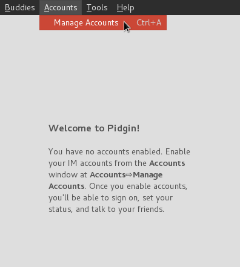

Pidgin est une application de messagerie multiplateforme (fonctionne sur la plupart des systèmes d'exploitation) et multiprotocole. Elle prend en charge un grand nombre de protocoles de messagerie différents tels que: xmpp, skype, AIM, TOX, Whatsapp, facebook, etc, de sorte que vous pouvez avoir toute votre messagerie faite avec une seule application.

Pour configurer le chat Disroot sur pidgin, suivez ces étapes faciles:

1. **Installer Pidgin.**
Si vous utilisez windows/macos, vérifiez le [site web de pidgin](http://pidgin.im/download/) et téléchargez une version.
Si vous êtes un utilisateur linux, vérifiez votre gestionnaire de paquets et télécharger pidgin. (vérifiez pour des plugins supplémentaires pendant que vous y êtes.)

2. **Le lancer.**
Vous serez accueilli par un message de bienvenue comme celui-ci:

Pour continuer, il faut **ajouter un compte**.
Si ce n'est pas la première fois que vous exécutez pidgin vous devriez utiliser le menu:

3. **Mise en place du compte.**
Tout d'abord, choisissez le protocole xmpp dans la liste déroulante:

Remplissez ensuite les informations requises:

!Note! Si vous souhaitez utiliser un avatar (facultatif), vous pouvez sélectionner "Utiliser cette icône de compagnon pour ce compte" et parcourir votre système de fichiers local (ordinateur) pour l'image que vous voulez utiliser.

4. Appuyez sur "**Ajouter**" et c'est fini!
Maintenant, vous êtes prêt à convertir les gens de quitter les applications malveillantes des entreprises et de sauter sur le *vaisseau* de la fédération.

**Tous vos contacts sont synchronisés entre tous les clients, de sorte que vous pouvez utiliser le chat Disroot sur tous les périphériques en même temps.**
