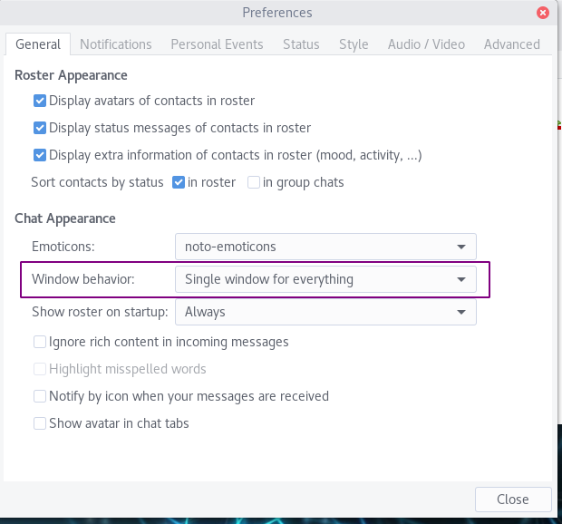
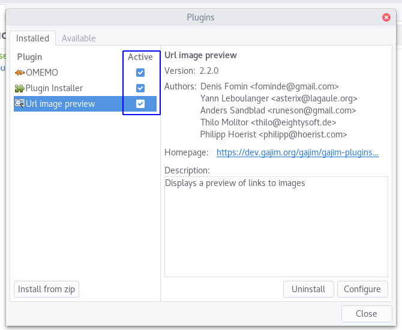

||
|:--:|
|Gajim es un programa de mensajería multi-plataforma (funciona en la mayoría de los sistemas operativos).|

Para configurar el chat de Disroot en Gajim, sigue estos sencillos pasos:

## Instala Gajim
ILa mayoría de los usuarios de GNU/Linux, debería poder encontrarlo en los repositorios de sus distribuciones y descargarlo (mientras buscas, mira si hay algunos plugins adicionales).

## Inicialo
serás recibido por un mensaje de bienvenida como este:

- If you want to use your Disroot account then choose **"I already have an acccount I want to use"**.
- If you want to create a new account, choose **"I want to register for a new account"**

## Setup account
Next fill in the information needed:

Replace **username** by either your Disroot username, or by the username you have already created.

Click on **Finish**.

**All your contacts are synced between all the clients, so you can use disroot chat on all the devices at the same time.**

## Single window
Instead of having several windows (for contacts, for conversations, etc.), you can have a single window for everything.

Go to the **Preferences**. It depends on either you’re using Windows or Linux.
You may find it at the top bar menu. Or you may have to right-click on the Gajim icon in the app list.

In the **Preferences** window, in **Chat Appearance**, change the **Window behavior** to **“Single window for everything”**.

## Plugins
We also need to set up a few plugins.
Depending of your OS, you may have to install them first. [See that page](https://dev.gajim.org/gajim/gajim-plugins)

Then, in the same place you found the **Preferences**, you should find **Plugins**. We need two plugins:
    - OMEMO
    - URL image preview

So go to the **Available** tab and check those two plugins. Click on **Install/Upgrade** when you’re done.

Then, go to the **Installed** tab. Check the plugins to make them active. Then close the windows.

## Join a room
Room are also called group conversations or MUC (Multiple Chat Users).

To join one, click on **Accounts**, then on **Join Group Chat**.

There, some group conversations may appear. If not, click again on  **Join Group Chat**.

- **Nickname**: you can set whatever you want, it doesn't have to be your username!
- **Room**: the name of the room you want to join. If the room doesn't exist, it will then be created, and you will be its admin.
- **Server**: enter **chat.disroot.org**
- **Password**: useful only if the room you're trying to join is password protected.
- **Bookmark**: very useful, it allows to remember room you joined, so that you can easily and quickly find them again. And it allows also to keep them from one device to another one!
- **Autojoin**: if enabled, then on startup, Gajim will automatically open the room.

## History
As soon as you close Gajim, the rooms are cleaned of messages that you've already read.
However, you can still read a group conversation history.

Click on the **three vertical dots** next to the attach file icon and choose **History**.
You can navigate through history by date.
