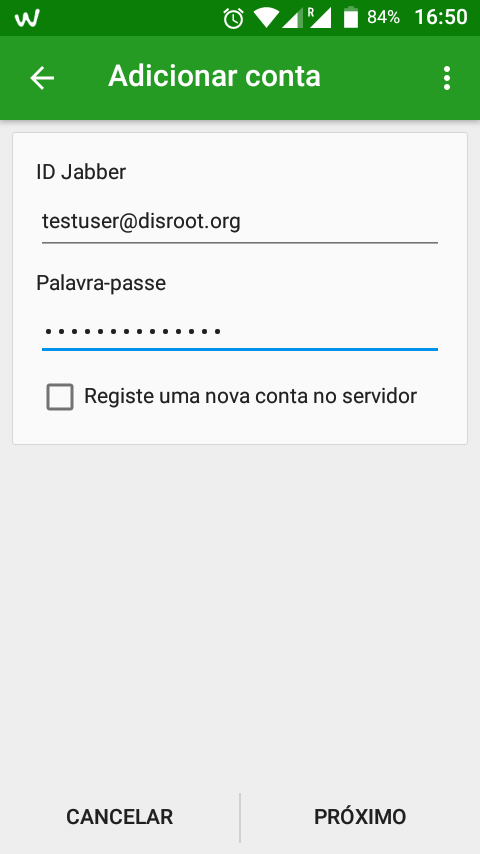

Conversations é um poderoso aplicativo xmpp para Android que suporta criptografia OTR e GPG, além de conferências (Multi-User Chat: MUC). Está disponível no [F-Droid](https://f-droid.org/en/) e em outros repositórios comerciais.

Siga estas instruções para começar.

**1 - Obtenha o Conversations de um dos repositórios.**

**2 - Adicione uma conta.**
-  Escreva seu **e-mail completo do disroot** (**Jabber ID**)
-  **Palavra-passe**

3 - **Adicione um avatar**, se quiser, ou pule esta etapa se não deseja ter um ou já o tem em outro aplicativo.

4 - **Tudo pronto!** Você está pronto para propagar a mensagem: abandonem os aplicativos corporativos malignos e juntem-se à *Nave Espacial* da federação.

**Todos os seus contatos estarão sincronizados entre os diferentes aplicativos. Então, você pode usar o chat disroot em vários dispositivos ao mesmo tempo.**
