|```Meta information```|
|:--:|
|```This howto was last updated on``` **2019-04-28** ```and it refers to:```<br>**Pix-Art Messenger: version v2.2**<br>

**NOTE:**```If the howto refers to an older software version than the provided by``` **Disroot**,```or the one you're using in your device, there could be missing features or small parts of the information that may have changed.```<br> **Disroot's** ```how-to documentation is a community driven procces. We try to keep it as updated as we can.```

---
||
|:--:|
|Pix-Art Messenger is a powerful XMPP client for Android that supports encryption and group chats. It is a fork of Conversations and it's available on F-Droid and other commercial app stores.|

---

# Get Pix-Art messenger
Download it from [**F-Droid**](https://f-droid.org/) and install it on your device.


# Creating or adding an account
First time you start **Pix-Art** you'll see a screen like this:

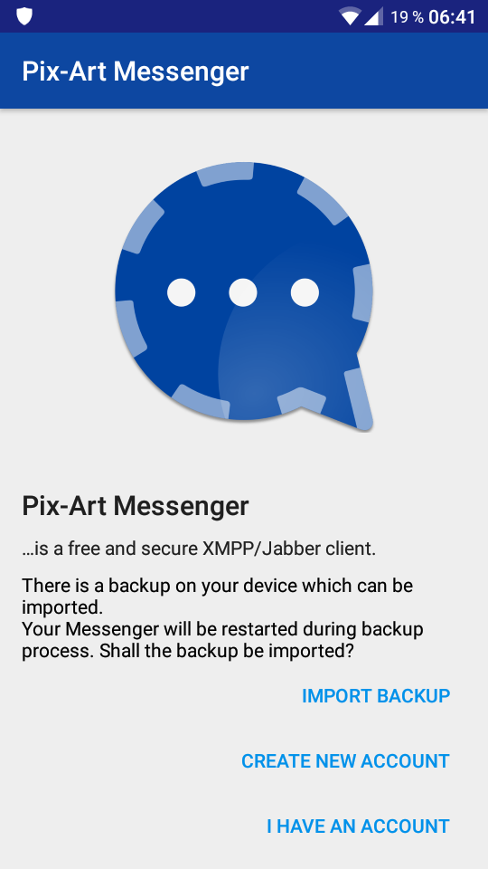

If you want to use your **Disroot** account, choose **I have an account**. However, you can also use an account from another XMPP server.

You can also create an account on any XMPP server that allows registration from an app: choose **Create new account** (this is not possible on **Disroot**).

If you choose **I have an account**, you'll have to fill in the information as it's shown below:

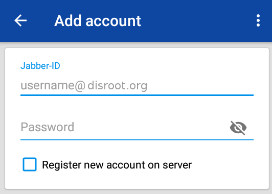

1. **Jabber-ID**: It is also called *XMPP Address*. It is *Your_Disroot_email*
2. **Password:** *Your_super_secret_Disroot_password*
3. **Register new account on server**: let this box unchecked. Check it if you want to create a new account on a XMPP server that allows it (it is not possible on **Disroot**).

Tap on **Next** when you're ready.

You will be asked for a nickname. It doesn't have to be your **Disroot** username, it can be anything you want. Keep in mind that this is how other people will know you.

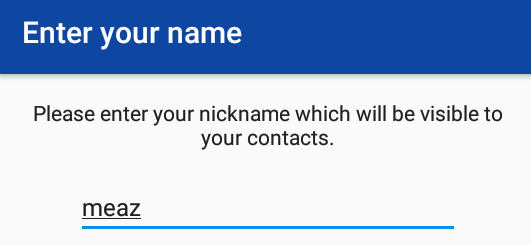

After that, the default **Privacy Settings** opens and you can change them as you wish:

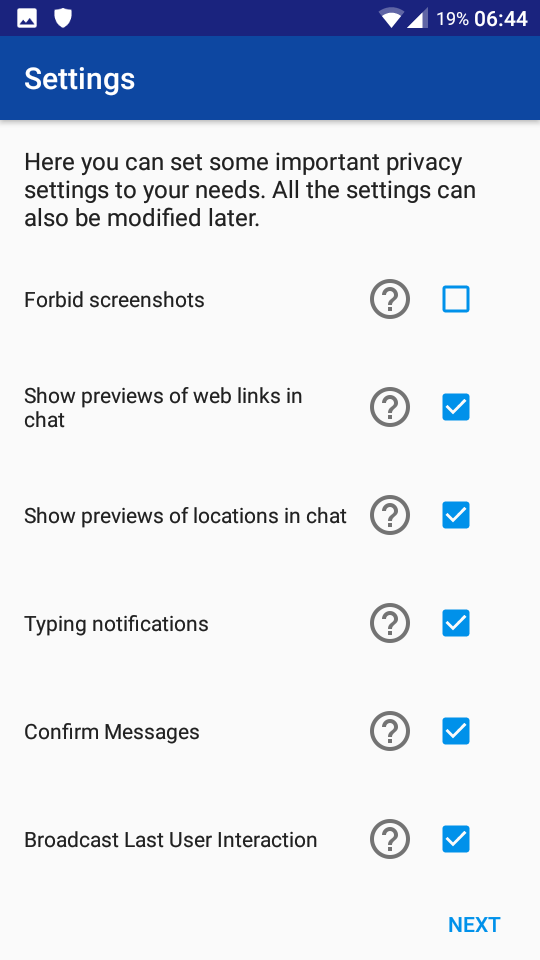

To add an avatar or change it, click on the default avatar and choose the file you want to use. If you don't want to change it, **Pix-Art** will use the default avatar which is an icon with a letter. Click on **Publish** when you're done.

You can click on **Skip** if you don't want to set an avatar or want to do it later.

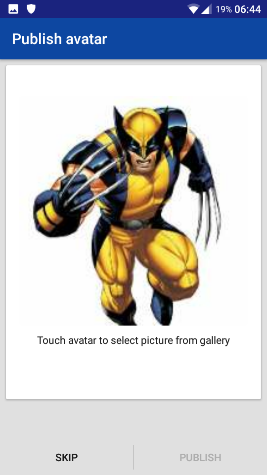


# Home page
This is what we could call the **Pix-Art Messenger** "home page":

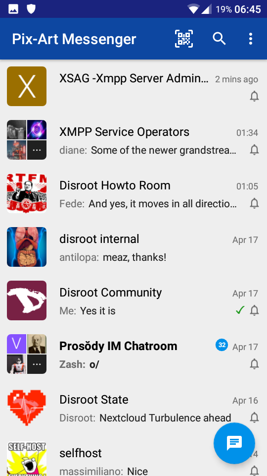

Here you can see all your conversations, either public rooms or 1:1 discussions.

The most recent/active conversations automatically appears on top *(for example, on the image, you see that the* XSAG - XMPP... *room got a message 2 minutes ago, that's why it appears on the top)*.

Discussions are set in bold to let you know that there are unread messages. You can also know how many messages you still need to read (check on the image the *Prosody IM Chatroom*: there are 32 unread messages).

The **blue button** on the bottom-right corner allows you to get to the Contacts list and the Rooms list, and to add/join contacts and rooms.


# Rooms
Room are also called group conversations or MUC (Multiple Users Chats).

From the **Home** page, click on the **Blue button** 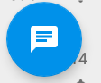.

From there, choose **Multi Users Chats**.

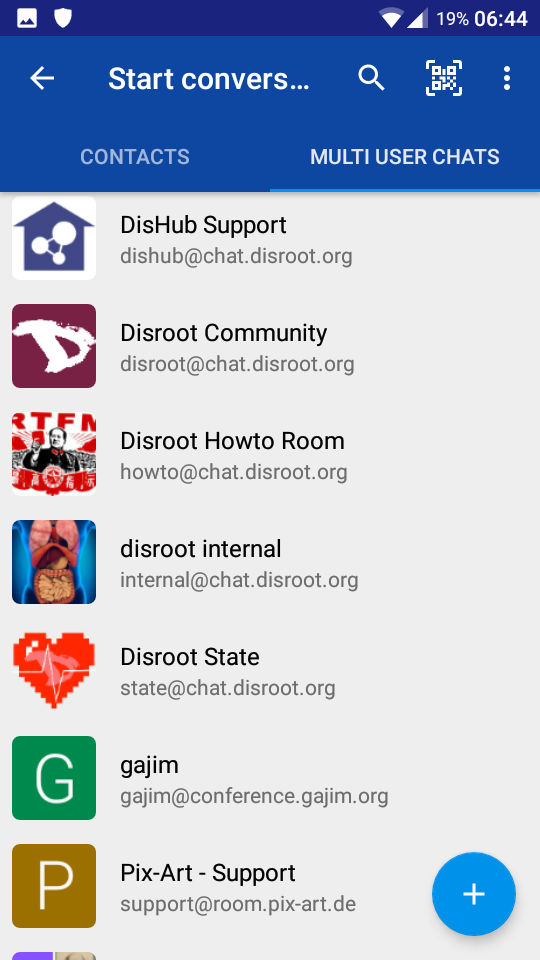

As you can see, a room on **Disroot** server looks like this *room_name@chat.disroot.org*.

But you can have room form other XMPP server, for example *support@room.pix-art.de*.

## Entering or creating a room
From the list of your **Multi Users Chats**, click on the **Blue Plus button** .

You'll get this:

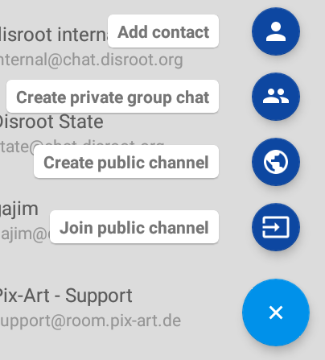

- **Create private group chat**: if you choose this, only the contacts you choose will be able to enter your group. The **contacts** must be added in your contact list first.
- **Create public channel**: if you choose this, anyone that know the address of your room will be able to join it.
- **Join public channel**: you can join only public channel with ths option. To join a private group, the owner needs to add you as a member/contact.

### Create private group chat
If you choose **Create private group chat** from the options, you will get this:

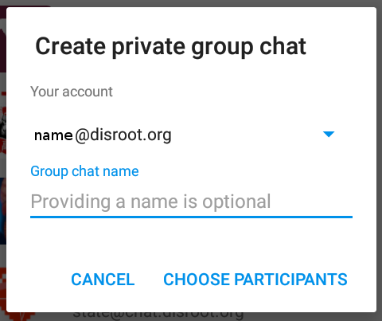

- **Your account**: choose the account you want to use. You may have several accounts, from different providers.
- **Group chat name**: Pix-Art will create a random room address. If you want to have an alias to this room so that you find it easier to remember it, then do that here.

Then, you need to choose the participants of your private group chat. Those participants must already be in your contacts list:

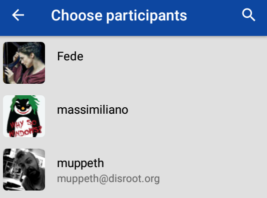

To invite new contact to this private group, click on the three dots  that you an see in the upper-right corner of the room.

From the following menu, choose **Invite Contact**.

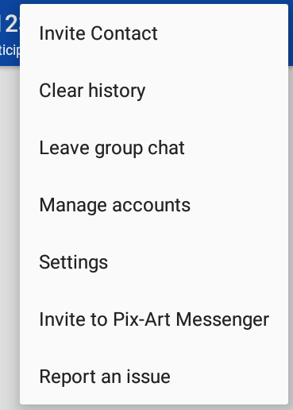

Don't forget that those new participants that you want to add in your room must already be in your contacts list.

### Create public channel
If you choose **Create public channel** from the options, you will get this:

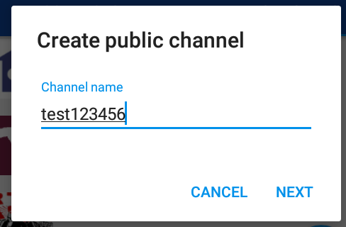

**Channel name**: the name you want to give to your room/channel.

If you choose **test123456** then your room address will be *test123456@xmpp_room_server*.

Click on **Next** when you're done.

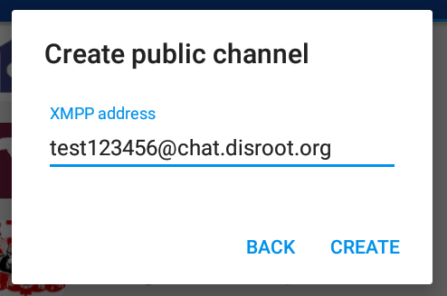

Pix-Art automatically adds the room server address if you have only one account. So if you're account is a **Disroot** account, **@chat.disroot.org** is added to the room name.

Click on **Create** when you're done.

### Join public channel
If you choose **Join public channel** from the options, you will get this:

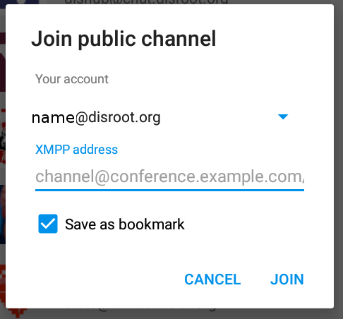

- **Your account**: choose the account you want to use. You may have several accounts, from different providers.
- **XMPP address**: enter here the address of the room you want to join in. For a room on the **Disroot** XMPP server, the address will look like this:  **room_name@chat.disroot.org**.
- **Save as bookmark**: check this box if you want to be able to keep this room from one device to another, or if you want to "remember" this room.
- **Join**: click here when you're done.

## Room options and informations
To access the room options and informations, click on the name of the room at the top of the room:

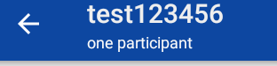

From there you have several possibilities:

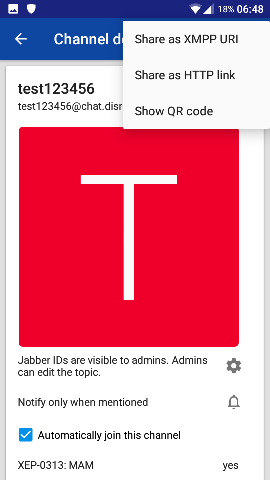

- If you click on the three dots on the upper-righ corner, you can **Share** the room address in different ways.
- If you're the owner of the room, you can set an avatar for your room. In this example, you see that the avatar is red square with a white T in it. Simply click on it to change it.
- If you're the owner of the room, you can click on the **wheel**, and change the room options: if everyone can see the Jabber/XMPP address of everyone, if anyone can change the room subject, if the channel is moderated.
- You can change the way you get notified by clicking on the **bell**.
- If you choose **Automatically join this channel**, that means that when you open Pix-Art, Pix-Art will pull all the messages of this room directly.

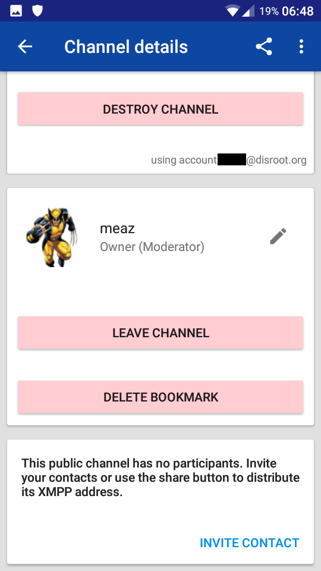

- **Destroy channel**: will remove channel not only from your device, but also from the server, so no one will be able to join it again. It is available only if you're the owner of the room.
- You can change your username. That means that you can have different usernames in different rooms.
- **Leave Channel**: will disconnect you from the channel, meaning you won't receive any messages from it anymore, and won't be able to write in it anyore, until you reconnect/rejoin it.
- **Delete bookmark**: you bookmark a room in order to find it easier, and also to keep it from one device to another. If you want to remove a bookmark, this is the place.
- **Invite contact**: if you want to have other participants to join your room, click on this button.


## Leaving a room
To leave a room, enter it, the click on the three dots  that you an see in the upper-right corner of the room.

From the following menu, choose **Leave group chat**.


You're then disconnect of the room. But if you added it in your bookmarks, it is still there.


# Direct chat: 1 to 1 conversation
You can also chat with someone in private, in a 1:1 discussion with only the two of you participating.

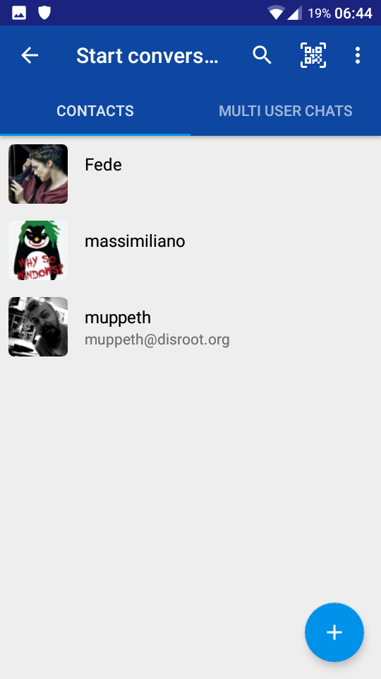


## Adding a contact
From the list of your **Contacts**, click on the **Blue Plus button** .

You get this:


So choose **Add contact**.

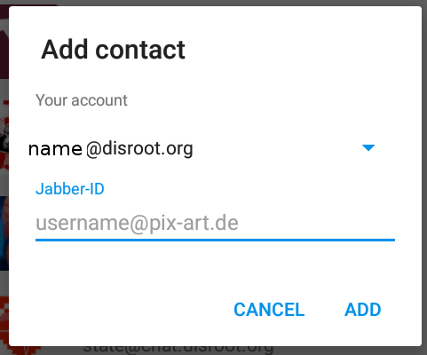

- **Your account**: choose the account you want to use. You may have several accounts, from different providers.
- **Jabber-ID**: this is the XMPP address of the contact you want to add. If this contact is a **Disroot** contact, this is simply his/her **Disroot** email, so **username@disroot.org**.

## Removing a contact
To remove a contact, right-click on his/her name in your contact list. Choose **Manage contact** then **Remove**


# Write a message
For 1:1 discussion or in a room, here is where you write your message:

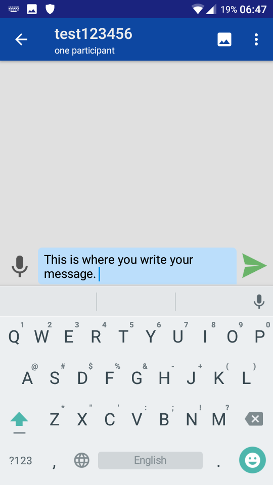

Click on  to send it.

If you're writting a room, make sure you're in the right room before sending your message! You can see that in the top of the window:


Here we are in the *test123456* room, and there is only *one participant* online at the moment.

You can send files by clicking this icon 

You then get several possibilities:
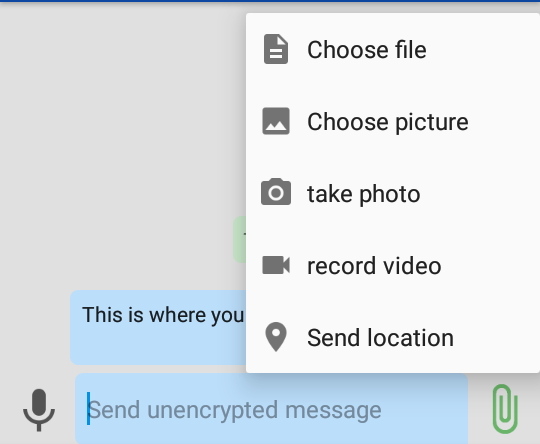

The files maximum size on **Disroot** XMPP server is 10MB.

## Writing in private group chat
If you're in a private group chat, Pix-Art will forced you to write encrypted (using what is called **OMEMO**). Otherwise, you'll get this message:
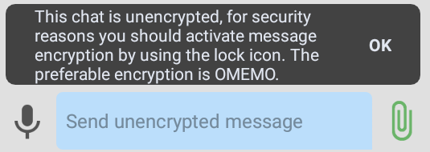

To do that, make sure that the lock icon on the upper-right corner of the private group chat looks like this:
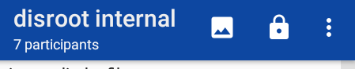

Then you should see this when you write a message:

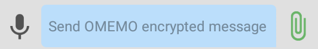

**Note**: to use OMEMO in a group chat, you must trust the participants OMEMO fingerprints. So you'll get this window when tapping **OK** in the OMEMO message above:

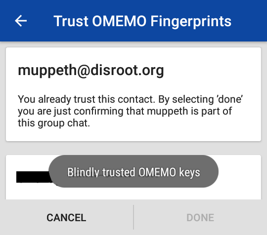

If you trust all the participants, then you accept their OMEMO fingerprints by tapping **Done**.

## Encryption in 1:1 discussion
You can encrypt your message in your 1:1 discussions.

To do that, make sure that the lock icon on the upper-right corner of the discussion looks like this:


If that is not the case, click on this **lock icon** and choose **OMEMO**.

Then you should see this when you write a message:


# Using several accounts
On Pix-Art, you can only use one account by default. However, you can change this.
In the **Settings**, choose **Expert settings**.

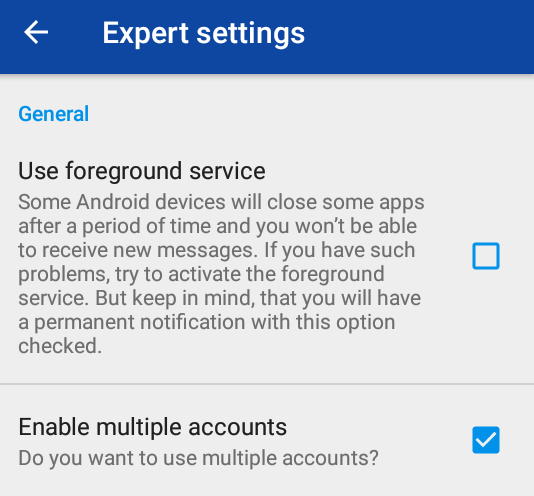

Make sure that the **Enable multiple accounts** box is checked.

Then, from the **Home** page, click on the dots  on the upper-right corner and choose **Manage accounts**.

You get this:
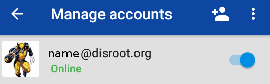

Click on the **add** icon . You can then add your account as previously explained.


# Removing an account
From the **Home** page, click on the dots  on the upper-right corner and choose **Manage accounts**.

Long press your account and choose **Delete account**.

 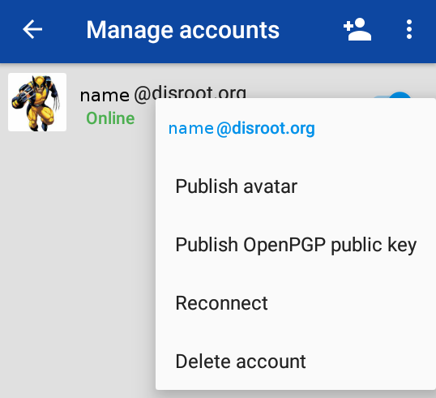


# Final note on Pix-Art
We have just presented what we think to be the most important features to start using your XMPP account on **Pix-Art**.

If you have any question regarding the use of **Pix-Art**, join the Pix-Art XMPP room: support@room.pix-art.de or check the [github repo](https://github.com/kriztan/Pix-Art-Messenger)


 <center><a rel="license" href="http://creativecommons.org/licenses/by- sa/4.0/"></a><br />This work is licensed under a <br><a rel="license" href="http://creativecommons.org/licenses/by-sa/4.0/">Creative Commons Attribution-ShareAlike 4.0 International License</a>.</center>

---
