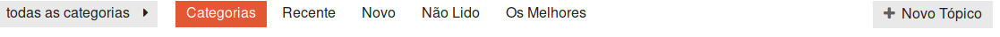
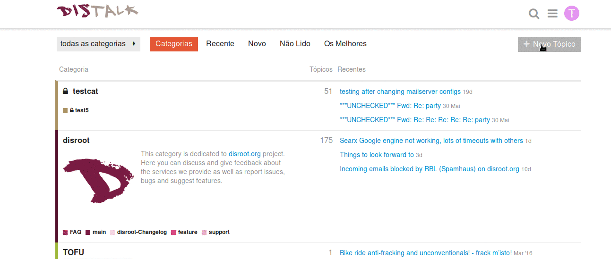
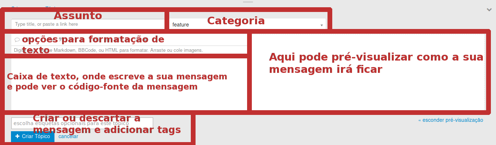
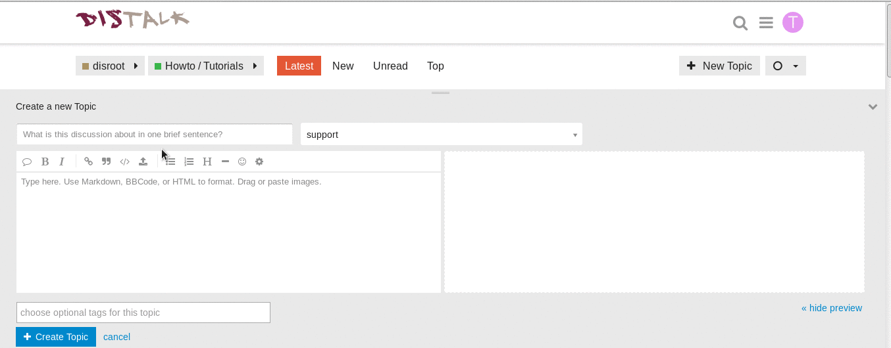
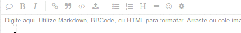
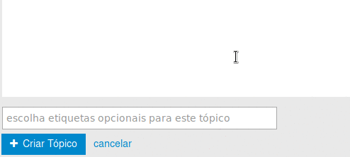
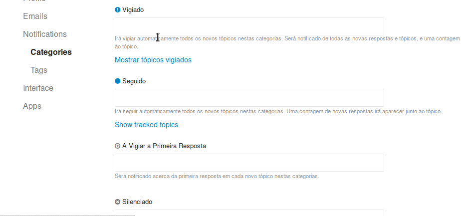
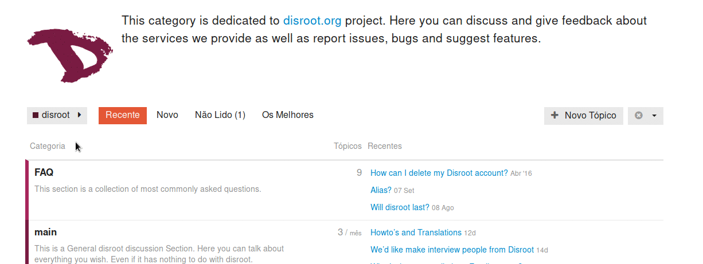

O Discourse tem um interface de utilizador simples e intuitivo. Mesmo que você esteja a usar o Discourse principalmente como uma mailing list, recomendamos que que dê uma vista de olhos no Discourse para ter uma melhor experiência de utilizador. Aqui seguem algumas dicas para começar a usar o Discourse:

# Fazer Login
Pode fazer login no fórum com uma conta de utilizador apenas para o Discourse, ou com a sua conta Disroot "tudo em um", caso tenha uma.
Vá a https://forum.disroot.org/ e carregue em   NO canto superior direito.
**Caso tenha uma conta de utilizador no Disroot, certifique-se que seleciona a opção "Login with disroot account" antes de inserir a sua password e nome de utilizador.**

Caso ainda não tenha uma conta de utilizador no Disroot, pode criar uma visitando https://user.disroot.org, o que lhe dará acesso adicional a: armazenamento cloud, email, xmpp gestor de projetos. Também pode decidir criar uma conta apenas para o fórum, encontrará o botão "Sign up" no canto superior direito da página.

# O menu de utilizador
Os botões no canto superior direito incluem, pesquisa e as suas definições pessoais de utilizador:

Carregue no teu ícone de utilizador o botão com a primeira letra do seu nome de utilizador, (assim que tiver uma foto de utilizador a letra será substituída por essa foto) para poder ver as suas mensagens e notificações e entrar nas definições da sua conta e área de utilizador.

Os números pequenos no topo do seu avatar indicam o número de notificações (à direita) e mensagens (esquerda) que tem. Quando clica no seu avatar verá todas as suas mensagens e notificações listadas em baixo. Também pode ver as suas mensagens através do botão .

Para entrar nas definições pessoais carregue no seu avatar e depois no ícone . Aqui pode mudar o seu avatar, ajustar o sistema de notificações, as categorias vistas e acompanhadas e muito mais.

Nestas definições pessoais pode também alterar a língua do interface para Português ou outras línguas.

# Navegação
Quando faz log in no fórum (ou quando carrega em  para regressar à página principal do fórum), irá encontrar uma lista das categorias que está a acompanhar. Categorias são como sub-fóruns. Se é membro de um grupo privado, no fórum, as categorias desse grupo serão listadas no topo da página e as restantes categorias públicas serão listadas em baixo. Mais informações sobre como seguir ou esconder certas categorias serão colocadas em breve noutro tutorial.

A barra no topo permite navegar rapidamente entre os posts: Recente, Novo, Não Lido, Os Melhores. Também pode filtrar as categorias que quer ver usando o botão  .
No fim desta barra de top encontra o botão para criar uma nova thread de discussão (Novo Tópico).

Os tópicos mais recentes também aparecem listados na sua página principal, à direita do botão C
"Categorias". Quando carrega num tópico será encaminhado para o último post não lido desse tópico.

# "Continua para baixo"

Assim que estiver na thread de um tópico pode simplesmente continuar a ler a thread toda numa única página. Não há botões de "página seguinte", ou "página número X" - para continuar a ler basta continuar mover para baixo!

Á medida que novos posts chegam eles irão aparecer automaticamente na thread.

# Responder aos posts

Para enviar uma reposta no tópico use o butão  no fim da página.

Para responder a um post específico dentro da thread use o botão  que existe nesse post especifico.

Para inserir uma citação (de algo escrito num post anterior), selecione o texto que quer citar e depois carregue no botão "responder". Repetir este processo no caso de várias citações numa resposta!

Para ter a certeza que que alguém em particular recebe uma notificação acerca da sua resposta, cite o nome de utilizador dessa pessoa. Use uma @ antes para comecar a selecionar o nome de utilizador da pessoa em causa
Ex: `@umutilizadorqualquer`

Também pode assinalar um like, partilhar, assinalar, guardar nos um post bookmark.

Também pode convidar outro utilizador a participar numa determinada thread, carregando no botão  no final da página.

# Criar um novo tópico
Pode criar um tópico dentro de uma categoria (support, changelog, etc) ou indo até à respetiva categoria e carregar no botão   ou simplesmente carregar no botão novo tópico e quando estiver a compor a mensagem, escolher a categoria na qual quer que a mensagem seja postada.

# O interface
O interface é relativamente simples.

O Discourse tem suporte para Markdown e HTML para compôr as mensagens. Do lado esquerdo do painel escreve o seu tópico e no lado direito do painel pode pré-visualizar como o seu tópico será apresentado.

Mas não é necessário aprender Markdown ou HTML para escrever um tópico. Pode simplesmente usar as opções de formatação de texto apresentadas na barra superior:
**Citação**, **Bold**, **Itálico**, **Lista de Items**, **Lista Númerada**, **Títulos**, **Linha horizontal**, **Emojis**. Atalhos como CTRL+b ou CTRL+I
funcionam.

## Inserir imagens e videos
Você pode inserir imagens ou vídeos no seu post, arrastando-os do para a parte da mensagem onde os quer colocar.

## Fazer upload de ficheiros para o seu tópico
Pode fazer o upload de ficheiros carregando no botão "Carregar"  e depois navegar pelos ficheiros até encontrar o ficheiro que quer.

## Mover ficheiros, imagens e vídeos de um sitio para o outro dentro do post
Ficheiros, imagens e vídeos são representados no lado esquerdo do ecrã (onde se pode ver o código todo do post) da seguinte forma, ex:

**Ficheiros**
> < a class="attachment" href="/uploads/default/original/1X/ffd8f38b235dbf199a919f0187ae63a183d22ada.odt">hello world.odt</a> (8.0 KB)

**Imagens**
> < img src="/uploads/default/original/1X/019a9706a4676128e452b81f450851353f36175c.png" width="690" height="347">

**Vídeos**
>https ://forum.disroot.org/uploads/default/original/1X/59b17ec97a8daabcb96a787b4900f3d3221083da.mp4

Para os mover de um sítio para o outro dentro do post que está a escrever, basta cortar a linha de texto que representa o ficheiro em causa e colá-la noutra parte do post.
Para além disso, no caso de imagens, é possível ajustar o tamanho com que vão aparecer no post alterando os valores que aparecem à direita de  `height=` (altura) e `width=` (largura) na linha.

## Adicionar tags/etiquetas ao seu tópico
Adicionar um tag torna mais fácil para outras pessoas pesquisarem tópicos ou threads específicos sobre um determinado assunto. Adicionar um tag é super fácil.

Assim que tiver terminado de compor o seu post basta carregar em  "Criar tópico" 

# Como vigiar/acompanhar ou silenciar uma categoria
No Discourse é possível regular o fluxo de mensagens que se recebe via fórum e por email. Pode silenciar uma categoria ou apenas uma sub-categoria que você não tenha interesse em seguir, ou selecionar "vigiar" categorias, o que vai garantir que receberá sempre notificações e emails da(s) categoria(s) em que está interessado.

Se silenciar uma categoria, irá também silenciar todas as suas sub-categorias, a não ser que especifique que quer vigiar alguma sub-categoria. Se "silenciar" uma categoria ou sub-categoria, será na mesma capaz aceder às mensagens no fórum, caso queira dar uma olhada de tempos a tempos. Simplesmente não receberá nenhum email ou notificação acerca desses posts/tópicos.

As categorias e sub-categorias existentes no fórum do Disroot atualmente são:

* disroot
 * disroot-Changelog
 * support
 * feature
 * main
 * FAQ
* Open Talks
* TOFU
* Engineering Yuvasamithi

A melhor maneira de selecionar categorias para vigiar/silenciar é nas suas preferências, a partir daí pode fazer todas as suas escolhas a partir de um único sítio.

Basta ir a **Categories** e irá ver os **campos** para **Silenciado** e **Vigiado**, escrever as que quer em  cada campo e no final carregar em **Guardar as alterações** para elas entrarem em vigor.

O outro método é ir a cada categoria ou sub categoria e fazê-lo a partir daí carregando no botão à direita de "Novo tópico" 

 Pode encontrar mais dicas na [Página de boas-vindas do Discourse](https://forum.disroot.org/t/welcome-to-discourse)
