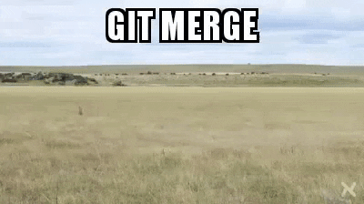

# Git Basics

We'll not cover all the aspects of using git in this tutorial. There are lots of in-depth tutorials and books written about this tool and what we're aiming at is providing a short and easy way to contribute to tutorials and translations.

# Before starting the work

## Installing git
Since all the modifications will happen on your local machine, you need to [install git](https://gist.github.com/derhuerst/1b15ff4652a867391f03) to be able to send your changes as well as sync changes of others. Depending on your platform the ways to install git may vary so check the link above or refer to your platform specific documentation.

## Installing Atom editor
If you haven't yet, it's time to install [Atom](https://atom.io). **Atom** is a feature rich text editor with special git integration. If your Operating system is not automatically detected or listed when going to [Atom](https://atom.io) website, check [Other platforms](https://github.com/atom/atom/releases/latest). For all Arch users, you can simply install it using `pacman -S atom` or other package manager of your choice.

## Create an account on git instance
After installing **git** and **Atom**, you'll need an account on **Disroot** git instance. As of late we fortunately host our own **gitea** instance, but you'll have to register an account separately. Your **Disroot** account doesn't apply here. For a better assignment we suggest to use the same username as on **Disroot**.

To create an account just go to [https://git.disroot.org](https://git.disroot.org) and register.

## Preparing the workspace
Git is designed with collaboration in it's core. So, first thing we need to do is get a copy of all files within the project onto our local hard drive. This process is called "*cloning a repository*". All modifications are done on our local machine (most of the work is made offline). Once we've decided that the changes (new tutorial, translation) are finished we can sent/sync them back to the repository on the server (*push*).

### Cloning the **Howto Disroot** repository
To clone the repository just open a terminal, navigate to the directory you would like to clone the repository to, and run `git clone <url>` command, where *<url>* is basically the address of the repository you want to clone. In our case it would be:

`git clone https://git.disroot.org/disroot/howto`

Once the repository is copied to your hard drive you will see a `howto` directory that consists of all the files you could previously browse in your web browser when on our repository's url.

You can later move that directory to any place you want on your computer.

### Access to the repository
In order to be able to commit changes to **Disroot**'s git repository, you need to request access. This is done via [our git project page](https://git.disroot.org/disroot/howto)

Once admins grant you the access, you can "*push*" your changes to the server.

!! 
!! NOTE: You can start working without access granted as all the changes happen on your local computer.

# Starting to work
Now you can start **Atom**.

Go to the File tab, select `Open Folder` and choose the directory you've just cloned (*howto*).

The interface of **Atom** is clean and easy to understand. The left sidebar is your project's navigation tree, the middle window is where you edit files and bottom bar indicates number of changed files, current branch, quick pull/push to git.

You can open and work on multiple files in tabs or as split screen side by side.
Unsaved files with local modifications are marked with a blue dot (depending on the theme you use of course).
To save the file changes use the *File* menu or the *Ctrl+s* keyboard shortcut.

**Before** you start working on the files, you'll need to create your own **branch**.

## Creating branches
Branches are basically your own private workspaces.

Each git project has it's own **master** branch. Master branch is the main, *production* copy of the project. This branch is automatically synced with the website, so any change made to that branch are instantly visible on the website. That is also why adding any changes to the **master** branch is restricted only to the owners of the project.

In order to start working, create your own branch. This will basically make a clone of the **master** branch.

On the bottom-right corner of **Atom**, click on **master** (or any other branch name) and choose **New Branch**. Choose a name for your branch, something easy for other to know what you're working on, what your branch is about. For example if your planning to work on a nextcloud howto, call it "nextcloud_howto" or something similar.

Press **Enter** on your keybord when you're done.

Now, you need to **publish** your new branch so that it is created on the server. **Atom** will ask your credential. Use the one created for our git instance.

Switching between branches can also be done from that menu. Current working branch is visible on the bottom bar. Click on it: other local branches will appear.

Once the branch is created and published, and you have change the current work on this new branch, you can create new files, modify existing ones, etc.

## Committing changes
Now you're working on your computer creating new tutorials or translating existing ones. Apart from saving changes to your laptop, you can/should also **commit** your changes.

Committing changes syncs the work you've done on your branch to the git server. So a commit is a set of files created or modified. If the branch doesn't exist on repository, it will be created and all your modifications and new files will be uploaded to the server. In that case you can work on your files on multiple machines, or other people can take over, help working on your branch.

To commit your changes need to:
 - Make sure all files are saved
 - **Stage all** the files you've modified and want to commit to the server
 - Write a **commit message** (a short and very specific summary of what has been changed)
 - Hit **commit** button

 

 Once the files are committed, it's time to **push** (send) them to the server:
 - Open Push/Pull popup window
 - Press Push

 

## Merge request
Once you think your work is finished and ready to be published on the website, it's time to merge it to the **master branch**.

  **NOTE!!!**

While you are working on your branch, other users possibly commit and merge their own changes, esp. if you are working on existing files. If those changes from the other users have already been merged to the **master branch**, the version of the files you changed may no longer be the actual ones and therefore the changes from other users may not be included in your files. In that state, if you want to let your changes be merged to the **master branch**, this process may be very chaotic.

Luckily git is able to compare versions and to insert your changes into the updated file versions. To trigger this, you need to update your branch **before** you **Create** a **Merge Request**. By doing this you will spare the admins and yourself a lot of needless work:

 - First of all is to make sure all the changes are committed
 - Open Terminal (Linux)
 - Switch to **Master Branch**: ***git checkout master***
 - Update **Master Branch**: ***git pull***
 - Switch to working branch: ***git checkout <Branch_Name>***
 - Update your working branch from **Master Branch**: ***git rebase master***
 - Verify the changes and commit the changes to the Server

Now you can start with the final steps of merging your files to the **Master Branch**:

- First of all is to make sure all the changes are committed.
- Login to [https://git.disroot.org](https://git.disroot.org)
- If you pushed any changes to the server on your branch, in the top right you'll see a **"Create Merge Request"** button that will open the merge request form.
- Add a title
- Add a descripton
- Make sure the **source branch** is the one you want to merge from (the one you've been working on)
- Make sure the **target branch** is the one you want to merge to (usually Master branch
- Checkin the box **Delete source branch when merge request is accepted.** is also a good thing to do if you're completely done working on your branch.

Once you've created a merge request, it will be reviewed by **Disroot** admins and, if it's all right, they can approve your commit then. This means your changes will be merged with the master branch and therefore visible on the website.

If there's any issue, admins could request you to correct something. Once all the corrections are made and the documentation meets the **Disroot** guidelines, your merge request will be pulled to the master.

## Pulling changes from the server
If you want to keep the local **master** branch and your local branch up to date, you'll need to pull changes from the server.

Each time someones gets his merge request pulled in to the master, everyone should also pull the changes to their local branches. Then you can easily see what's new and what has changed recently. On the master branch we keep a file called **CHANGELOG** where we note all significant changes to Howtos.

Pulling should be done on regular basis (specially before you start working on new branch).

 - Open Push/Pull popup window
 - Press **Pull**

## Template to use for how-to's
You can copy the content [here](en/template.txt) and create your how-to file.
