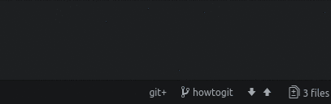
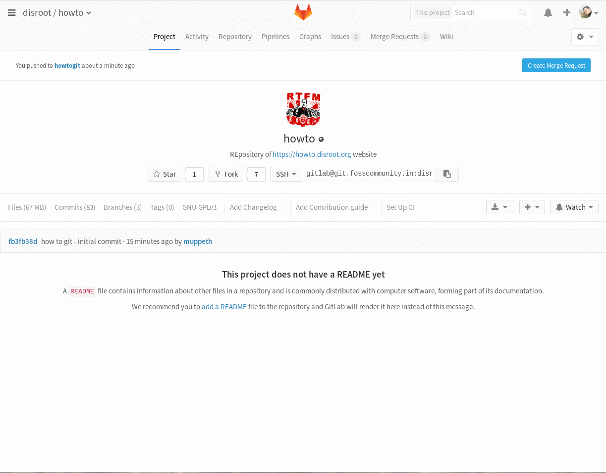

Cet article va essayer d'expliquer les bases de l'utilisation de git pour contribuer aux traductions ainsi que pour soumettre de nouveaux tutoriels.

Afin de suivre tous les changements et de travailler avec plusieurs personnes en même temps, nous avons choisi d'utiliser **git** comme système de contrôle de version. Git est un outil très populaire parmi les développeurs et les administrateurs système, mais ses fonctionnalités peuvent être facilement applicables partout où l'historique des changements et la capacité de soumettre du contenu et de collaborer dans un groupe est nécessaire.

Dans ce tutoriel, nous ne couvrirons pas tous les aspects de l'utilisation de git. C'est un outil très complexe et puissant avec des tonnes de tutoriels approfondis et des livres écrits à son sujet. Ce que nous cherchons est de fournir un moyen court et facile de contribuer aux tutoriels et aux traductions.

# Comment créer un compte sur l'instance git
Tout d'abord, vous avez besoin d'un compte sur l'instance git utilisée par disroot.org.<!-- Malheureusement git n'est pas encore un service fédéré donc vous devez avoir un compte. Grâce à nos amis de **FOSS Community India**, nous hébergeons tout notre travail sur leur instance gitlab.-->
Pour créer un compte, allez sur [https://git.disroot.org](https://git.disroot.org) aet enregistrez-vous. En plus de l'enregistrement d'un nouveau compte, vous pouvez choisir d'utiliser l'un des fournisseurs d'ID tels que gitlab.com, github, twitter, gitbucket, google si vous avez déjà un compte sur l'une de ces plateformes.

# Installer Git
Comme toutes les modifications seront effectuées sur votre machine locale, vous devez [installer git](https://gist.github.com/derhuerst/1b15ff4652a867391f03) pour pouvoir envoyer vos modifications ainsi que les changements de synchronisation des autres. Selon votre plate-forme, les méthodes d'installation de git peuvent varier, alors vérifiez le lien ci-dessus ou consultez la documentation spécifique à votre plate-forme.

# Installer l'éditeur Atom
Si vous ne l'avez pas encore fait, il est temps d'installer [Atom](https://atom.io). Atom est un éditeur de texte riche en fonctionnalités avec une intégration git spéciale. Si votre système d'exploitation n'est pas automatiquement détecté ou répertorié lorsque vous accédez au site [Atoms](https://atom.io), vérifiez [d'autres plateformes](https://github.com/atom/atom/releases/latest). Pour tous les utilisateurs d'Arch, vous pouvez simplement l'installer en utilisant `pacman -S atom` ou un autre gestionnaire de paquets de votre choix.

# Cloner le dépôt
Git est créé avec la collaboration dans son noyau. La première chose que nous devons faire est d'obtenir une copie de tous les fichiers du projet (git repository) sur votre disque dur local. Toutes les modifications sont effectuées sur votre machine locale (vous travaillez hors ligne). Ce n'est qu'une fois les changements décidés (nouveau tutoriel, traduction) terminés que vous pouvez décider de les envoyer/synchroniser (push) vers le référentiel sur le serveur.

La façon la plus simple de cloner le référentiel est d'ouvrir votre terminal, en naviguant vers le répertoire dans lequel vous voulez cloner le référentiel, et d'exécuter la commande `git clone <url>`, où *<url>* est essentiellement l'adresse du dépôt que vous voulez cloner. Dans notre cas, ce serait:

`git clone https://git.disroot.org/disroot/howto`

Une fois que le dépot est copié sur votre disque dur, vous verrez un répertoire `howto` qui contient tous les fichiers que vous pouviez auparavant voir dans votre navigateur lorsque vous êtiez sur l'url de notre dépôt.

Vous pouvez déplacer plus tard ce répertoire à n'importe quel endroit de votre disque dur.

# Demander l'accès au dépôt howto git
Pour pouvoir suggérer des changements dans le dépôt git, vous devez demander l'accès. Une fois que les administrateurs vous accordent l'accès, vous pouvez pousser vos changements sur le serveur (notez que vous pouvez commencer à travailler sans l'accès accordé car tous les changements se produisent sur votre ordinateur local).

# Maintenant, le travail peut commencer.
Maintenant vous pouvez démarrer Atom et `Ouvrir le dossier` que vous venez de cloner (*howto*). L'interface d'Atom est claire et facile à comprendre. La barre latérale de gauche est l'arborescence de navigation de votre projet, la fenêtre du milieu est l'endroit où vous éditez les fichiers et la barre du bas indique le nombre de fichiers modifiés, la branche courante,  pull/push rapidement sur git.

Vous pouvez ouvrir et travailler sur plusieurs fichiers dans des onglets ou comme écran divisé côte à côte.
Les fichiers non sauvegardés avec des modifications locales sont marqués d'un point bleu (selon le thème que vous utilisez bien sûr)
Pour enregistrer les modifications de fichier, utilisez le menu *Fichier* ou le raccourci clavier *Ctrl+s*.

Mais avant de commencer à travailler sur les fichiers, vous devez créer votre propre: **branche**

# Branches Git
Les branches sont essentiellement vos propres espaces de travail privés. Chaque projet git a sa propre branche **master**. La branche master est la principale copie *production* du projet. Cette branche est automatiquement synchronisée avec le site Web, de sorte que toute modification apportée à cette branche est immédiatement visible sur le site Web. C'est aussi pourquoi l'ajout de modifications à la branche **master** est limité aux seuls propriétaires du projet.
Afin que vous puissiez commencer à travailler, créez votre propre branche. Ceci fera en fait un clone de la branche **master**.

Il est également possible de passer d'une branche à l'autre à partir de ce menu. La branche de travail actuelle est visible sur la barre inférieure.

Une fois la branche créée et modifiée, vous pouvez créer de nouveaux fichiers, modifier les fichiers existants, etc.

# Valider vos changements
Okay, donc vous travaillez sur votre ordinateur pour créer de nouveaux tutoriels ou traduire ceux qui existent déjà. En plus d'enregistrer les modifications sur votre ordinateur portable, vous pouvez/devriez également valider vos modifications. Le fait d'effectuer des changements synchronise le travail que vous avez fait sur votre branche avec le serveur git. Si la branche n'existe pas sur le serveur, elle sera créée et toutes vos modifications et nouveaux fichiers seront envoyés sur le serveur. Dans ce cas, vous pouvez travailler sur vos fichiers sur plusieurs machines, ou d'autres personnes peuvent prendre la relève, vous aider à travailler sur votre branche.

Pour valider vos changements, voici ce qui doit être fait:
- s'assurer que tous les fichiers sont sauvegardés
- mettre en "stage" tous les fichiers que vous avez modifiés et que vous souhaitez "commit" sur le serveur.
- Ecrire un message de "commit"- écrivez un petit résumé de ce qui a été changé.
-  Appuyez sur le bouton Valider
 
Une fois les fichiers validés, il est temps de les pousser vers le serveur:
-  Ouvrir la fenêtre popup push/pull
-  Appuyer sur la touche

# Demande de fusion ("Merge request")
Une fois que vous pensez que votre travail est terminé et prêt à être publié sur le site, il est temps de le fusionner avec la branche **master**.

- Bien sûr, vous devez d'abord vous assurer que tous les changements sont bien effectués.
- Connectez-vous sur [https://git.disroot.org](https://git.disroot.org)
- si vous avez appuyé sur n'importe quel changement au serveur de votre branche, en haut à droite, vous verrez le bouton **"Créer une demande de fusion"**.
- Cela va ouvrir le formulaire de demande de fusion.
- Ajoutez le titre
- Ajoutez une description
- Assurez-vous que la **branche source** est celle sur laquelle depuis laquelle vous voulez fusionner  (une branche sur laquelle vous avez travaillée)
- Assurez-vous que la branche **cible** est celle vers laquelle vous voulez fusionner (habituellement la branche "master")

Une fois que vous avez créé la demande de fusion, elle sera examinée par les administrateurs de Disroot. Les administrateurs peuvent alors accepter votre commit ce qui signifie qu'il sera fusionné avec la branche master et donc visible sur le site ou vous demander de corriger quelque chose. Une fois que toutes les corrections sont effectuées et que les *chefs suprêmes* de Disroot sont satisfaits, votre demande de fusion sera ajoutée à la banche "master".

# Récupérer ("pull") les changements du serveur
Si vous voulez garder la branche locale **master** et votre branche locale à jour, vous devez récupérer les modifications du serveur. Chaque fois que quelqu'un voit sa demande de fusion ajoutée à la branche "master", tout le monde devrait aussi ajouter ('pull") les changements dans ses branches locales. Vous pouvez alors voir facilement ce qui est nouveau et ce qui a changé récemment. Sur la branche maître, nous conservons un fichier appelé "CHANGELOG" dans lequel nous notons toutes les modifications importantes apportées à Howtos.
Le tirage ("pull") doit être effectué régulièrement (surtout avant de commencer à travailler sur une nouvelle branche).

-  Ouvrir la fenêtre popup push / pull
-  Appuyez sur **pull****.

# Un peu de vocabulaire et d'explications
**Dépôt git** - Répertoire qui regroupe tous les fichiers appartenant au projet.
