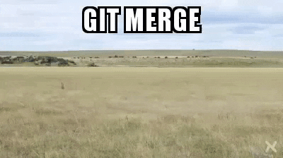

# Les bases de Git

Nous ne couvrirons pas tous les aspects de l'utilisation de git dans ce tutoriel. Il existe de nombreux tutoriels et livres approfondis sur cet outil et notre objectif est de fournir un moyen court et facile de contribuer aux tutoriels et aux traductions.

# Avant de commencer le travail

## Installer git
Comme toutes les modifications se feront sur votre machine locale, vous devez [installer git](https://gist.github.com/derhuerst/1b15ff4652a867391f03) pour pouvoir envoyer vos modifications et synchroniser celles des autres. En fonction de votre plateforme, la façon d'installer git peut varier. Vérifiez le lien ci-dessus ou consultez la documentation spécifique à votre plateforme.

## Installation de l'éditeur Atom
Si vous ne l'avez pas encore fait, il est temps d'installer [Atom](https://atom.io). **Atom** est un éditeur de texte riche en fonctionnalités avec une intégration spéciale de git. Si votre système d'exploitation n'est pas automatiquement détecté ou listé lorsque vous allez sur le site web de [Atom](https://atom.io), vérifiez [les autres platformes](https://github.com/atom/atom/releases/latest). Pour tous les utilisateurs d'Arch, vous pouvez simplement l'installer en utilisant `pacman -S atom` ou un autre gestionnaire de paquets de votre choix.

# Comment créer un compte sur l'instance git
Après avoir installé **git** et **Atom**, vous aurez besoin d'un compte sur l'instance git **Disroot**. Depuis peu, nous hébergeons heureusement notre propre instance **gitea**, mais vous devrez enregistrer un compte séparément. Votre compte **Disroot** ne s'applique pas ici. Pour une meilleure affectation, nous vous suggérons d'utiliser le même nom d'utilisateur que sur **Disroot**.

Pour créer un compte, rendez-vous sur [https://git.disroot.org](https://git.disroot.org) et enregistrez-vous.

## Préparation de l'espace de travail
Git est conçu avec la collaboration au cœur de ses préoccupations. La première chose à faire est donc d'obtenir une copie de tous les fichiers du projet sur notre disque dur local. Ce processus s'appelle "*cloner un dépôt*". Toutes les modifications sont effectuées sur notre machine locale (la plupart du travail est effectué hors ligne). Une fois que nous avons décidé que les modifications (nouveau tutoriel, traduction) sont terminées, nous pouvons les envoyer/synchroniser vers le référentiel sur le serveur (*push*).

### Cloner le référentiel **Howto Disroot**.
Pour cloner le dépôt, il suffit d'ouvrir un terminal, de naviguer vers le répertoire dans lequel vous souhaitez cloner le dépôt, et de lancer la commande `git clone <url>`, où *<url>* est essentiellement l'adresse du dépôt que vous souhaitez cloner. Dans notre cas, ce serait :

`git clone https://git.disroot.org/disroot/howto`

Une fois que le dépôt est copié sur votre disque dur, vous verrez un répertoire `howto` qui consiste en tous les fichiers que vous pouviez précédemment parcourir dans votre navigateur web quand vous étiez sur l'url de notre dépôt.

Vous pouvez par la suite déplacer ce répertoire à l'endroit de votre choix sur votre ordinateur.

### Accès au référentiel
Afin de pouvoir apporter des modifications au dépôt git de **Disroot**, vous devez demander l'accès. Cela se fait via [notre page de projet git](https://git.disroot.org/disroot/howto)

Une fois que les administrateurs vous ont accordé l'accès, vous pouvez "*pousser*" vos modifications sur le serveur.

!! 
!! REMARQUE : Vous pouvez commencer à travailler sans que l'accès vous soit accordé, car toutes les modifications sont effectuées sur votre ordinateur local.

# Commencer à travailler
Vous pouvez maintenant démarrer **Atom**.

Allez dans l'onglet Fichier, sélectionnez "Ouvrir un dossier" et choisissez le répertoire que vous venez de cloner (*comment faire*).

L'interface de **Atom** est propre et facile à comprendre. La barre latérale de gauche est l'arbre de navigation de votre projet, la fenêtre du milieu est l'endroit où vous éditez les fichiers et la barre du bas indique le nombre de fichiers modifiés, la branche courante, un pull/push rapide vers git.

Vous pouvez ouvrir et travailler sur plusieurs fichiers dans des onglets ou en écran partagé côte à côte.
Les fichiers non enregistrés avec des modifications locales sont marqués d'un point bleu (en fonction du thème que vous utilisez bien sûr).
Pour enregistrer les modifications du fichier, utilisez le menu *Fichier* ou le raccourci clavier *Ctrl+s*.

**Avant** de commencer à travailler sur les fichiers, vous devez créer votre propre **branche**.

## Création de branches
Les branches sont en fait vos propres espaces de travail privés.

Chaque projet git a sa propre branche **master**. La branche master est la copie principale, *production* du projet. Cette branche est automatiquement synchronisée avec le site web, de sorte que toute modification apportée à cette branche est instantanément visible sur le site web. C'est également la raison pour laquelle l'ajout de toute modification à la branche **master** est réservé aux seuls propriétaires du projet.

Pour commencer à travailler, créez votre propre branche. Il s'agit en fait d'un clone de la branche **master**.

Dans le coin inférieur droit de **Atom**, clique sur **master** (ou tout autre nom de branche) et choisis **Nouvelle branche**. Choisissez un nom pour votre branche, quelque chose de facile pour que les autres sachent sur quoi vous travaillez, quel est le sujet de votre branche. Par exemple, si vous prévoyez de travailler sur un howto nextcloud, appelez-le "nextcloud_howto" ou quelque chose de similaire.

Appuyez sur **Entrée** sur votre clavier lorsque vous avez terminé.

Maintenant, vous devez **publier** votre nouvelle branche pour qu'elle soit créée sur le serveur. **Atom** vous demandera votre identifiant. Utilisez celui créé pour notre instance git.

Le passage d'une branche à l'autre peut également se faire à partir de ce menu. La branche de travail actuelle est visible dans la barre inférieure. Cliquez dessus : d'autres branches locales apparaîtront.

Une fois que la branche est créée et publiée, et que vous avez modifié le travail en cours sur cette nouvelle branche, vous pouvez créer de nouveaux fichiers, modifier des fichiers existants, etc.

## Validation des modifications
Vous travaillez maintenant sur votre ordinateur à la création de nouveaux didacticiels ou à la traduction de didacticiels existants. Outre l'enregistrement des modifications sur votre ordinateur portable, vous pouvez/devriez également **valider vos changement (commit)** vos modifications.

La validation des modifications synchronise le travail que vous avez effectué sur votre branche avec le serveur git. Un commit est donc un ensemble de fichiers créés ou modifiés. Si la branche n'existe pas sur le dépôt, elle sera créée et toutes vos modifications et nouveaux fichiers seront téléchargés sur le serveur. Dans ce cas, vous pouvez travailler sur vos fichiers sur plusieurs machines, ou d'autres personnes peuvent prendre le relais et vous aider à travailler sur votre branche.

Pour valider vos changements, vous devez :
 - S'assurer que tous les fichiers sont sauvegardés
 - Mettez en page tous les fichiers que vous avez modifiés et que vous voulez livrer au serveur.
 - Écrire un **message de validation** (un résumé court et très spécifique de ce qui a été modifié).
 - Appuyez sur le bouton **commit**.

 

 Une fois les fichiers validés, il est temps de les "pousser" (envoyer) vers le serveur :
 - Ouvrir la fenêtre popup Push/Pull
 - Appuyez sur Push

 

## Demande de fusion
Une fois que vous pensez que votre travail est terminé et prêt à être publié sur le site web, il est temps de le fusionner à la branche **master**.

  **REMARQUE!!!**

Pendant que vous travaillez sur votre branche, d'autres utilisateurs peuvent livrer et fusionner leurs propres modifications, en particulier si vous travaillez sur des fichiers existants. Si les changements des autres utilisateurs ont déjà été fusionnés dans la **branche principale**, la version des fichiers que vous avez modifiés peut ne plus être la version actuelle et donc les changements des autres utilisateurs peuvent ne pas être inclus dans vos fichiers. Dans cet état, si vous voulez laisser vos modifications être fusionnées dans la **branche principale**, ce processus peut être très chaotique.

Heureusement, git est capable de comparer les versions et d'insérer vos modifications dans les versions mises à jour des fichiers. Pour déclencher cela, vous devez mettre à jour votre branche **avant** de **créer** une **demande de fusion**. En faisant cela, vous épargnerez aux admins et à vous-même beaucoup de travail inutile :

 - Tout d'abord, il faut s'assurer que toutes les modifications sont validées.
 - Ouvrez le Terminal (Linux)
 - Passez à la **branche principale** : ***git checkout master***
 - Mettez à jour **Master Branch** : ***git pull***
 - Passage à la branche de travail : ***git checkout <Branche_Nom>***
 - Mettez à jour votre branche de travail à partir de **Master Branch** : ***git rebase master***
 - Vérifier les changements et commiter les changements sur le serveur.

Maintenant vous pouvez commencer avec les étapes finales de la fusion de vos fichiers vers la **Branche principale** :

- La première chose à faire est de s'assurer que toutes les modifications sont validées.
- Connectez-vous à [https://git.disroot.org](https://git.disroot.org)
- Si vous avez poussé des changements sur le serveur de votre branche, en haut à droite vous verrez un bouton **"Créer une demande de fusion "** qui ouvrira le formulaire de demande de fusion.
- Ajouter un titre
- Ajoutez une description
- Assurez-vous que la **branche source** est celle à partir de laquelle vous voulez fusionner (celle sur laquelle vous avez travaillé).
- Assurez-vous que la **branche cible** est celle vers laquelle vous voulez fusionner (généralement la branche principale).
- Cocher la case **Supprimer la branche source lorsque la demande de fusion est acceptée** est également une bonne chose à faire si vous avez complètement terminé de travailler sur votre branche.

Une fois que vous avez créé une demande de fusion, elle sera examinée par les administrateurs de **Disroot** et, si tout va bien, ils pourront alors approuver votre validation. Cela signifie que vos modifications seront fusionnées avec la branche master et donc visibles sur le site web.

S'il y a un problème, les administrateurs peuvent vous demander de corriger quelque chose. Une fois que toutes les corrections sont effectuées et que la documentation est conforme aux directives de **Disroot**, votre demande de fusion sera transférée vers la branche principale.

## Extraction des modifications du serveur
Si vous souhaitez maintenir à jour la branche **master** locale et votre branche locale, vous devrez extraire les modifications du serveur.

Chaque fois qu'une demande de fusion de quelqu'un est transférée dans le master, tout le monde devrait également transférer les changements dans sa branche locale. Ainsi, vous pouvez facilement voir ce qui est nouveau et ce qui a changé récemment. Sur la branche principale, nous conservons un fichier appelé **CHANGELOG** où nous notons toutes les modifications significatives apportées aux Howtos.

L'extraction doit être effectuée régulièrement (surtout avant de commencer à travailler sur une nouvelle branche).

 - Ouvrir la fenêtre popup Push/Pull
 - Appuyez sur **Pull**.

## Modèle à utiliser pour les guides pratiques
Vous pouvez copier le contenu [ici](fr/template.txt) et créer votre fichier "how-to".
