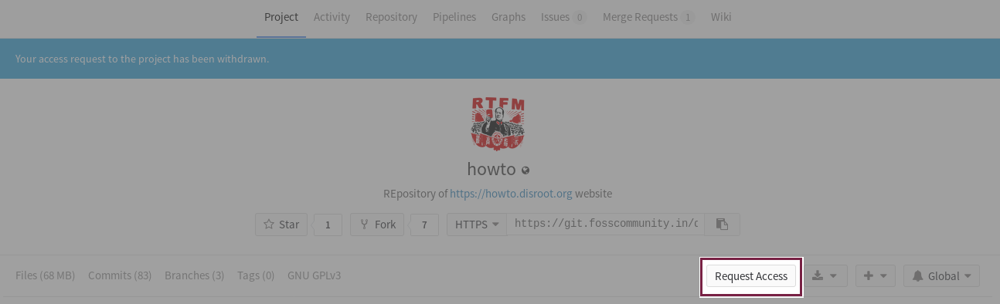

Este artigo tentará explicar princípios base sobre como utilizar o git para poder contribuir para as traduções, bem como criar e submeter novos manuais/tutoriais.

De modo a poder acompanhar todas as alterações e poder trabalhar com várias pessoas ao mesmo tempo, nós escolhemos utilizar o **git** como o nosso sistema de controlo de versões. O Git é uma ferramenta muito popular entre programadores e administradores de sistemas, mas as suas funcionalidades podem ser facilmente aplicáveis em qualquer contexto onde seja necessário a possibilidade de submeter conteúdos e trabalhar em equipa.

Neste guia, não vamos cobrir todas as funcionalidades do git. É uma ferramenta bastante complexa e poderosa, com um montão de tutoriais/manuais/guias já escritos sobre como funcionam essas funcionalidades. O que queremos com este guia sobre git é mostrar de uma maneira curta como contribuir de um modo simples para traduções e manuais/guias.

# Como criar uma conta de utilizador num serviço de Git
Antes de mais é necessário criar uma conta de utilizador no serviço de git utilizado pelo disroot.org.
<!--Infelizmente o git não é um serviço federado, por isso é necessário criar uma conta de utilizador. Nós alojamos todo o nosso trabalho na instância de Gitlab dos nossos amigos da **FOSS Community India**.-->
Para criar uma conta de utilizador, basta ir a [https://git.disroot.org](https://git.disroot.org) e registar-se. Para além de registar uma nova conta, pode escolher utilizar como metodo de autenticação, o gitlab.com, github, twitter, gitbucket, google caso já tenha uma conta numa dessas plataformas.

# Instalar o Git
Como todo o trabalho será feito no seu computador, necessita de [instalar o git](https://gist.github.com/derhuerst/1b15ff4652a867391f03) no seu computador para poder enviar as suas alterações e poder receber as alterações feitas por outros. A maneira de instalar o git pode variar consoante o seu sistema operativo. Por isso consulte o link acima referido ou procure a documentação referente a como instalar o git no seu sistema operativo.

# Instalar o editor de texto Atom
Casa ainda não o tenhas feito deves instalar o [Atom](https://atom.io). O Atom é um editor de texto que tem integração com o git. Caso o teu sistema operativo não seja automaticamente detetado quando visitares o site [Atoms](https://atom.io) vê o link [Other platfroms](https://github.com/atom/atom/releases/latest). Para os utilizadores do Arch Linux, podem instalar o o git usando `pacman -S atom` ou outro gestor de pacotes à vossa escolha.

# Clonar o repositório
O Git foi criado tendo como objetivo a colaboração entre pessoas. Antes de mais precisas de descarregar uma cópia de todos os ficheiros do projeto (repositório git) para o teu computador. Todas as modificações são feitas localmente no teu computador (podes trabalhar offline). Quando achares que as alterações (novos tutoriais, traduções) estão completos podes decidir enviar/sincronizar (push) com o repositório que está alojado no servidor.

A maneira mais fácil de clonar um repositório é: abrir o terminal (linha de comandos), navegar até ao diretório/pasta para onde queres clonar/descarregar o repositório e correr o comando `git clone <url>`, onde está *<url>* deves colocar o endereço URL do repositório que queres clonar/descarregar. No nosso caso concreto é:

`git clone https://git.disroot.org/disroot/howto`

Uma vez que o repositório esteja colando para o teu computador irás ver uma pasta chamada `howto` que contém todos os ficheiros, que viste no teu browser de Internet quando visitaste o endereço do projeto/repositório.

Mais tarde podes mover essa pasta para qualquer outra parte do teu computador que prefiras.

# Pedir acesso ao repositório git
Para poderes submeter alterações no repositório git online do disroot, primeiro necessitas de pedir acesso ao repositório. Assim que os administradores de deem acesso, pode começar a submeter/enviar as tuas alterações para o repositório online (é possível começar a trabalhar localmente no teu computador sem ainda ter sido concedido acesso ao repositório online, as alterações que fizeres apenas serão feitas localmente nos ficheiros que estão no teu computador).

# Agora o trabalho pode começar.
Agora podes abrir o Atom e carregar em `Open Folder` e escolher o directório/pasta que clonaste (*howto*). O interface do Atom é simples e fácil de entender. A barra esquerda é a lista de ficheiros e pastas do projeto, a janela do meio é onde editas os ficheiros e barra de baixo indica o número de ficheiros alterados and bottom bar indicates number of changed, o ramo em que estás e tem os botões para rápidamente sincronizar e actualizar com o repositório git online.

Com o Atom podes abrir e trabalhar em múltiplos ficheiros em múltiplas tabs ou dividir o ecrã.
Ficheiros alterados, cujas alterações não foram guardadas têm uma bolinha azul (dependendo do aspeto gráfico que escolheste para o Atom, claro).
Para guardar as tuas alterações usa o menu *File* o as teclas *Ctrl+s*.

**Mas** antes de começares a trabalhar nos ficheiros precisas de criar o teu próprio: **branch** (ramo)

# Branches/Ramos
Branches/Ramos são basicamente os teus espaços de trabalho privado, cópia privada. Cada projeto git tem o seu próprio ramo/branch **master**. O branch Master é o cópia principal de *produção* do projeto. Este branch é automáticamente sincronizado com o website [howto.distoot.org](https://howto.disroot.org), por isso qualquer alteração feita neste branch/ramo é automaticamente visível no website. E é por isso que o envio de alterações para o ramo **master** são restringidas, apenas os administradores do disroot, as podem realizar
Para poderes começar a trabalhar cria o teu próprio ramo/branch. Isto básicamente irá criar uma cópia, na qual podes trabalhar, do ramo **master**.

Mudar de ramo também pode ser feita a parti do mesmo menu. O ramo a partir do qual estás a trabalhar é visivél a partir da barra de baixo do ecrã.

Uma vez que o ramo esteja criado e que tenhas mudado para esse ramo, podes crias novos ficheiros, alterar os ficheros atuais, etc.

# Enviar as tuas alterações (fazer commit)
Ok, então estás a trabalhar no teu computador e a criar novos tutorais ou a traduzir tutoriais já existentes. Para além de gravar as tuas alterações no teu computador, tu também podes/deves enviar (fazer commit) das tuas alterações. Fazer commit das alterações sincroniza o trabalho que fizeste no teu ramo/branch com o servidor git. Se o ramo ainda não existe no servidor, ele será criado automáticamente quando fazes commit e todas as tuas alterações e ficheiros novos serão enviados para o servidor. A partir desse momento, em que os teus ficheiros novos e alterações foram sincronizadas online, podes trabalhar nos teus ficheiros a partir de computadores diferentes, locais diferentes e outras pessoas que estejam a trabalhar no projeto podem participar trabalhar nos ficheiros que sincronizaste e ajudar a trabalhar no ramo que criaste.

Para fazer commit das tuas alterações precisas de:
 - certificar-te que guardaste todos os ficheiros
 - stage all the files you've modified and want to commit to the server
 - Escrever uma mensagem de commit, uma nota breve sobre o que foi alterado (não demasiado longa)
 - Carregar no botão commit
 
 Uma vez que tenha sido feito o commit dos ficheiros é altura de fazer *push* (enviar) para o servidor:

 - Abra a janela popup de push/pull
 - Carrega em push

# Merge request
Quando achares que o teu trabalho está acabado e pronto a ser publicado no website, é altura de enviar as tuas alterações (merge request) para o ramo/branch principal do projeto, o ramo **master**.

- Primeiro, obviamente, tens que certificar-te que fizeste commit de todas as alterações que fizeste.
- Faz login em [https://git.disroot.org](https://git.disroot.org)
- se fizeste *push* de qualquer alterações para o servidor no teu ramo então verás no canto superior direito o botão **"Create Merge Request"**
- Isto irá criar um formulário de "merge".
- Cria um título
- Adiciona uma descrição
- Certifica-te que o **source branch** (o ramo a partir do qual fazes o pedido de merge) é o ramo que queres em que tu estiveste a trabalhar.
- Certifica-te que o **target branch** é aquele com o qual queres fazer merge (normalmente é o master branch)

Assim que criares o merge request, ele será revisto pelos administradores do disroot. Os administradores podem aprovar o teu pedido de commit o que significa que as tuas alterações serão inseridas no ramo master e portanto visíveis no website, ou então podem pedir para tu corrigires alguma coisa. Assim que todas as correções estiverem feitas e os *"governantes"* do disroot estiverem satisfeitos o teu pedido de merge será integrado no ramo master.

# Pulling (descarregar alterações do servidor)
Se queres manter a cópia do ramo **master** que tens no guardada no teu computador atualizada, precisas de fazer um "pull request" das alterações que foram feitas no servidor (por outras pessoas). Cada vez que alguém tem o seu merge request aprovado, todas as outras pessoas devem fazer um pull request para os seus ramos. Deste modo podes ver o que há de novo e que alterações foram feitas recentemente (por outras pessoas). No ramo master branch mantemos um ficheiro chamado "CHANGELOG" (registo de alterações) onde anotamos todas as alterações significativas nos tutoriais.
Os "pull request" devem ser feitos regularmente (especialmente antes de começar a trabalhar num ramo novo).

 - abre a janela popup de push / pull
 - Carrega em **pull**

# Algum vocabulário e explicação

**git repository/repositório git** - Diretório (pasta) que consiste em todos os ficheiros que pertencem ao projeto
