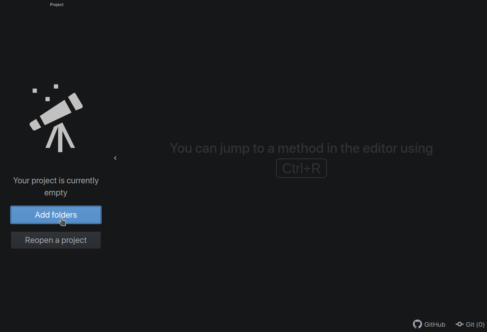
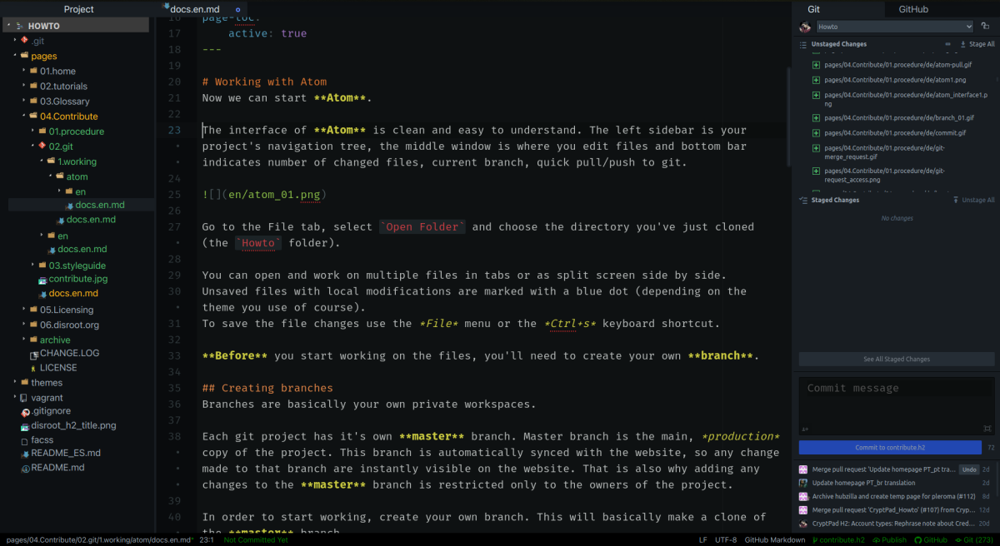
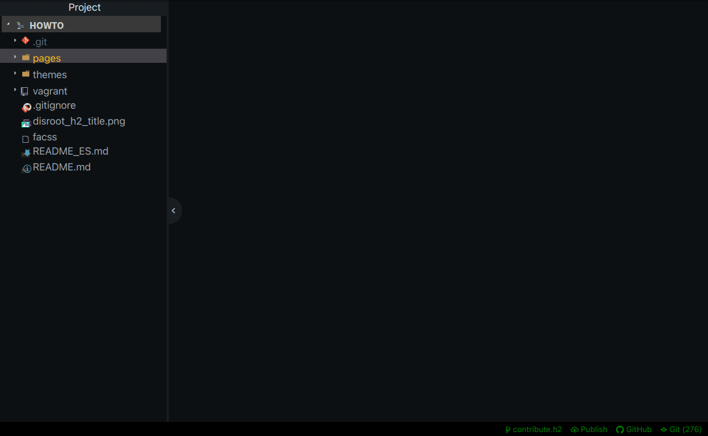
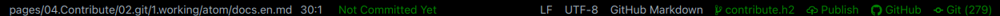
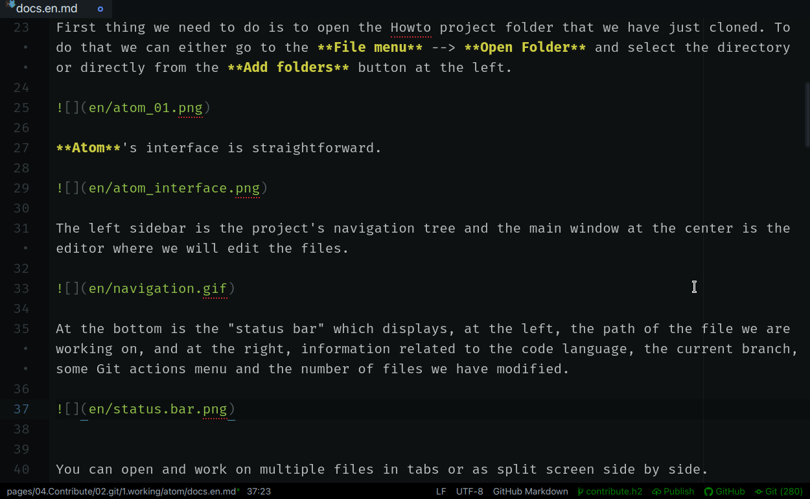
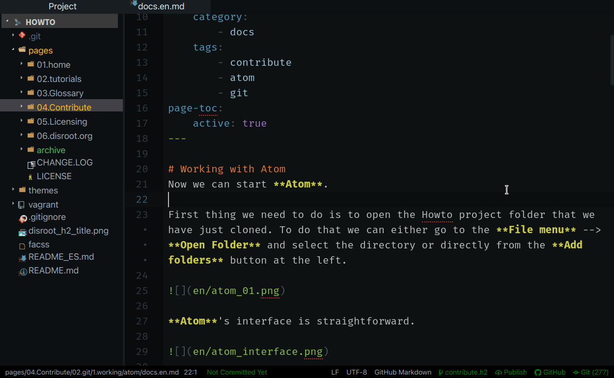
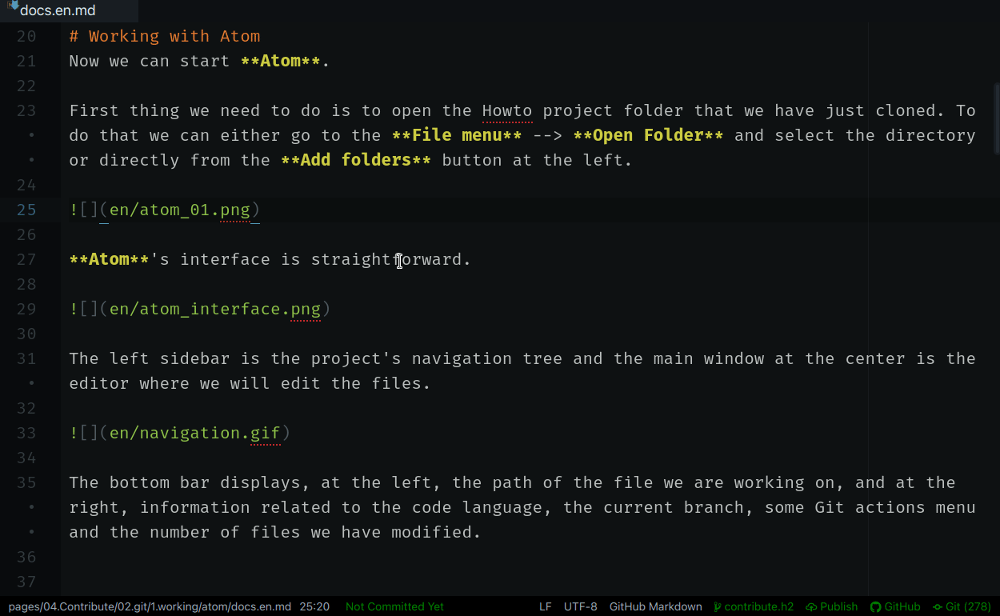
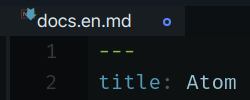

# Getting familiar with Atom
Let's start by getting to know the interface a little bit. Once we have started Atom we will see that it is quite straightforward.

First thing we need to do is to open the Howto project folder that we have just cloned. To do that we can either go to the **File menu** --> **Open Folder** and select the directory or directly from the **Add folders** button at the left.

The left panel is the project's navigation tree and the main window is the editor where we will edit the files.

At the bottom is the "status bar" which displays, at the left, the path of the file we are working on and, at the right, information related to the code language, the current branch, some Git actions menu and the number of files we have modified.

Clicking on the **Git** button at the right side of the status bar will display the Git panel where we can view all the files we have modified as well as some Git operations that we can perform (and that we will see later on).

We can also toggle the panels if we need to focus just on the text editor.

We can activate the **Markdown preview** to have a visual idea of what are we doing on a file by pressing the keys `Ctrl` + `Shift` + `m`...

... and we can open and work on multiple files in tabs or splitting the screen into several panels.

**Atom** is highly customizable, to the point we can tweak practically each and every one of its parts to better suit our needs.

The two last things to note before we start to work are:

- The unsaved files with local modifications are marked with a blue dot (depending on the theme we are using).

- To save the file changes we can use the **File menu** --> **Save** or the `Ctrl` + `s` keyboard shortcut.

Now that we know our workspace, it is time to get down to work.
