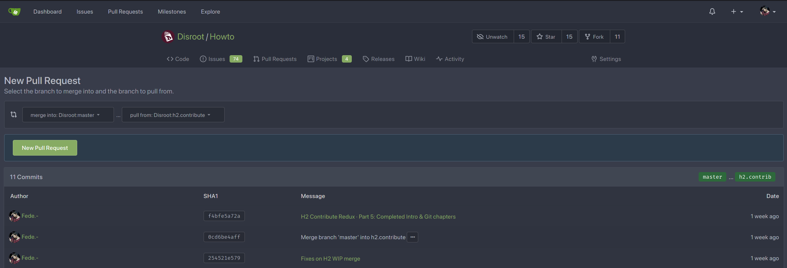
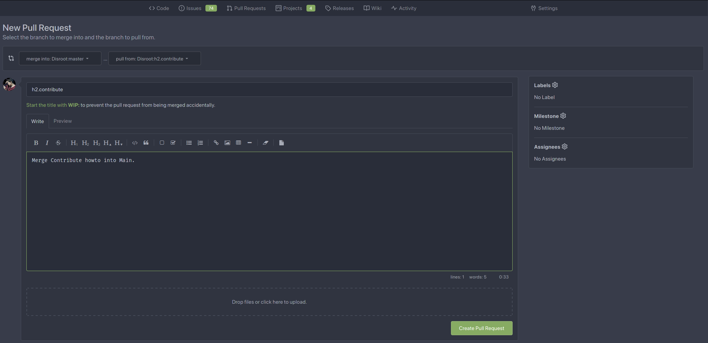

# Working with Atom + Git
Finally we get to the most interesting part! Let's review what we have done so far.

We have got an exact copy of the **Disroot Howto** folder where are all the files we can see online when we need to learn something about how a service works or how to configure a client.

We have **cloned** the repository and we did it using our first git command: `git clone`. The next step will be to create a **branch**.

## Creating branches
Every git project, the Howto's project in this case, has a **main** branch (or master branch) which contains all the files we can see in *production*. The changes we make on this branch are automatically synced with the site, and become visible immediately. And that is the reason why adding any changes to this **main** branch is restricted to the owners of the project.

In general terms, a branch is basically an independent workspace created from the main line of development on which we can work and test things without compromising the original code.

In the image above we have the Howto's site content represented by the main line (main). Suppose we want to translate one of its tutorials. We create a new branch (branch 1) and we start working locally on it. While we are translating, someone else wants to start writing a new howto so creates a new branch (branch 2) for that purpose. As we can see, all this happens in parallel and at the same time but without affecting the main branch.

When the translation is done, it is "submitted" to the remote repository to be reviewed and integrated to the production line. In the meantime, the writing of the new howto continues and when it is ready it follows the same process, it is reviewed, updated with the changes introduced by the other branches if necessary and finally it is also integrated to the main one.

OK. Let's create our branch so we can start working.

In the bottom-right corner of **Atom**, click on **master** (or any other branch name) and choose **New Branch**. A good practice is to give it a name descriptive enough so that others can easily figure out what we are working on when they see it. For example, if we plan to translate the Nextcloud howto, we could call it "cloud_language_translation" or something similar.

Once we are done we press **Enter** on our keyboard.

In the terminal, we should use the `git branch` command like this:

`git branch -b our.branch.name`

To switch between branches we can also use this menu. Our current working branch is visible on the bottom bar. If we click on it other local branches will appear.

Switching between branches in the terminal is done with the command `git checkout`. If, for example, we want to switch from our current branch to the main one, we should write:

`git checkout master`

And viceversa, from the main branch to our branch:

`git checkout our.branch.name`

### Publishing our branch
We have created a local branch and we can start translating or writing a howto. For this branch we just created to also exist in the remote repository we need to **publish** it. In Atom it is done using the **Publish** function. When we click on it, we will be asked to enter our credentials. We need to enter our Gitea username and password.

In the terminal this can be done with the `git push` command, specifying the remote and the branch name we want to push. In our case it would be:

`git push origin our.branch.name`

When we cloned the **Howto** repository, Git automatically set up its URL as the default "remote" called `origin`. In Git a "remote" is an "alias" for a repository, so we can use this "alias" (origin in this case) instead of writing the entire URL of the remote repository every time we need to interact with it.

To understand this, we can write the command `git remote -v` to see the remotes we have set up in our local repository and the URLs that they refer to.

Now that we have created a branch and already published it, we can create new files and modify the existing ones on this (our) branch.

## Committing changes
We are now on our computer translating an existing tutorial or creating a new one and we have been saving the changes we made (using `Ctrl`+`s`, for example) but those changes are only saved in our text editor. We need to **commit** them to our branch first to then "push" them to the remote repository.

So, the first thing we need to understand is that a **commit** is not like doing `Ctrl`+`s` because Git is not "just a backup system". A **commit** is more like a snapshot of our project folder at a certain point. The main idea behind a version control system (Git in this case) is being able to keep track of all the changes made to our code over time so we can look back and check when, how and why it has "evolved". Every commit is, then, a "milestone" in the track history of our project. And every "milestone" is accompanied by a message which describes what has changed. We need to keep in mind that the more commits we make the more populated gets the project timeline, thus increasing the chances of generate a "confusing" record history.

In a very general way, we could say a commit is a set of files created or modified on our local branch that we want to "submit" to the remote git repository.

So when we have decided to create a commit we need to "tell" Git what we want to include in it.

To do a "commit" of the changes is a process that consists of the following steps:

1. Make sure we have saved all the modified files,
2. "stage" those files we want to commit,
3. write a descriptive "commit message" (a short and very specific summary of what has been changed), and finally
4. commit the files.

All the changes we have done so far in our local branch, they were made in our "working directory" and now we need to "move" them to the "staging" area. "Staging" refers to the moment in which those changes are selected to be included in the next commit.

In Atom, this process is incredibly easy. Let's check the process again:

1. Make sure all files are saved and **Stage all** the files we have modified and want to commit to the repo,
2. once they are in the "staging area" we can now
3. write a **commit message** and finally
4. commit the changes by clicking the **Commit** button.

Now let's see how to do the same but in the terminal.

1. The Git command to "move" the files from the "working directory" to the "staging area" is `git add` and if we only have a file or two to **add** we can simply write:

  `git add our.file`

  But if we have several files to commit we do not need to add the changes file by file. We can use

  `git add .`

  and it will include all the current changes into the next commit.

2. Now that the files are in the "staging area" we need to commit them. We can do that by using the `git commit` command with the option `-m` to write a commit message. For example:

  `git commit -m "my commit message"`

  Note that the commit message must be wrapped in quotations `"` `"`.

  If we do not use the `-m` option then we will be prompted to add a message in our default text editor.

  Another useful option is `-a`. It not only will automatically stages all modified files to be committed but we can also skip the `git add` command with it. For example, writing:

  `git commit -a -m "my commit message"` or

  `git commit -am "my commit message"`

Once the files are committed, it is time to **push** (send) them to the remote repository.

## Pushing the changes
We have committed all the changes in our local branch and we want now "upload" them to the remote repository.

In Atom this can be done by simply clicking on the **Push** option in the bottom bar.

In the terminal, we have already seen the command to do this: `git push`. So, to push our local changes to the remote branch we have to write:

`git push origin our.branch.name`

## Requesting a Merge

**Merging** is the process of integrating commits from different branches. Usually (but not only) the commits made on a given branch into the main one.

Once we think our work is finished and ready to be published on the website, it is time to merge it to the **main branch**.

This merge operation is done by the **Disroot** admins. But it is us who have to request that it be done.

In **Gitea** it is called **Pull Request** and the procedure, in principle, is pretty simple.

1. We go to **Disroot's Git** site at [**git.disroot.org**](https://git.disroot.org) and login with our **Gitea** credentials.

2. Next we need to look for our branch in the **Howto** repository, select it and then click on the **New Pull Request** button.

3. In the next page we can do a last and more visual revision of the commits we have made and, if we find it OK, then press the **New Pull Request** again.

4. Now we are required to write a "merge request" message. It does not need to be long and detailed but descriptive enough, similar to the commit message one, in order to make it easy to others to know what the changes are about. We can also (and it is recommended) add labels for better identification.

5. In the last step we can assign "Reviewers", add "Labels" (if we did not do it previously), link our Pull Request to a "Milestone" or a "Project" and define who will be assigned to manage the request (usually the same **Disroot** admins with whom we have been in contact in the Howto's XMPP room).

That's it. \O/

Once the Pull Request is done, it will be reviewed by **Disroot** admins. If it is all right and the documentation meets the **Disroot** guidelines, they can approve our commits then. This means our changes will be merged with the main branch and therefore visible on the website.

If there is any issue, admins could request us to correct something. And, again, once all the corrections are made, our Pull Request will be merged to the main branch.

## Pulling changes from the repository
Pull is an operation to update a local version of a remote repository.

If we want to keep the local main branch for future translations or howtos we will need to "pull" the changes integrated to the recently updated remote because ours will no longer be up-to-date with the remote main one.

In Atom we only need to click on the **Pull** function at the right in the status bar.

In the terminal, this is done with the command `git pull`. So if we are still on our local branch and we want to "update" it after commits were sent and accepted, we need:

1. Make sure we are on the local main branch or in another. We can use the `git branch` command which will shows us the branch we are

2. Once we are on the main branch, write:

  `git pull`

  This will download the modifications added to the main branch and update our local copy with them.

Since always there are people working on the code and it changes frequently, it is highly recommended to "pull" from the remote main branch to our local one - specially before we start working on new branch - so we can easily see what is new and what has changed recently.

---

Check [Troubleshooting](/contribute/git/troubleshooting) for more help and common conflict situations
