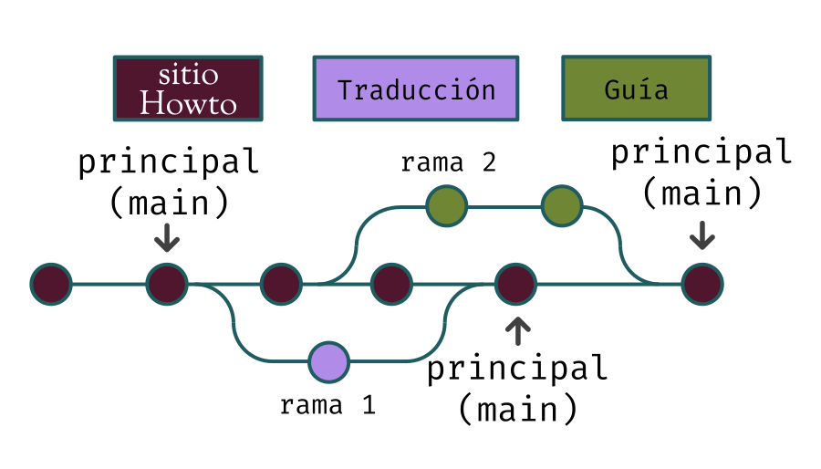
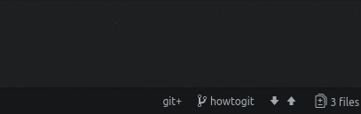
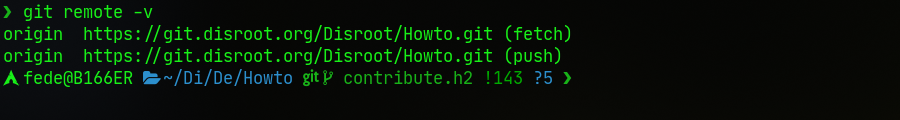
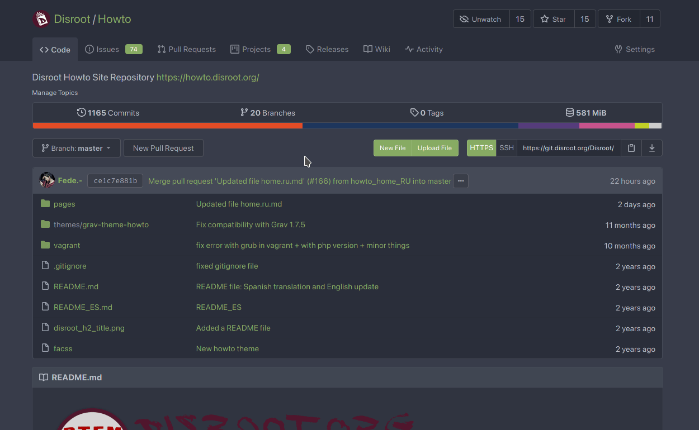
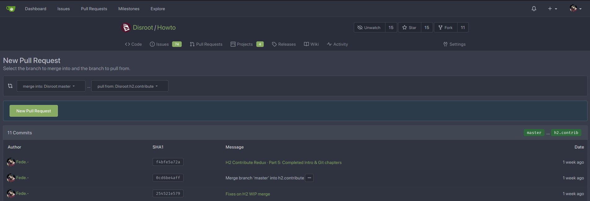
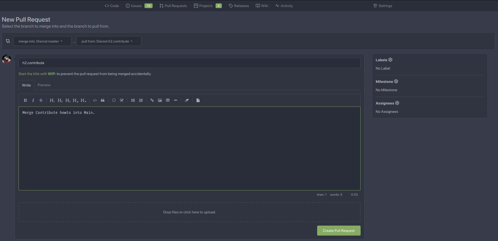
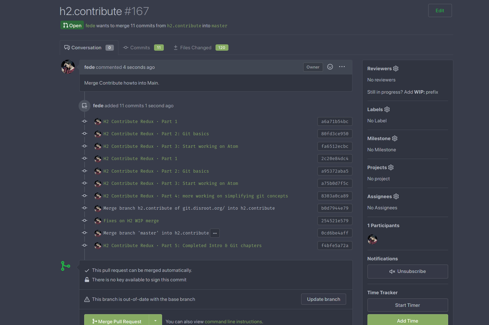
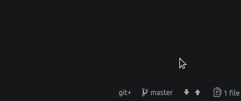

# Trabajando con Atom + Git
¡Finalmente llegamos a la parte más interesante! Revisemos lo que hicimos hasta ahora.

Obtuvimos una copia exacta de la carpeta **Howto de Disroot** donde están todos los archivos que podemos ver en línea cuando necesitamos aprender algo acerca de cómo funciona un servicio o cómo configurar un cliente.

Hemos **clonado** el repositorio y lo hicimos utilizando nuestro primer comando Git: `git clone`. El siguiente paso será crear una **rama**.

## Creando ramas
Cada proyecto Git, el proyecto Howto en este caso, tiene una rama **principal (main)** (o rama "master") que contiene todos los archivos que podemos ver en *producción*. Los cambios que realizamos en esta rama se sincronizan automáticamente con el sitio, y se hacen visibles inmediatamente. Y esa es la razón por la cual agregar cambios a esta rama **principal** está limitado a las personas propietarias del proyecto.

En términos generales, una rama es básicamente un espacio de trabajo independiente creado a partir de la línea principal de desarrollo sobre la cual podemos trabajar y probar cosas sin comprometer el código original.

En la imagen de arriba tenemos el contenido del sitio Howto representado por la línea principal (o *main*). Supongamos que queremos traducir uno de sus tutoriales. Creamos una nueva rama (rama 1) y comenzamos a trabajar localmente en ella. Mientras estamos traduciendo, alguien más quiere empezar a escribir una nueva guía así que crea una nueva rama (rama 2) con ese propósito. Como podemos ver, todo esto sucede en paralelo y al mismo tiempo pero sin afectar a la rama principal.

Cuando una traducción está terminada, es "enviada" al repositorio remoto para ser revisada e integrada a la línea de producción. Mientras tanto, la escritura de la nueva guía continúa y cuando está lista sigue el mismo proceso, es revisada, actualizada con los cambios introducidos por las otras ramas si es necesario y finalmente también es integrada a la principal.

Muy bien. Creemos nuestra rama así podemos comenzar a trabajar.

En la esquina inferior derecha de **Atom**, hacemos clic en **main** o **master** (o cualquier otro nombre de rama) y elegimos **Nueva rama**. Una buena práctica es darle un nombre suficientemente descriptivo para que otras personas puedan darse cuenta fácilmente en qué estamos trabajando cuando la vean. Por ejemplo, si planeamos traducir la guía de Nextcloud, podríamos llamarla "cloud_spanish_translation" o algo parecido.

Una vez hecho eso, presionamos **Enter** en nuestro teclado.

En la terminal, deberíamos utilizar el comando `git branch` como sigue:

`git branch -b nombre.de.nuestra.rama`

Para cambiar entre ramas podemos también usar este menú. Nuestra rama de trabajo actual es visible en la barra inferior. Si hacemos clic en ella aparecerán otras ramas locales.

Cambiar entre ramas en la terminal se hace con el comando `git checkout`. Si, por ejemplo, queremos cambiar de nuestra rama actual a la principal, deberíamos escribir:

`git checkout main`

Y viceversa, de la rama principal a la nuestra:

`git checkout nombre.de.nuestra.rama`

### Publicando nuestra rama
Hemos creado una rama local y podemos comenzar a traducir o escribir una guía. Para que esta rama que acabamos de crear también exista en el repositorio remoto necesitamos **publicarla**. En Atom esto se hace usando la función **Publicar**. Cuando hacemos clic en ella, se nos pedirá ingresar nuestras credenciales. Necesitamos escribir nuestro nombre de usuaria o usuario y contraseña de Gitea.

En la terminal esto puede hacerse con el comando `git push`. En nuestro caso sería:

`git push origin nombre.de.nuestra.rama`

Cuando clonamos el repositorio **Howto**, Git automáticamente establece su URL como el "remoto" por defecto llamado `origin`. En Git un "remoto" es un "alias" para un repositorio, así podemos usar este "alias" ("origin" en este caso) en lugar de escribir la URL completa del repositorio remoto cada vez que necesitamos interactuar con él.

Para comprender esto, podemos escribir el comando `git remote -v` para ver los remotos que hemos configurado en nuestro repositorio local y las URLs a las que refieren.

Ahora que hemos creado una rama y ya la publicamos, podemos crear nuevos archivos y modificar los existentes en esta (nuestra) rama.

## Remitiendo los cambios
Ahora estamos en nuestra computadora traduciendo un tutorial existente o creando uno nuevo y hemos estado guardando los cambios que hicimos (usando, por ejemplo, `Ctrl`+`s`) pero esos cambios solamente se guardan en nuestro editor. Necesitamos hacer **commit** (remitirlos) a nuestra rama primero para luego hacer "push" (enviarlos) al repositorio remoto.

Así que, lo primero que necesitamos entender es que un **commit** no es como hacer `Ctrl`+`s` porque Git no es "solo un sistema de respaldos". Un **commit** es más como una instantánea de nuestra carpeta de proyecto en un punto determinado. La idea principal detrás de un sistema de control de versiones (Git en este caso) es permitir llevar un registro de todos los cambios realizados a nuestro código a lo largo del tiempo así podemos mirar hacia atrás y verificar cuándo, cómo y por qué se ha "desarrollado". Cada "commit" es, entonces, un "hito" en el historial de registros de nuestro proyecto. Y cada "hito" es acompañado de un mensaje que describe qué ha cambiado. Necesitamos tener en cuenta que cuantos más commits realizamos más se llena la línea de tiempo, aumentando por consiguiente las posibilidades de generar un historial de registros "confuso".

De una manera muy general, podríamos decir que un commit es un conjunto de archivos creados o modificados en nuestra rama local que queremos "enviar" al repositorio Git remoto.

Así que cuando decidimos crear un commit necesitamos "decirle" a Git qué queremos incluir en él.

Hacer un commit de los cambios es un proceso que consiste de los siguientes pasos:

1. Asegurarnos que hemos guardado todos los archivos modificados,
2. "preparar (stage)" aquellos archivos que queremos remitir,
3. escribir un "mensaje de commit" descriptivo (un breve y muy específico resumen de lo que ha sido modificado), y finalmente
4. "remitir", hacer commit de los archivos.

Todos los cambios que hemos realizado hasta ahora en nuestra rama local, fueron hechos en nuestro "directorio de trabajo" y ahora necesitamos "moverlos" al área de preparación ("staging area"). "Staging" refiere al momento en el que esos cambios son seleccionados para ser incluidos en el siguiente commit.

En Atom, este proceso es increíblemente fácil. Revisémoslo de nuevo:

1. Nos aseguramos que todos los archivos están guardados y hacemos **Stage all** de los archivos que hemos modificado y queremos remitir al repo,
2. una vez que están en el "staging area" podemos ahora
3. escribir un **mensaje de commit (commit message)** y finalmente
4. hacer commit de los cambios (remitirlos) haciendo clic en el botón **Commit**.

Ahora veamos cómo hacer lo mismo pero en la terminal.

1. El comando Git para "mover" los archivos desde el "directorio de trabajo" al "staging area" (área de preparación) es `git add` y si solo tenemos un archivo o dos para **agregar (add)** podemos simplemente escribir:

  `git add nuestro.archivo`

  Pero si tenemos varios archivos para hacer commit no necesitamos agregarlos archivo por archivo. Podemos usar

  `git add .`

  y esto incluirá todos los cambios actuales en el siguiente commit.

2. Ahora que los archivos están el "área de preparación" necesitamos remitirlos. Podemos hacerlo utilizando el comando `git commit` con la opción `-m` para escribir un mensaje de commit. Por ejemplo:

  `git commit -m "mi mensaje de commit"`

  Noten que el mensaje de commit debe estar encerrado entre comillas `"` `"`.

  Si no utilizamos la opción `-m` entonces se nos pedirá adjuntar un mensaje en nuestro editor de texto por defecto.

  Otra opción muy útil es `-a`. No solo prepara todos los archivos modificados para el commit sino que también nos evita escribir el comando `git add`. Por ejemplo, podemos escribir:

  `git commit -a -m "mi mensaje de commit"` o

  `git commit -am "mi mensaje de commit"`

Una vez que los archivos están "commiteados" (remitidos), es momento de hacer "**push**" (enviarlos) al repositorio remoto.

## Enviando los cambios
Hemos commiteado todos los cambios en nuestra rama local y ahora queremos "subirlos", como dijimos, al repositorio remoto.

En Atom esto puede hacerse simplemente haciendo clic en la opción **Push** en la barra inferior.

En la terminal, ya hemos visto el comando para esto: `git push`. Así que, para enviar nuestros cambios locales a la rama remota tenemos que escribir:

`git push origin nombre.de.nuestra.rama`

## Solicitando una "fusión"

**Fusionar (merge)** es el proceso de integrar los commits de diferentes ramas. Habitualmente (pero no siempre) los commits hechos en una rama determinada en la principal.

Una vez que pensamos que nuestro trabajo está terminado y listo para ser publicado en el sitio web, es el momento de fusionarlos en la **rama principal (main)**.

Esta operación de fusión es realizada por los admins de **Disroot**. Pero es tarea nuestra solicitar que se haga.

En **Gitea** se llama **Pull Request** y el procedimiento, en principio, es bastante simple.

1. Vamos al sitio **Git de Disroot** en [**git.disroot.org**](https://git.disroot.org) y accedemos con nuestras credenciales de **Gitea**.

2. A continuación necesitamos buscar nuestra rama en el repositorio **Howto**, seleccionarla y luego hacer clic en el botón **New Pull Request**.

3. En la siguiente página podemos hacer una última y más visual revisión de los commits que hemos hecho y, si nos parece que está bien, entonces presionar de nuevo el botón **New Pull Request**.

4. Ahora se nos solicita escribir un mensaje de "solicitud de fusión (merge request)". No necesita ser largo y detallado pero sí descriptivo, parecido al mensaje de commit, para que a otras personas les resulte sencillo saber el por qué de los cambios. También podemos (y es recomendado) agregar etiquetas para una mejor identificación.

5. En el último paso podemos asignar "Revisores", agregar "Etiquetas" (si no los hicimos previamente), vincular nuestro "Pull Request" a un "Hito" o a un "Proyecto" y definir quién será asignado para gestionar la solicitud (usualmente, los mismos admins de **Disroot** con quienes hemos estado en contacto en la sala XMPP de Howto).

Eso es todo. \O/

Una vez que el Pull Request está hecho, será revisado por los admins de **Disroot**. Si todo está bien y la documentación cumple con los lineamientos de **Disroot**, pueden entonces aprobar nuestros commits. Esto significa que nuestros cambios serán fusionados con la rama principal y por lo tanto visibles en el sitio web.

Si hay algún inconveniente, los admins podrían solicitarnos corregir algo. Y, de nuevo, una vez que las correcciones son realizadas, nuestro Pull Request será fusionado a la rama principal.

## Descargando cambios del repositorio
"**Pull** (traer, jalar)" es una operación para actualizar la versión local de un repositorio remoto.

Si queremos mantener la rama principal local para futuras traducciones o guías, necesitaremos hacer "pull", traer los cambios integrados a la rama remota recientemente actualizada porque la nuestra ya no estará al día con ella.

En Atom solo necesitamos hacer clic en la función **Pull** que está a la derecha en la barra de estado.

En la terminal, esto se hace con el comando `git pull`. Así que si todavía estamos en nuestra rama local y queremos "actualizarla" después que se hayan remitido cambios y estos fueran aceptados, necesitamos:

1. Asegurarnos que estamos en la rama principal local o en otra. Podemos usar el comando `git branch`que nos mostrará en qué rama estamos (para cambiar de rama, ya vimos el comando `git checkout` más arriba)

2. Una vez que estamos en la rama principal, escribimos:

  `git pull`

  Esto descargará las modificaciones agregadas a la rama principal remota y actualizará nuestra copia local con ellas.

Ya que siempre hay gente trabajando en el código y este cambia con frecuencia, es altamente recomendable hacer "pull" de la rama main remota a la local nuestra - especialmente antes de comenzar a trabajar en una nueva rama - así podemos ver fácilmente qué hay de nuevo y qué ha cambiado recientemente.

---

Mirar [Solución de problemas](/contribute/git/troubleshooting) para más ayuda y situaciones de conflicto comúnes
