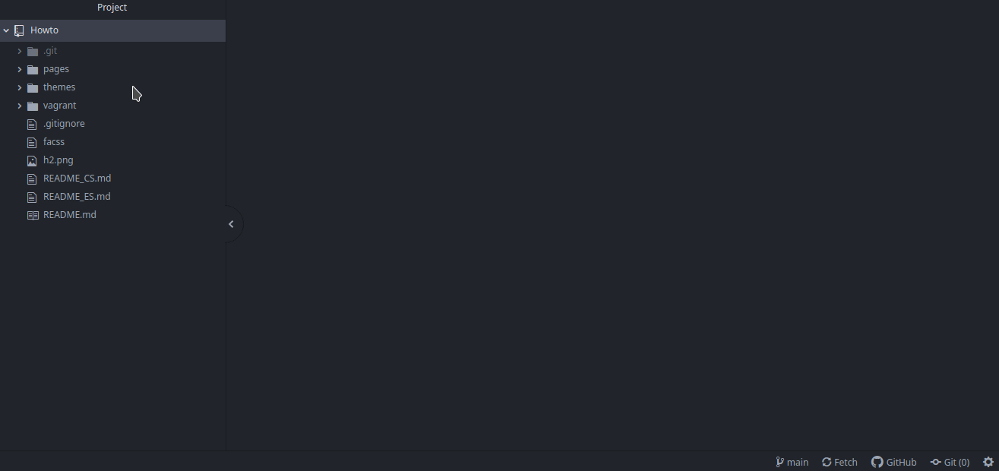
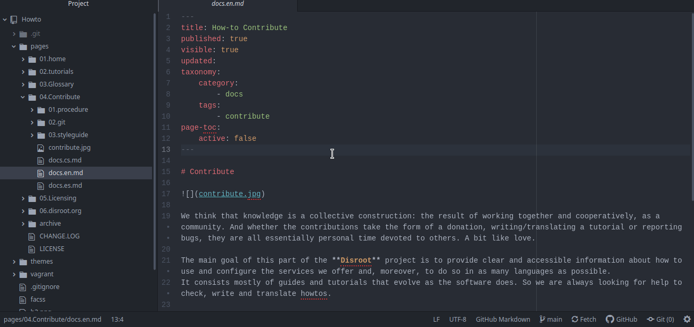
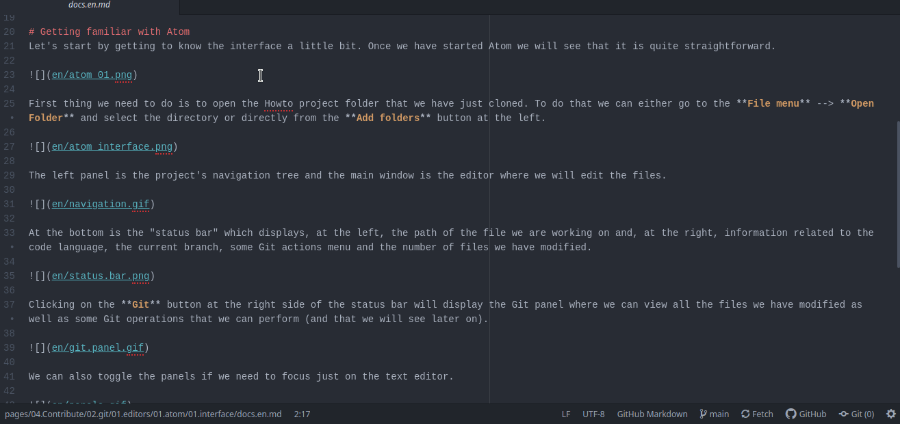
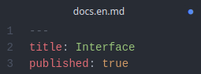

# Familiarizándonos con Atom
Comencemos por conocer un poco la interfaz. Una vez que hayamos iniciado Atom veremos que es bastante directo.

Lo primero que necesitamos hacer es abrir la carpeta del proyecto Howto que acabamos de clonar. Para esto podemos ir al **menú Archivos** --> **Abrir carpeta** y seleccionar el directorio, o directamente con el botón **Agregar carpetas** que está a la izquierda.

En el panel izquierdo está el árbol de navegación del proyecto y la ventana principal es el editor donde editaremos los archivos.

En la parte de abajo está la "barra de estado" que muestra, a la izquierda, la ruta del archivo en el que estamos trabajando, y, a la derecha, información relativa al lenguaje del código, la rama actual, algunos menús de acciones de Git y el número de archivos que hemos modificado.

Haciendo clic en el botón **Git** en el lado derecho de la barra de estado se mostrará el panel de Git donde podemos ver todos los archivos que hemos modificado así como también algunas operaciones de Git que podemos realizar (y eso lo veremos a continuación).

También podemos contraer los paneles si necesitamos enfocarnos solo en el editor.

Podemos activar la **vista previa Markdown** para tener una idea visual de lo que estamos haciendo sobre un archivo presionando las teclas `Ctrl` + `Shift` + `m`...

... y podemos abrir y trabajar sobre múltiples archivos en pestañas o dividiendo la pantalla en varios paneles.

**Atom** es altamente personalizable, hasta el punto que podemos modificar prácticamente todas y cada una de sus partes para que se ajuste mejor a nuestras necesidades.

Las últimas dos cosas para notar antes de comenzar a trabajar son:

- Los archivos con modificaciones locales no guardados son marcados con un punto azul (dependiendo del tema que estemos usando).

- Para salvar los cambios podemos usar el **menú Archivos** --> **Guardar** o el atajo 
de teclado `Ctrl` + `s`.

Ahora que conocemos nuestro espacio de trabajo, es momento de ponernos a trabajar.
