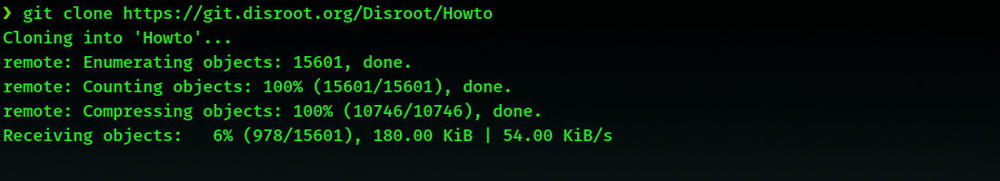

# Git?
Ano, **Git**. Je to řídicí systém verzí, software, který nám umožňuje sledovat úpravy souborů a uchovávat záznamy o všech provedených změnách, takže pokud se potřebujeme vrátit k určité verzi, můžeme to udělat relativně snadným způsobem. Je to také výkonný nástroj pro spolupráci, protože umožňuje mnoha lidem pracovat na stejných souborech projektu.

Naučit se základy systému Git a pracovat s ním může být nejen velmi užitečné, ale také zábavné.

# Rozsah tohoto výukového kurzu
Naše používání systému Git nevyžaduje vysokou úroveň technických znalostí, sadu potřebných základních příkazů se může naučit každý. A aby to bylo ještě jednodušší, existuje několik textových editorů s integrovaným systémem Git, které omezují interakci s terminálem na minimum. 
Takže cílem následujících návodů je seznámit vás se základy systému Git, hlavního nástroje, který používáme pro správu souborů projektu **Howto**. Nebudeme se tedy zabývat všemi aspekty jeho používání, pouze některými základními pojmy a příkazy.

Pokud se o systém Git budete zajímat více, existuje spousta podrobných výukových programů a dokumentace o něm napsaných, které snadno najdete na internetu.

# Co Git dělá?: Základní pojmy

Když čtete výukový program **Disroot**, vidíte ve svém prohlížeči reprezentaci části kódu, v našem případě textového souboru zapsaného ve formátovací syntaxi zvané **Markdown**. Celý kód tohoto webu a jeho obsah je umístěn v úložišti **Git**, složce obsahující všechny soubory projektu a historii změn každého z těchto souborů (co se změnilo, kdo to změnil a proč se to změnilo).

V tomto úložišti (neboli repo) existuje **hlavní větev** (neboli "hlavní větev"), která je výchozí vývojovou linií projektu a ze které lze vytvářet různé další větve, aniž by došlo k jejímu narušení.

Představte si strom: "hlavní větev" by byla kmenem, ze kterého "vyrůstají a vyvíjejí se" různé větve. Jakmile dokončí svůj cyklus, mohou být začleněny do "kmene", nebo z něj dokonce "vypadnout", aniž by jej ovlivnily.

Hlavní větev je tedy ta, která obsahuje kód, který vidíme online (nebo "v produkci"), a větve, které vytváříme, jsou ty, které obsahují naši práci.

Tímto způsobem, když je třeba výukový program upravit (např. protože byl aktualizován nějaký software, v dokumentu byly nalezeny překlepy, je třeba přidat/odstranit nějaké informace atd) nebo přeložit, uděláme to, že zkopírujeme vzdálený repozitář do našeho počítače, abychom mohli na souborech pracovat lokálně. Tento postup se nazývá **klonování** a po jeho provedení jsou všechny úpravy a operace Git spravovány z našeho místního úložiště.

## Klonování úložiště **Howto Disroot**
Jak jsme již zmínili, proces získání kopie všech souborů v rámci projektu se nazývá "**sklonovat**" úložiště. A jakmile jej naklonujeme, všechny úpravy se budou provádět na této kopii v našem místním počítači (většina práce se provádí offline).

Pro klonování úložiště stačí otevřít terminál, přejít do adresáře, do kterého chceme úložiště klonovat, a spustit příkaz `git clone`, tj. tímto příkazem "řekneme" gitu, aby jej "stáhl". Za příkazem následuje **url adresa** repozitáře, který chceme klonovat. V našem případě by to bylo:

`git clone https://git.disroot.org/Disroot/Howto`

Pokud chceme přeložit stránku z **Disroot webu**, pak napíšeme:

`git clone https://git.disroot.org/Disroot/Website`.

Poté se proces spustí a za několik minut, v závislosti na našem internetovém připojení, budeme mít repozitář "naklonovaný" na našem počítači.

Po dokončení tohoto procesu se nám zobrazí adresář `Howto` (nebo `Website`) obsahující všechny soubory webu. Tento adresář můžeme později přesunout na libovolné místo v našem počítači.

Nyní, než se skutečně pustíme do práce, nastavíme si identitu, abychom mohli nerušeně postupovat vpřed.

## Nastavení identity
Abychom mohli odesílat naši práci z našeho počítače do vzdáleného úložiště, je nutné nastavit naše uživatelské jméno a e-mail. Tyto informace používá systém Git k "podepisování" revizí ("snímků" našich úprav, na to se podíváme později).

1. Otevřete naklonovanou složku v terminálu.

2. Type and complete with your information the following commands: 
`git config --global user.email` **uživatel@email** `<- zde patří vaše emailová adresa` 
`git config --global user.name` **"jméno"** `<- a zde vaše jméno`

Nebudeme potřebovat zadávat tyto údaje znovu.

## Požadavek na přístup k úložišti Disroot
Rychlejší a doporučený způsob požádání o přístup přez naši **Howto Chat místnost** na `howto@chat.disroot.org`. Také nám můžete poslat email na adresu `howto@disroot.org`.

Jakmile vám správci povolí přístup, budete moci  "*push*" (odeslat) vaše změny na server.

!! **POZNÁMKA** 
!! Můžete začít pracovat bez přístupu jelikož všechny změny se dějí u Vás na počítači a požádat o něj později.

Ok. Pojďme dále.
