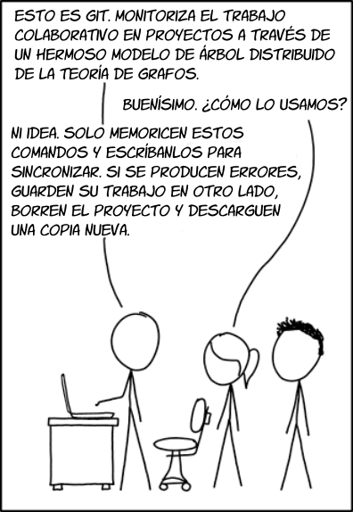
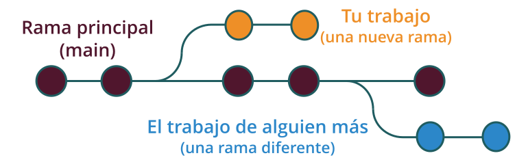
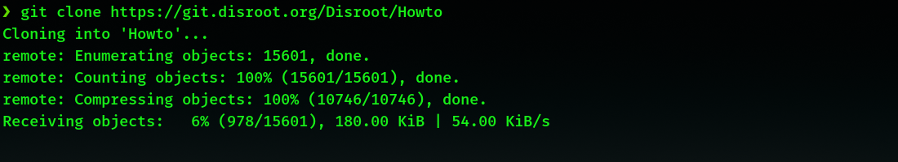

# ¿Git?
Si, **Git**. Es un sistema de control de versiones, un programa que nos permite hacer seguimiento de modificaciones a archivos, manteniendo un registro de todos los cambios hechos, por lo que si necesitamos volver a una versión específica podemos hacerlo de una manera relativamente sencilla. También es una poderosa herramienta de colaboración ya que posibilita que muchas personas trabajen sobre los mismos archivos de un proyecto.

Aprender las bases de Git y trabajar con él puede ser no solo muy útil, sino también una experiencia divertida.

# Alcance de este tutorial
Nuestro uso de Git no requiere un elevado nivel de conocimiento técnico, cualquiera puede aprender el conjunto básico de comandos necesarios. Y, para hacerlo aún más fácil, hay varios editores de texto con Git integrado que reducen la interacción con la terminal al mínimo. 
Así que el objetivo de los siguientes tutoriales es mostrarles lo fundamental de Git, la herramienta principal que usamos para gestionar los archivos del proyecto **Howto**. Por lo tanto, no cubriremos todos los aspectos de su uso, solo algunos conceptos y comandos básicos.

Si les interesa conocer más acerca de Git, hay un montón de tutoriales detallados y documentación escrita que pueden encontrar fácilmente en Internet.

# ¿Que hace Git?: Conceptos básicos

Cuando leen un tutorial de **Disroot** , lo que ven en sus navegadores es la representación de una pieza de código, en nuestro caso, un archivo escrito en una sintaxis de formato llamada **Markdown**. El código y el contenido entero de este sitio web está alojado en un **repositorio de Git**, una carpeta que contiene todos los archivos del proyecto y el historial de cambios de todos y cada uno de esos archivos (qué cambió, quién lo cambió y por qué cambió).

En este repositorio (o repo) hay una **rama principal** (la rama _"main"_ o _"master"_), que es la linea de desarrollo por defecto del proyecto y desde la cual otras ramas pueden ser creadas sin comprometerla.

Piensa en un árbol: la "rama principal" sería el tronco del cual diferentes ramas "crecen y se desarrollan". Una vez que completan su ciclo, pueden ser integradas en el "tronco" o incluso "caer" de él sin afectarlo.

Así, la rama principal es la única que contiene el código que vemos en línea (o "en producción") y las ramas que creamos son las que contienen nuestro trabajo.

 

 

De esta manera, cuando un tutorial necesita ser modificado (e.j, porque algún programa ha sido actualizado, erratas son encontradas en el documento, hay información que es añadida o eliminada, etc) o es traducido, lo que hacemos es copiar el repositorio remoto en nuestra máquina así podemos trabajar localmente sobre los archivos. Este procedimiento es llamado **clonado** y una vez realizado, todas las modificaciones y las operaciones Git son gestionadas desde nuestro repositorio local.

## Clonando el repositorio **Howto Disroot**
Como mencionamos antes, el proceso de obtener una copia de todos los archivos dentro del proyecto es llamado "**clonar**" un repositorio. Y una vez que lo hemos clonado, todas las modificaciones se harán en la copia de nuestra máquina local (la mayoría de nuestro trabajo es hecho fuera de línea).

Para clonar un repositorio solo abrimos una terminal, navegamos hasta el directorio donde queremos hacerlo, y ejecutamos el comando `git clone`, es decir, a través de este comando le decimos a Git que lo descargue. El comando es seguido por la **direccion URL** del repositorio que queremos clonar. En nuestro caso seria:

`git clone https://git.disroot.org/Disroot/Howto`

Si queremos traducir una página del **Sitio web de Disroot** entonces escribimos:

`git clone https://git.disroot.org/Disroot/Website`

A continuación se iniciará el proceso y unos minutos después, dependiendo de nuestra conexión a Internet, tendremos el repositorio clonado en nuestra máquina.

Una vez el proceso ha sido completado, veremos un directorio `Howto` (o un directorio `Website`) que contiene todos los archivos del sitio. Luego podemos moverlo a cualquier directorio a cualquier que queramos de nuestro ordenador.

Ahora, antes de empezar realmente a trabajar, configuremos nuestra identidad para continuar sin distracciones.

## Establecer nuestra identidad
Para poder enviar el trabajo desde nuestra máquina al repositorio remoto, es necesario configurar nuestro nombre de usuario o usuaria y correo electronico. Esta información es usada por Git para "firmar" los "commits" (las "instantáneas" de nuestras modificaciones, veremos esto más adelante).

1. Abrimos nuestra terminal en (o navegamos hasta) el directorio/carpeta donde hemos clonado el repositorio.

2. Escribimos y completamos con nuestra información los siguientes comandos: 
`git config --global user.email` **nuestro@correo** `<- aqui va nuestra dirección de correo electrónico` 
`git config --global user.name` **"Nombre de usuaria o usuario"** `<- y aquí nuestro nombre de usuario o usuaria` 

No necesitaremos introducir esta información otra vez.

## Solicitando acceso al repositorio de Disroot
La forma más rápida y recomendada de solicitar el acceso es a través de nuestra **sala de chat de Howto** en `howto@chat.disroot.org`. También puedes enviarnos un email a  `howto@disroot.org`.

Una vez que los administradores les den acceso, podrán hacer "*push*" (enviar) sus cambios al servidor.

!! **NOTA** 
!! Podrían empezar a trabajar sin el acceso concedido, ya que todos los cambios se realizan en sus ordenadores, y solicitar luego el acceso al repositorio.

Ok. Sigamos.
