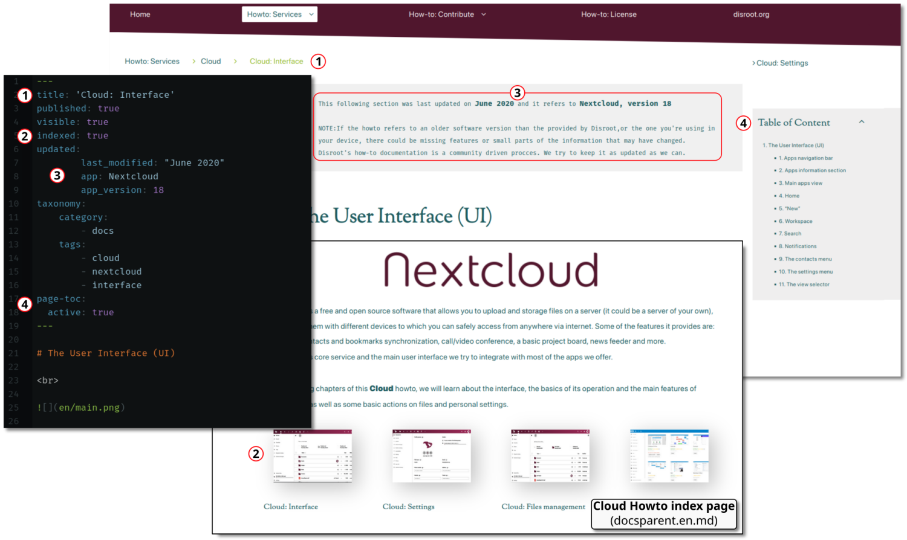

# Obecná struktura

Web **Howto** se skládá z textových souborů ve formátu Markdown, které jsou obsaženy ve složkách hierarchicky uspořádaných do sekcí.

Stránka má **tři hlavní adresáře**:
- **pages**: tento adresář obsahuje stránky a návody. Jedná se o jediný obsah, který můžeme upravovat a překládat.
- **themes**: zde jsou soubory a konfigurace, které utvářejí podobu webu.
- **vagrant**: tato složka obsahuje soubory potřebné ke spuštění softwaru Vagrant, který slouží k vytváření virtuálních prostředí.

Jediný adresář, který nás zajímá pro vytváření, úpravy a překlad howtos, je **pages**.

Jak vidíme na obrázku výše, adresář **stránky** obsahuje několik dalších adresářů a podadresářů.

- **01.home**: zde se nachází úvodní stránka **Howto**.
- **02.tutorials**: v tomto adresáři jsou umístěny všechny návody a jsou uspořádány podle kategorií.
- **03.Glossary**: zde je stránka, kde hodláme shromažďovat většinu důležitých pojmů, které používáme prostřednictvím howtos a návodů.
- **04.Contribute**: v tomto adresáři najdeme návody, jak vytvářet, upravovat a překládat stránky webu.
- **05.Licensing**: licence, pod kterou je obsah stránek uvolněn.
- **06.disroot.org**: odkaz na webové stránky **Disroot**.
- **Archiv**: tato složka obsahuje všechny návody, které již nejsou online.

# Stránky
V současné době existují dvě různé šablony pro stránky **Howto**:
- **docs.md**: jedná se o nejběžnější textové soubory, které můžeme najít na webu Howto, tedy stránky, které tvoří howto.

- **docsparent.md**: tyto stránky slouží k indexování všech **podřízených stránek**, které jsou ve svém **záhlaví** označeny jako `indexed:true`, a vytvářejí nabídku souvisejících stránek. Pokud je ve složce *dceřiné stránky* umístěn obrázek, zobrazí se v indexu jeho miniatura (preferovaná velikost miniatury je 400x300).

## Záhlaví stránky
Záhlaví stránky je místo, kde nastavujeme všechny proměnné pro danou stránku. Je to část, která se zobrazuje nad obsahem uzavřeným mezi třemi pomlčkami `---`.

Níže je uveden seznam nejčastějších proměnných, které lze zadat v jednotlivých záhlavích, a jejich účel.

- **title**: je název stránky a bude se zobrazovat v nabídkách a indexech.

- **subtitle**: zobrazuje se jako položky na domovské stránce.

- **icon**: ikona Fork-awesome, která se zobrazuje na domovských stránkách.

- **visible**: nastavuje se pomocí logické hodnoty, *true* nebo *false*. Pokud je u stránek dětí druhého stupně nastavena hodnota false, nezobrazí se v indexu.

- **indexed**: nastavuje se pomocí logické hodnoty, *pravdivé* nebo *nepravdivé*. Příspěvky nastavené na hodnotu true se zobrazí v indexech nadřazených stránek. Také přidá miniaturu do adresářů stránek, pokud existují (preferovaná velikost miniatury je 400x300).

- **updated**: je-li zadáno, zobrazí se na stránce informace o metadatech.

- **published**: nastavuje se pomocí logické hodnoty, *true* nebo *false*.

- **taxonomy**: slouží k nastavení kategorií a značek. Příspěvky s kategorií 'téma' se zobrazí jako hlavní témata v nabídce domovské stránky.

- **page-toc**: nastavuje se pomocí logické hodnoty, *true* nebo *false*. Určuje, zda je *Tabulka obsahu* na stránce viditelná, nebo ne. Obvykle se nastavuje na false pro indexové stránky (docsparent.md).

Abychom lépe pochopili, jak tyto proměnné ovlivňují stránky, můžeme se podívat například na záhlaví indexové stránky **Cloud** (02.Cloud/docsparent.cs.md):

- _docsparent.md_ na indexové/hlavní stránce

- _docs.md_ header and view at the Cloud howto index (02.Cloud/docsparent.en.md)

## Meta information

The meta information is set automatically when specified in the page header under the `updated:` variable. It is necessary to let readers know if the howto is up to date. The fields to complete are:

`last_modified:` "Month and Year" wrapped between `" "` _(i.e: "June 2020")_ 
`app:` Software name _(i.e: Nextcloud)_ 
`app_version:` Number version of the software _(i.e: 18)_ 

### Where to place the Meta information?
This information is not necessary in the indexes, but in those pages where there is data that may vary with updates.

