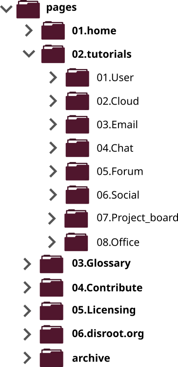
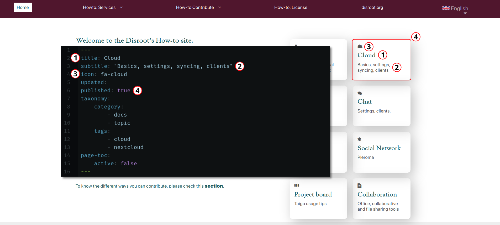
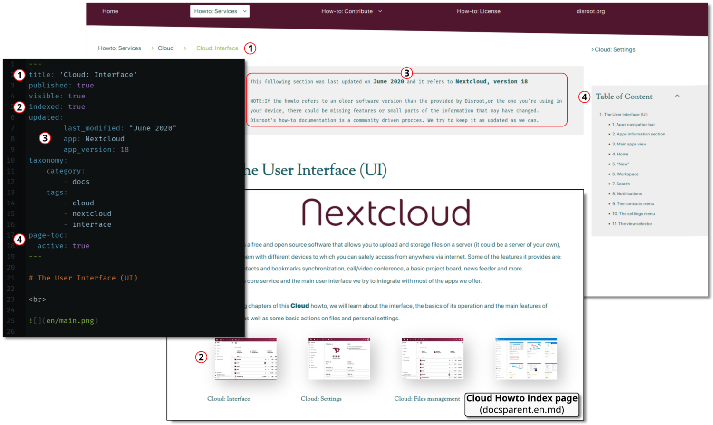
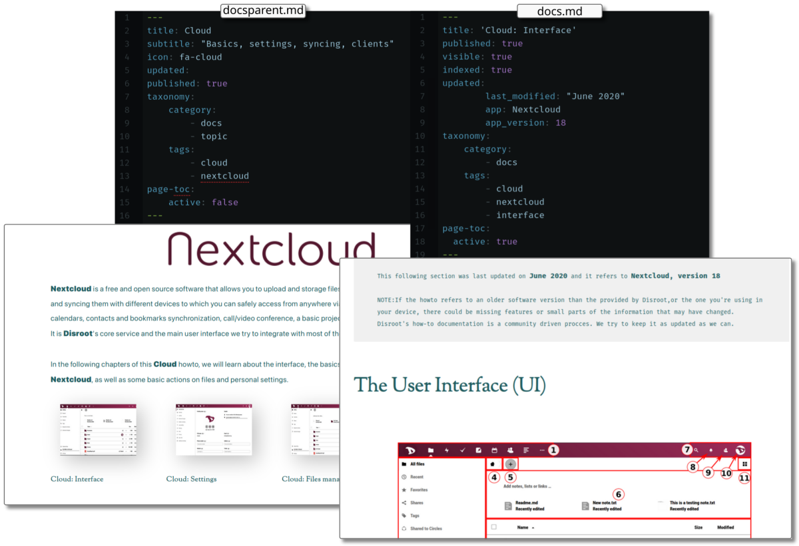

# General Structure

The **Howto** site is made up of text files in Markdown format contained in folders organized hierarchically in sections.

The site has **three main directories**:
- **pages**: this folder contains the pages and tutorials. This is the only content we can edit and translate.
- **themes**: here are the files and configurations that shape the site.
- **vagrant**: this folder contains the necessary files to run Vagrant, a software to create virtual environments.

The only directory we are interested in for creating, editing and translating howtos is **pages**.

As we can see in the image above, the **pages** directory contains several other directories and subdirectories.

- **01.home**: here is the **Howto** landing page.
- **02.tutorials**: this is the directory where all the howtos are located and organized by categories.
- **03.Glossary**: here is the page where we intend to gather most of the important terms we use through the howtos and guides.
- **04.Contribute**: in this directory we will find guides on how to create, edit and translate the pages of the site.
- **05.Licensing**: the license under which the site content is released.
- **06.disroot.org**: the link to the **Disroot** website.
- **archive**: this folder contains all the howtos that are no longer online.

# Pages
There are currently two different templates for the **Howto** pages:
- **docs.md**: these are the most common text files we can find in the Howto site, the pages that make the howtos.

- **docsparent.md**: these pages are used to index all the **child pages** that are marked as `indexed:true` in its **headers**, creating a menu of the related pages. If an image is placed in the folder of a *child page*, a thumbnail will be shown in the index (preferred thumbnail size is 400x300).

## Page headers
The page header is the place where we set all the variables for a given page. It is the part that appears above the content enclosed between three dashes `---`.

Below there is a list of the most common variables that can be specified in each header and their purpose.

- **title**: is the name of the page and it will appear in menus and indexes.

- **subtitle**: is displayed as items in the home page.

- **icon**: a Fork-awesome icon that is displayed on the home pages.

- **visible**: set by a boolean value, *true* or *false*. When set to false on second degree children pages, they will not appear in the index.

- **indexed**: set by a boolean value, *true* or *false*. Posts set to true appear in parent pages indexes. Also add a thumbnail in page directories if any (preferred thumbnail size is 400x300).

- **updated**: when it is specified, the metadata information will be displayed on page.

- **published**: set by a boolean value, *true* or *false*.

- **taxonomy**: to set categories and tags. Posts with the category 'topic' appear as the main topics on the home page menu.

- **page-toc**: set by a boolean value, *true* or *false*. Determines if a *Table of Content* is visible on page or not. Usually it is set to false for index pages (docsparent.md).

To better understand how these variables affect the pages, we can take a look at, for example, the **Cloud** index page header (02.Cloud/docsparent.en.md):

- _docsparent.md_ at the index/home page

- _docs.md_ header and view at the Cloud howto index (02.Cloud/docsparent.en.md)

## Meta information

The meta information is set automatically when specified in the page header under the `updated:` variable. It is necessary to let readers know if the howto is up to date. The fields to complete are:

`last_modified:` "Month and Year" wrapped between `" "` _(i.e: "June 2020")_ 
`app:` Software name _(i.e: Nextcloud)_ 
`app_version:` Number version of the software _(i.e: 18)_ 

### Where to place the Meta information?
This information is not necessary in the indexes, but in those pages where there is data that may vary with updates.

