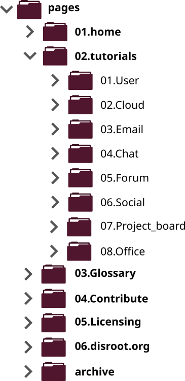
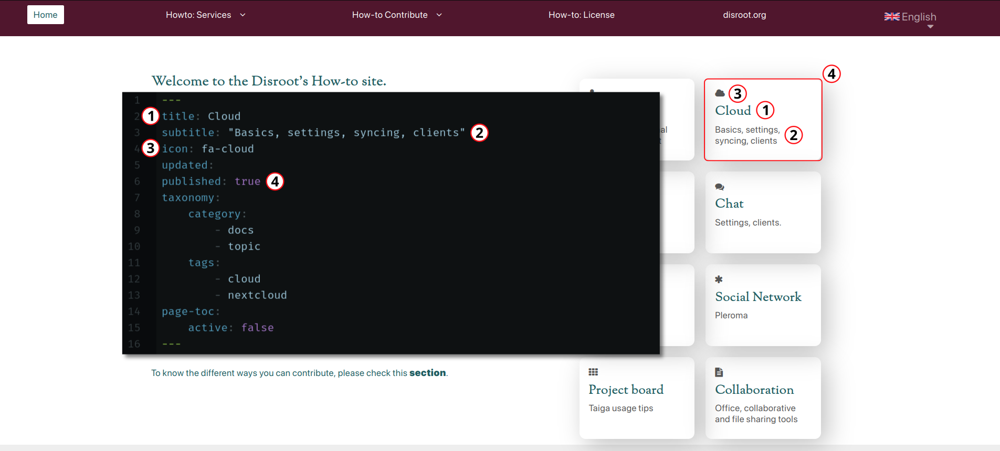

# Estructura general

El sitio **Howto** está compuesto de archivos de texto en formato Markdown contenidos en carpetas organizadas jerárquicamente en secciones.

El sitio tiene **tres directorios principales**:
- **pages**: esta carpeta contiene las páginas y tutoriales. Este es el único contenido que podemos editar y traducir.
- **themes**: aquí están los archivos y configuraciones que le dan forma al sitio.
- **vagrant**: esta carpeta contiene los archivos necesarios para ejecutar Vagrant, un programa para crear entornos virtuales.

El único directorio que nos interesa para crear, editar y traducir guías es **pages**.

Como podemos ver en la imagen de arriba, el directorio **pages** contiene varios otros directorios y subdirectorios.

- **01.home**: aquí está la página de inicio del sitio **Howto**.
- **02.tutorials**: este el directorio donde todas las guías están alojadas y organizadas por categorías.
- **03.Glossary**: aquí está la página donde intentamos reunir la mayoría de los términos que utilizamos a través de las guías y tutoriales.
- **04.Contribute**: en este directorio encontraremos guías sobre cómo crear, editar y traducir las páginas del sitio.
- **05.Licensing**: la licencia bajo la cual está el contenido del sitio.
- **06.disroot.org**: el link al sitio de **Disroot**.
- **archive**: esta carpeta contiene todas las guías que ya no están en línea.

# Páginas (pages)
Hay actualmente dos diferentes plantillas para las páginas del sitio **Howto**:

- **docs.md**: estas son los archivos de texto más comúnes que podemos encontrar dentro del sitio Howto, las páginas que forman las guías.

- **docsparent.md**: estas páginas son utilizadas para indexar todas las **páginas secundarias** que están marcadas como `indexed:true` en sus **cabeceras (headers)**, creando un menú de las páginas relacionadas. Si una imagen es ubicada en la carpeta de una *página secundaria*, una miniatura será mostrada en el índice (el tamaño preferido de la miniatura es de 400x300 píxeles).

## Cabeceras de las páginas (page headers)
La cabecera de una página es el lugar donde establecemos las variables para una página determinada. Es la parte que aparece arriba del contenido encerrada entre tres guiones `---`.

Debajo hay una lista de las variables más comúnes que pueden ser especificadas en cada cabecera y sus propósitos.

- **title**: "título". Es el nombre de la página y aparecerá en los menús e índices.

- **subtitle**: "subtítulo". Los subtítulos son mostrados como items en las páginas principales.

- **icon**: "ícono". Un ícono de Fork-awesome que se muestra en la página de inicio.

- **visible**: establecido por un valor booleano, *true (verdadero)* o *false (falso)*. Cuando se establece como *false* en las páginas secundarias, estas no aparecerán en el índice.

- **indexed**: "indexado". Establecido por un valor booleano, *true (verdadero)* o *false (falso)*. Las publicaciones configuradas como *true* aparecen en los índices de las páginas principales. También agrega una miniatura, si la hubiera, en los directorios de páginas (el tamaño preferido de la miniatura es de 400x300 píxeles).

- **updated**: "actualizada". Cuando se especifica, se mostrará como "meta información" en la página.

- **published**: "publicada". Establecido por un valor booleano, *true (verdadero)* o *false (falso)*.

- **taxonomy**: "clasificación". Se utiliza para establecer categorías y etiquetas. Las publicaciones con la categoría 'topic' (tópico) aparecen como los tópicos principales en el menú de la página de inicio.

- **page-toc**: "índice de la página". Establecido por un valor booleano, *true (verdadero)* o *false (falso)*. Determina si un índice (*table of content*) es visible o no en una página. Usualmente, se establece como *false* para las páginas principales (docsparent.md).

Para comprender mejor cómo estas variables afectan a las páginas, podemos echar un vistazo a, por ejemplo, la cabecera de la página principal de la **Nube** (02.Cloud/docsparent.en.md):

- _docsparent.md_ en la página de inicio

- _docs.md_ cabecera y vista en la página principal de la guía sobre la Nube (02.Cloud/docsparent.en.md)

## Meta información

La meta información es establecida automáticamente cuando se especifica en la cabecera de una página debajo de la variable `updated:`. Es necesario que las personas usuarias sepan si una guía está actualizada. Los campos a completar son:

`last_modified:` "última modificación". "Mes, Año" encerrados entre comillas `" "`. _(p.ej: "Junio, 2020")_ 
`app:` Nombre del programa o servicio. _(p.ej: Nextcloud)_ 
`app_version:` Número de versión del programa. _(p.ej: 18)_ 

### ¿Dónde colocar la meta información?
Esta información no es necesaria en las páginas principales, sino en  aquellas donde la información pueda variar con las actualizaciones.

