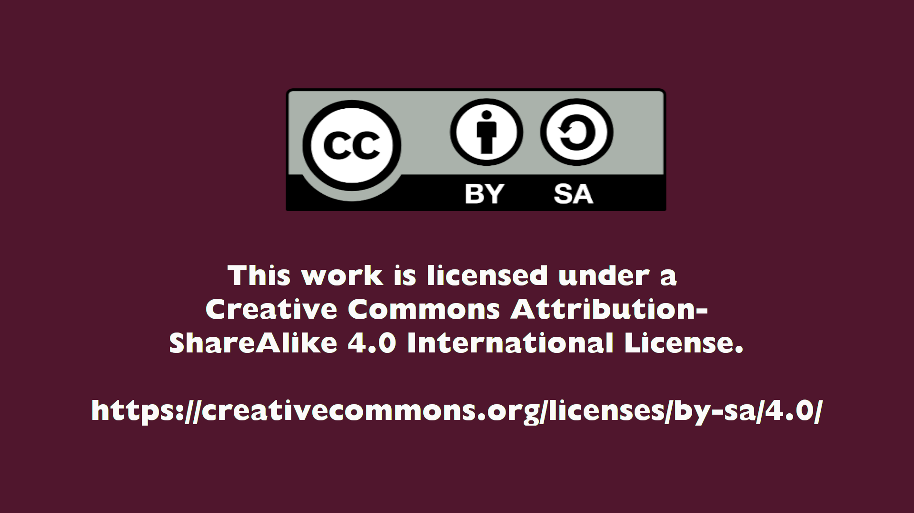

# Pokyny pro vzhled obsahu

Stejně jako u informací, i při zařazování vizuálního obsahu musíme dodržovat určitá kritéria, aby návod byl především didaktický a užitečný. Mějte na paměti, že někdy příliš mnoho obrázků může způsobit, že se přestaneme soustředit na informace a výsledkem bude poněkud nepřehledný dokument. Nemluvě o tom, že to může zbytečně prodloužit dobu načítání stránky.

Takže první, co musíme udělat, je vyhodnotit, které základní vizuální pomůcky je třeba zahrnout. Například najít nabídku nebo konfiguraci, popsat akce, způsob jejich provedení nebo porovnat účinky jejich provedení.

# Obecná kritéria
Obecně řečeno, vizuální obsah návodu k použití by pak měl splňovat následující kritéria:

1. **Použití vizuálních pomůcek** _(kdykoli je to možné)_ **jako například**:
    - snímky obrazovky
    - Obrázky ve formátu GIF / videozáznamy z počítače nebo mobilního telefonu

* Doporučený software: * V případě, že se jedná o videokameru, můžete použít např:
 - [**Peek**](https://github.com/phw/peek): animovaný záznam GIF (počítač).
 - [**ScreenCam**](https://f-droid.org/en/packages/com.orpheusdroid.screenrecorder/): záznam obrazovky (telefon).
 - [**scrcpy**](https://github.com/Genymobile/scrcpy): záznamník mobilní obrazovky (počítač)

2. **Snadno se přizpůsobí dalším projektům**: Za tímto účelem by měly být zmínky o **Disroot** a další jedinečné identifikátory projektu **Disroot** omezeny na nezbytné minimum a obsah by měl být co nejobecnější a bez přídavných jmen. Tímto způsobem bude pro ostatní projekty snazší howtos používat, přizpůsobovat a upravovat.

3. **Konkrétní textový obsah**: Pište pouze to, co je nezbytné k vysvětlení úkolu nebo funkce, a upozorněte na důležité věci, které by uživatelé měli vědět, například pomocí "upozornění" (viz níže).

4. **Vyhněte se dlouhým odstavcům textu**

5. **Při popisu několika kroků nebo funkcí používejte místo velkých odstavců odrážky**.

6. **Vyhněte se používání tabulek, pokud neslouží k jinému účelu než k formování textu**.

## Používání "Upozornění":
"Upozornění" jsou malé části textu, které můžeme použít ke zdůraznění důležitých informací, například ke zdůraznění něčeho, co by uživatelé měli mít na paměti nebo čeho by si měli být vědomi, když něco konfigurují nebo než provedou nějakou akci.

Pro formátování oznámení musíme text začít dvěma vykřičníky `!!`.

Například:
```
!! **POZNÁMKA!** toto je příklad důležité informace.
```

bude vypadat takto:
!! **POZNÁMKA!** toto je příklad důležité informace.

#### Vložené obrázky

Obrázky jsou ve výchozím nastavení vycentrovány do dalšího řádku. Chcete-li použít obrázek inline, tedy na stejném řádku věty, použijte hned za ním {.inline}. Jako v tomto příkladu:

```
 {.inline}
```
----------------------------------------------------------------------


# Markdown: Několik tipů pro formátování

Jak jsme se již zmínili, [How-to Website](https://howto.disroot.org/) **Disroot** je vytvořen pomocí [Grav](https://getgrav.org/) a jako značkovací/formátovací jazyk pro tvorbu textu používá **Markdown**, protože je lehký a jeho syntaxe se snadno učí.

Níže najdete několik tipů a doporučení týkajících se formátování textu výukového programu.

## Nadpisy

Samotný titulek návodu se umisťuje do záhlaví stránky, můžete jej upravit, pokud používáte git.

Co se týče názvů jednotlivých částí návodu, můžete je v jazyce Markdown sestavit pomocí symbolu `#` a mezery před samotným názvem. Například:

Při psaní tohoto...
```
# Nadpis 1
## Nadpis 2
### Nadpis 3
#### Nadpis 4
##### Nadpis 5
```
...se zobrazí jako:

# Nadpis 1
## Nadpis 2
### Nadpis 3
#### Nadpis 4
##### Nadpis 5

Čím více `#` použijete, tím menší bude nadpis.

Nadpisy jsou důležité z několika důvodů. Jedním z hlavních je, že je Grav používá k automatickému generování TOC (Table of Content) stránky. Lze je tedy použít k zobrazení jednotlivých kapitol / částí návodu na začátku indexu stránky.


Menší tituly se v TOC zobrazují jako "podkapitoly". To by mohlo být užitečné k něčemu takovému:

Doporučujeme používat jeden `#` pro hlavní název stránky a dva `##` pro podkapitoly. Můžete použít `###` nadpisy pro menší nadpisy v textu, které chcete mít v TOC, a ještě menší nadpisy pro nadpisy, které v TOC být nemusí.


## Seznamy

Používejte seznamy pro výčet kroků nebo funkcí v návodu k použití.

Vytvořte si body s odrážkami, což je snadné. Writing...
```
Můj seznam:
- něco 1
1. dílčí položka 1
2. dílčí položka 2
- něco 2
```
... zobrazí toto:

Můj seznam:
- něco 1
1. dílčí položka 1
2. dílčí položka 2
- něco 2


## Tučně

Použijte tučné písmo pro zvýraznění:<br>
- Důležité informace
- Upozornění uživatelům
- Nebo menší název uvnitř oddílu, který není nutné uvádět v TOC.

Pro zvýraznění slova nebo řádku tučným písmem použijte dva symboly `*` před a za potřebnou částí.<br> Například pokud napíšete...

`**Něco**`

bude zobrazeno jako:

**Něco**


## Italic

Kurzíva funguje podobně jako tučné písmo. Můžete použít `_` symbol nebo jednu `*` před a za slovem, nebo částí textu pro kterou chcete použít kurzívu.<br>
Příklady:<br>
Psaní...<br>

`_příklad_`<br>
`*příklad*`

... zobrazí toto:

_příklad_<br>
*příklad*


## Odkazy

Někdy potřebujeme vložit odkazy na nějaké stránky, nebo webové stránky. Lze to udělat tímto způsobem:

Napsáním `[odkaz na webové stránky Disroot](disroot.org)`

bude zobrazeno jako:

[odkaz na webové stránky Disroot](disroot.org)


## Vložení videa / gifů / snímků obrazovky do návodu na použití

Jak už jsme se zmínili, máme rádi obrázky / videa v návodech. Můžete je vložit následujícím způsobem:

- Za prvé: Vytvořte složku, kam videa / gify / obrázky umístíte.
- Za druhé: Pojmenujte soubory podle pořadí, v jakém se budou v návodu objevovat.

Poté vytvořte odkaz s cestou ke složce a názvem daného souboru.<br>
Pokud tedy napíšete...

``

... zobrazí se toto:


A když uděláte toto:

Text před  Text za`.

dostanete toto:

text před  text po

Výše popsaná struktura funguje také pro vkládání gifů a videí .mp4.


## Kód

Pokud potřebujete zobrazit některé terminálové příkazy, řádky kódu, instrukce nebo příklady, jako jsme to dělali v této příručce, můžete použít symbol **`** před a za textem, který chcete zobrazit.<br>
Například:<br>

Toto je příkaz příkazového řádku: `sudo apt update`

# Terminologie

Aby byly návody ucelenější a daly se snáze přizpůsobit dalším skupinám, doporučujeme používat následující kritéria:

- Při psaní návodu k použití by měl být název **Disroot** uváděn jako: **Disroot**, začínající velkým písmenem a tučným písmem.

- A na jednotlivé služby odkazovat takto:

|Název služby|Disroot|
|-:|:-|
|Lufi|**Disroot Upload**|
|Forum/Discourse|**Disroot Forum**|
|Etherpad|**Disroot Pad**||
|XMPP|**Disroot Chat**|
|Emailové služby obecně|**Disroot Email**|
|Rainloop|**Disroot Webmail**|
|Private Bin|**Disroot Bin**|
|Nextcloud:|**Disroot Cloud**|
|Nextcloud Calendar App|**Disroot Calendar**|
|Nextcloud Notes App|**Disroot Notes**|
|Nextcloud Contacts App|**Disroot Contacts**|

Takto, pokud jsou výrazy regulární, je jednodušší udělat jen "*Vyhledat a nahradit*" :wink:


# Video návod

U video návodů si také myslíme, že obsah by měl být **zachován na minimální úrovni** a **krátký** natolik, aby uživatel mohl úkol splnit a aby byl přehledný.

Stejně jako textové návody by měly mít návody následující strukturu:

1. **Meta informace**
2. **Obsah**
3. **Licenční informace**

**Metadata** a **licenční informace** budou umístěny správci **Disroot** do popisu videa v instanci Peertube, kde budou videa umístěna.

## Popis obsahu

Videa by měla v maximální možné míře obsahovat:

- Název návodu na použití
- Stručný popis toho, čeho se týká
- Verze softwaru, kterého se týká

Tak, aby je správci **Disroot** mohli umístit do popisu videa v instanci Peertube.

## Obsah

## Licence na video návody k použití

Jak jsme již zmínili, informace o licencování umístí administrátoři **Disroot** do popisu videa.

Doporučujeme však, abyste na konec videa umístili následující obrázek, který bude asi 10 vteřin mizet:



V takovém případě, pokud bude video staženo a znovu nahráno na jiné místo, budou informace o licenci stále k dispozici.

---
