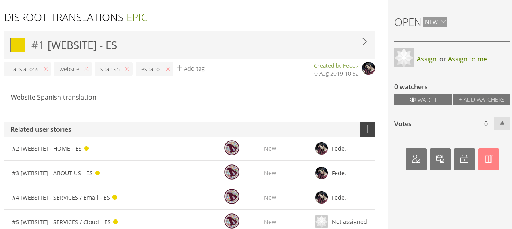
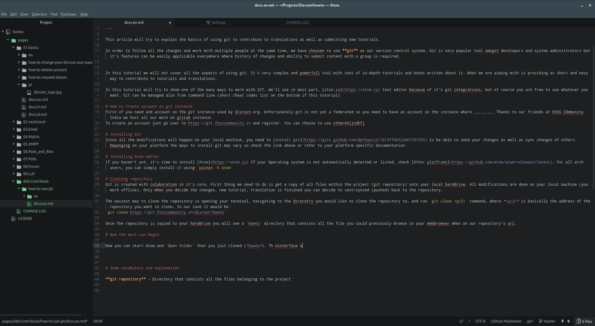
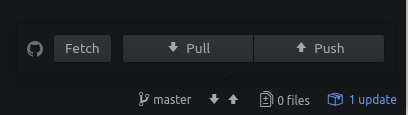
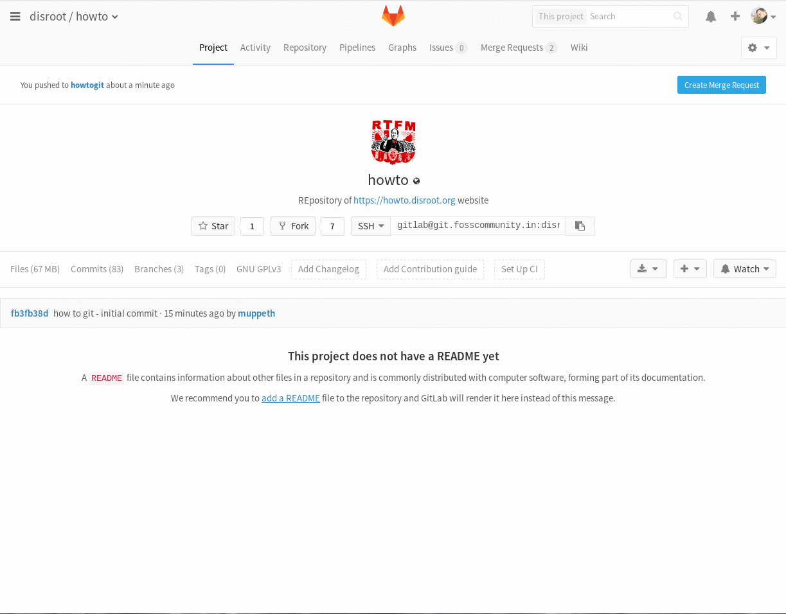

# Warum ein Übersetzungsschema?
Wir sind der Meinung, dass die Möglichkeit, allen Menschen in ihrer eigenen Sprache Zugriff auf Informationen zu ermöglichen, fundamental ist, um gemeinschaftliches Denken und Handeln zu fördern und zu beleben. Daher ist die Koordination der Menge an Informationen, die zu übersetzen sind, eine äußerst wichtige Aufgabe.

Das Übersetzungsschema besteht aus **vier** übergeordneten Schritten.

## Erstens: Einmalige Schritte
1. Erstelle Dir einen Account bei der [FOSS Community India](https://git.fosscommunity.in/users/sign_in)
2. Öffne ein Terminal und starte git 
`git init` 

3. Konfiguriere den git-Benutzernamen und -email 
`git config --global user.email user@email` 
`git config --global user.name "User Name"` 

## Zweitens: Einen zu übersetzenden Bereich auswählen
1. Melde Dich im [**Disroot Translations Board**](https://board.disroot.org/project/fede-disroot-translations/timeline) an
2. Wähle das **Epic** (*ein Satz User Stories*), das zu der Sprache gehört, in die Du übersetzen möchtest
3. Wähle die **User Story** (*der zu übersetzende Bereich*) und ordne ihn Dir zu (**assign**) 

## Drittens: An der Übersetzung arbeiten
1. **Klone das Disroot How-to-Repository** 
    a. Wechsel in das Verzeichnis, in dem Du arbeiten möchtest 
    b. Klone das Repository 
    `git clone https://git.fosscommunity.in/disroot/howto`
2. **Öffne den Atom-Texteditor** 
    a. Gehe zu **File**, wähle **Add Project Folder** und wähle das Verzeichnis aus, in welches das Projekt geklont wurde. 
 
    b. Erstelle eine **Branch** (die Branchbezeichnung sollte dieses Format haben: Website_Bereich.zum.übersetzen_Sprache 
    Zum Beispiel: 
    howto_contribute_git_ES 
    howto_email_webmail_IT)  
    c. Beginne mit der Arbeit an der Übersetzung 
    d. Speichere die Datei nach dem Benennungsmuster "Dateiname.Dein-Sprachcode.md" 
    Wenn Du zum Beispiel an einer deutschen Übersetzung einer Datei namens "docs.md" arbeitest, musst Du sie als "docs.de.md" abspeichern.

3. **Sende die Übersetzung** 
    Wenn Du Deine Arbeit beendet hast, musst Du Deine Änderungen übersenden ("commit"). Ein commit ist ein Satz erstellter oder veränderter Dateien. Deine Änderungen übersendest Du wie folgt: 
    a. Stelle sicher, dass alle Dateien gespeichert sind 
    b. Nun musst Du alle Dateien, die Du übersetzt hast und an den Server übergeben willst, bereitstellen ("Stage") 
    c. Schreibe eine Übersendungsnachricht (eine kurze und knackige Zusammenfassung Deiner Änderungen) 
    d. Klicke den Button **Commit** 

     

    Wenn die Dateien übersendet sind, musst Du sie noch auf den Server schieben ("push"): 
    e. Öffne das **Push/Pull**-Popupfenster 
 

    f. Klicke auf **Push** 

     

## Viertens: Die Zusammenführung der Übersetzungen beantragen
Der letzte Schritt besteht darin, die Zusammenführung Deiner Arbeit in der Master-Branch zu beantragen. Das heißt, wenn Deine Arbeit beendet ist und Du die Übersetzung an den Server übergeben hast, musst Du das **Disroot Übersetzungsteam** bitten, Deine Änderungen zu überprüfen und der Website hinzuzufügen. 
  **WICHTIG!!!**

Während Du an Deiner Branch arbeitest, kann es parallel zu weiteren Änderungen durch andere Nutzer kommen, insbesondere wenn Du bestehende Dateien bearbeitest. Wenn diese Änderungen anderer Nutzer bereits mit der Masterbranch zusammengeführt wurden, kann es passieren, dass diese Änderungen in Deiner Version noch nicht enthalten sind. Versuchst Du nun, Deine Änderungen der nun veralteten Dateien mit der Masterbranch zusammenführen zu lassen, kann es ziemlich chaotisch werden.

Glücklicherweise ist git in der Lage, Versionen zu vergleichen und Deine Änderungen in die aktualisierten Dateien einzufügen. Dazu musst Du jedoch, bevor Du eine Zusammenführung beantragst (**Create Merge Request**), Deine Arbeitsbranch aktualisieren. Durch diese Vorgehensweise kannst Du den Admins und Dir selbst eine Menge unnötiger Arbeit ersparen:

 - Stelle zunächst sicher, dass alle Änderungen übergeben wurden
 - Öffne ein Terminal (Linux)
 - Wechsle in die **Master Branch**: ***git checkout master***
 - Aktualisiere Deine lokale **Master Branch**: ***git pull***
 - Wechsle zurück in Deine Arbeitsbranch: ***git checkout <Branch_Name>***
 - Aktualisiere die Arbeitsbranch aus der lokalen **Master Branch**: ***git rebase master***
 - Verifiziere alle Änderungen und übergib die Dateien an den Server

Nun kannst Du loslegen mit den finalen Schritten, um Deine Dateien mit der **Master Branch** zusammenzuführen:

- Stelle zunächst sicher, dass alle Änderungen übergeben wurden
- Log Dich in unsere [git-Instanz](https://git.fosscommunity.in) ein
- Wenn Du Änderungen zu unserer Branch geschoben hast, wirst Du in der rechten oberen Ecke einen **"Create Merge Request"**-Button sehen. Klicke ihn an, es öffnet sich ein Formular
- Füge einen Titel hinzu (falls er nicht automatisch eingefügt wurde)
- Füge eine Beschreibung hinzu (falls sie nicht automatisch hinzugefügt wurde)
- Überprüfe, dass die Quelle (**source branch**) diejenige ist, von der aus zusammengeführt werden soll (die Branch, in der Du gearbeitet hast)
- Überprüfe, dass das Ziel (**target branch**) die Branch ist, in der die Änderungen zusammengeführt werden sollen (normalerweise die **Master**-Branch)
- Die Checkbox **Delete source branch when merge request is accepted** auszuwählen ist eine gute Idee, wenn Du mit Deiner Arbeit an Deiner Branch vollständig fertig bist

Wenn Du eine Zusammenführungsanfrage erstellt hast, wird sie durch die **Disroot**-Admins überprüft und, wenn alles in Ordnung ist, können sie Deine Übergabe genehmigen. Das heißt, dass Deine Änderungen mit der **Master**-Branch zusammengeführt werden und ab sofort auf der Website sichtbar sind.

Wenn es irgendwelche Probleme gibt, können die Admins Dich bitten, etwas nachzuarbeiten. Wenn Du Deine Korrekturen erledigt hast und die Dokumentation den **Disroot**-Richtlinien entspricht, wird Die Übergabe Deiner Änderungen stattfinden. Es ist nicht nötig, dass Du eine neue Zusammenführungsanfrage erstellst.
 

Um einen besseren Überblick über die Arbeit mit git und Atom zu erhalten, schau Dir bitte auch [**dieses Tutorial**](https://howto.disroot.org/en/contribute/git/how-to-use-git) an.
