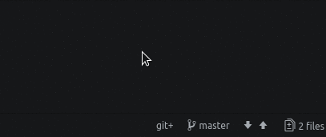
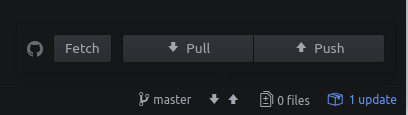

# Why a translation procedure?
We think that the possibility of making information accessible to all in their own languages is fundamental in order to encourage and promote collective thoughts and actions. So coordinating the amount of information to be translated is an important task.

For the purposes of this guide, we will assume that either you know what **git** is or you have read [**this howto**](https://howto.disroot.org/en/contribute/git/how-to-use-git).

---

**The translations procedure consist of four main steps.**

## First: One-time steps
1. Register an account at https://git.fosscommunity.in/users/sign_in
2. Open a terminal and start git 
`git init` 

3. Setup the git username and email 
`git config --global user.email user@email` 
`git config --global user.name "User Name"` 

## Second: Selecting a section to be translated
1. Login at [**Disroot Translations Board**](https://board.disroot.org/project/fede-disroot-translations/timeline)
2. Select the **Epic** (*the set of User Stories*) corresponding to the language into which you are going to translate
3. Select the **User Story** (*the section to be translated*) and **assign** it to yourself 

## Third: Working on translations
1. **Clone the Disroot Howto repository** 
    a. Navigate to the folder where you're going work in (or open the terminal in the folder) 
    b. Clone the repository 
    `git clone https://git.fosscommunity.in/disroot/howto`
2. **Open Atom text editor** 
    a. Go to **File**, select **Add Project Folder** and browse to the folder where the project was cloned. 
 
    b. Create a branch (the branch should have this format: site_section.to.be.translated_LAnguage 
    For example: 
    howto_contribute_git_ES 
    howto_email_webmail_IT  
    c. Start working on the translations 
    d. Save as "filename.your-language-code.md" 
    For example, if you were working on a french translation of a file named as "docs.md", you have to save it as "docs.fr.md"

3. **Sending the translation** 
    Once your work is done, you'll have to "commit" your changes. A commit is a set of files created or modified. To commit your changes you need to: 
    a. Make sure all files are saved 
    b. Stage all the files you've translated and want to submit to the server 
    c. Write a commit message (a short and very specific summary of what has been changed) 
    d. Hit **Commit** button 

     

    Once the files are commited, you have to "push" (send) them to the server: 
    e. Open **Push/Pull** popup window 
 

    f. Press **Push** 

     

## Fourth: Requesting the merge of the Translations
Final step is to request the merge of your work into the master branch. This means that once your finished and sent the translation, you need to request **Disroot Translation Team** to check if it's all right to finally add it to the site. 
1. Login to https://git.fosscommunity.in 
    At the top right you'll see a **Create Merge Request** button that will open the merge request form, click on it
2. Add a title
3. Add a descripton
4. Make sure the source branch is the one you want to merge from (the one you've been working on)
5. Make sure the target branch is the one you want to merge to (usually Master branch)
6. Check the box **Delete source branch when merge request is accepted** if you're completely sure your work is done, this way chances of confusing subsequent translations are avoided.

If there's any issue, Admins could request you to correct something. Once all the corrections are made and the documentation meets the **Disroot** guidelines, your merge request will be pulled to the master.
