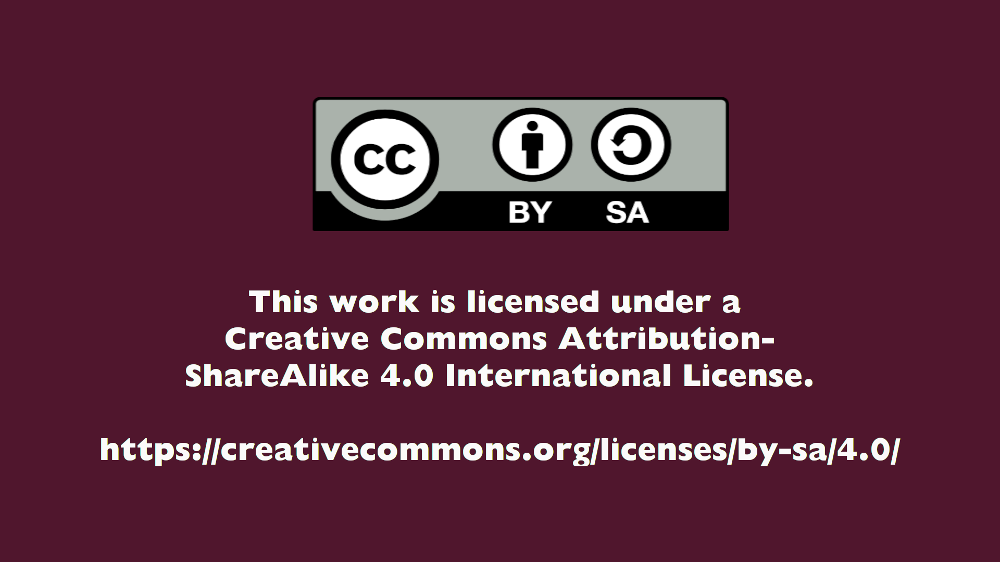

# Gestaltungsrichtlinie

Dieser Bereich soll einige grundlegende Richtlinien bereitstellen, wie ein Tutorial oder How-to für die **Disroot**-[How-to Website](https://howto.disroot.org) geschrieben werden sollen.
Das Ziel ist hierbei, eine einheitliche Struktur in den How-to's zu erreichen und sicherzustellen, dass die How-to's die Beiträge enthält, welche die **Disroot**-Gemeinschaft (nach einigen Diskussionen) für wichtig hält.

Wie wir bereits in den [git-Basics](/contribute/git/how-to-use-git) erläutert haben, arbeiten wir mit git, dem Atom-Texteditor und der Markdown Markup Sprache als Werkzeuge der Wahl.

Wenn Du Dich mit diesen Werkzeugen nicht wohl fühlst, kannst Du natürlich auch jeden anderen Texteditor benutzen. Wir nehmen alles :smiley:

## Seiten

Aktuell gibt es zwei verschiedene Vorlagen für die How-to-Seiten, "docs.md" und "docsparent.md". "docparent.md" wird alle Nachfolger-Seiten indizieren, die im Header mit "indexed:true" markiert sind, und dadurch ein Menü der zugehörigen Seiten erstellen. Wenn im Verzeichnis der Nachfolger-Seite eine Bilddatei abgelegt ist, wird im Index ein Thumbnail (400x300) dargestellt.

# Seiten-Header

Der Seiten-Header ist die Stelle, an der Du alle Variablen für die Seite setzen kannst. Er erscheint über dem Seiteninhalt, eingeschlossen von drei Bindestrichen (---).

Im Folgenden findest Du die Variablen, die im Header definiert werden können:

*title*: Der Name der Seite. Er erscheint in Menüs und Indizes.
*subtitle*: Erscheint unter Items auf der Homepage.
*icon*: Fork-Awesome Icon, das auf der Homepage erscheint.
*visible*: Boolean. Wird dieser Wert Nachfolgern zweiten Grades auf false gesetzt, erscheinen diese nicht im Index.
*indexed*: Boolean. Wird dieser Wert auf true gesetzt, erscheint die Seite im Index der Eltern-Seite. Fügt ein Thumbnail der Bilddatei im Seiten-Verzeichnis (400x300) ein.
*updated*: Wenn definiert, werden die Metadaten auf der Seite angezeigt.
*published*: Boolean
*taxonomy*: Setzt Kategorien und Tags. Seiten mit der Kategorie 'topic' erscheinen als Hauptthema im Homepage-Menü.
*page-toc*: Boolean. Bestimmt, ob ein Inhaltsverzeichnis auf der Seite angezeigt wird. Wird normalerweise auf false gesetzt bei Index-Seiten (docsparent.md).


#### Beispiele:


```
---
title: Cloud
subtitle: "Basics, settings, syncing, clients"  
icon: fa-cloud
updated:
________last_modified: "April 2019"		 
________app: Nextcloud
________app_version: 15
published: true
taxonomy:
____category:
________- docs
________- topic				
____tags:
________- cloud
page-toc:
____active: false			
---
```
_docsparent.md_


```
---
title: 'Cloud: Nextcloud Introduction'		
published: true
visible: true
indexed: true    			
updated:
________last_modified: "April 2019"		
________app: Nextcloud
________app_version: 15
taxonomy:
____category:
________- docs
____tags:
_______- cloud
page-toc:
____active: true					
---
```
_docs.md_


## Metainformationen

Metainformation werden automatisch erstellt, wenn sie im Seiten-Header unter 'updated' definiert sind:

```
updated:
________last_modified: "April 2019"
________app: Nextcloud
________app_version: 15
```

# Inhalts-Richtlinien

Wir sind der Meinung, dass die How-to-Texte der Übersichtlichkeit und Übertragbarkeit zuliebe so kurz wie möglich gehalten werden sollten. Im Idealfall enthalten sie nur die nötigsten Hintergrundinformationen, die grundlegenden Schritte und, wann immer möglich, visuelle Unterstützung (Screenshots, gifs), welche die erklärten Schritte verdeutlicht.

Der Inhalt eines How-to sollte die folgenden Kriterien erfüllen:

1. **Nutzung visueller Hilfen**:
    - Screenshots
    - Gif- / Video-Aufnahmen des Desktop oder Smartphones

!!    
!! Für Gif- / Video-Aufnahmen arbeiten wir normalerweise mit [**Peek**](https://github.com/phw/peek)
!!
!! Für mobile Endgeräte kannst Du [**ScreenCam**](https://f-droid.org/de/packages/com.orpheusdroid.screenrecorder/) nutzen

2. **Einfach durch andere Projekte anzupassen**:
Um dies zu erreichen, sollten unserer Meinung nach Erwähnungen von **Disroot** und besonderer Identifizierungsmerkmale des **Disroot**-Projekts auf ein notwendiges Minimum beschränkt werden. Auf diese Weise ist für andere Projekte einfacher, die How-to's zu verwenden und anzupassen.

3. **Prägnanter Inhalt**:
Schreibe nur, was notwendig ist, um eine Aufgabe oder eine Funktion zu beschreiben und weise auf wichtige Dinge hin, die ein Nutzer wissen sollte.

4. **Vermeide lange Absätze**

5. **Benutze Aufzählungen anstatt langer Absätze, wenn Du mehrere Schritte oder Funktionen beschreibst**

6. **Vermeide Taellen, es sei denn, sie dienen einem anderen Zweck als der Textformatierung**

#### Notes:

Starte eine Zeile mit !! um wichtige Hinweie zu formatieren. Füge das Ausrufezeichen-Bild mit \!\[]\(/home/icons/note.png) hinzu.

Beispiel:

!! 
!! **ACHTUNG!**

Wenn Du Dein Passwort verlierst oder vergisst, hast Du **keine** Möglichkeit mehr, an Deine Dateien zu kommen, da diese verschlüsselt sind. Nicht mal die Server-Administratoren können den Inhalt Deiner Dateien sehen.


#### Inline-Bilder

Bilder werden standardmäßig zentriert in der nächsten Zeile eingefügt. Um ein Inline-Bild zu erzeugen, also ein Bild in der selben Zeile wie dem Satz einzufügen, schreibe  {.inline} direkt dahinter. So wie in diesem Beispiel:

```
 {.inline}
```
----------------------------------------------------------------------


# Einige Formatierungshinweise

**Disroot**'s [How-to Website](https://howto.disroot.org/) wurde mit [Grav](https://getgrav.org/) erstellt, und nutzt **Markdown** als Markup- / Formatierungs-Texterstellungssprache, weil dies eine einfache Möglichkeit darstellt.

Wenn Du also ein How-To für **Disroot** erstellen möchtest und mit Markdown keine Erfahrung hast, wollen wir Dir hier ein paar Tipps und Empfehlungen zur Textformatierung eines Tutorials geben:

## Titel

Der How-To-Titel selbst steht im Seiten-Header. Du kannst ihn ändern, wenn Du git benutzt.

Für die Titel der unterschiedlichen Bereiche oder Abschnitte in einem How-to kannst Du in Markdown das '#'-Symbol und ein Leerzeichen vor dem Titel selbst benutzen. Zum Beispiel:

Schreibst Du dieses...
```
# Titel 1
## Titel 2
### Titel 3
#### Titel 4
##### Titel 5
```
...wird es so angezeigt:

# Titel 1
## Titel 2
### Titel 3
#### Titel 4
##### Titel 5

Je mehr `#` Du benutzt desto kleiner wird der Titel.

Titel sind aus verschiedenen Gründen wichtig. Einer der Hauptgründe ist, dass Grav automatisch aus den Titeln die TOC (Table of Content, Inhaltsverzeichnis) der Seite generiert. Auf diese Weise können Titel genutzt werden, um bereits am Anfang der Seite einen Überblick über die verschiedenen Kapitel oder Bereiche der Seite zu geben.

Kleinere Titel erscheinen als Unterkapitel in der TOC. Das kann sehr hilfreich sein, benötigt für die Ausführung natürlich eine gewisse Ordnung:

Wir empfehlen, das einzelne `#` ein einziges Mal auf der Seite zu nutzen, nämlich für den Seitentitel, und zwei `#` für Unterkapitel. Du kannst Titel mit drei `#` für untergeordnete Überschriften im Text benutzen, die Du auch noch in der TOC erscheinen lassen willst, und noch kleinere Titel für Überschriften, die nicht in der TOC enthalten sein müssen.


## Listen

Bitte, benutze Listen für schrittweise Erläuterungen oder Funktionsaufzählungen in einem How-to.

Aufzählungszeichen zu erzeugen ist ganz einfach. Schreibst Du...
```
Meine Liste:
- irgendwas 1
1. Unterpunkt 1
2. Unterpunkt 2
- irgendwas 2
```
...wird das Ganze später so aussehen:

Meine Liste:
- irgendwas 1
    1. Unterpunkt 1
    2. Unterpunkt 2
- irgendwas 2


## Fett

Bitte benutze die "Fett"-Formatierung um folgendes hervorzuheben:<br>
- Wichtige Informationen
- Warnungen an den Benutzer
- Kleinere Titel innerhalb eines Bereichs, die nicht unbedingt in der TOC aufgeführt werden müssen.

Um ein Wort oder eine Zeile "Fett" zu formatieren, füge zwei `**` vor und hinter dem zu formatierenden Text ein.<br> Wenn Du zum Beispiel schreibst...

`**Irgendetwas**`

wird es dargestellt als:

**Irgendetwas**


## Kursiv

Kursiv funktioniert genauso wie Fett. Du kannst einen `_` oder einen `*` vor und hinter dem zu formatierenden Text einfügen. Italic works in a similar way as bold. You can use the `_` symbol or one `*` symbol before and after the word or text section you want to apply the format.<br>
Beispiele:<br>
Schreibst Du...<br>

`_Beispiel_`<br>
`*Beispiel*`

...wird das so aussehen:

_Beispiel_<br>
*Beispiel*


## Links

Manchmal müssen wir Links zu anderen Seiten oder Websites einfügen. Dies kannst Du folgendermaßen erreichen:

Schreibst Du `[Link zur Disroot-Website](disroot.org)`

wird dies so aussehen:

[link to Disroot website](disroot.org)


## Einbetten von Videos / gifs / Screenshots in die How-to's

Wie wir schon erwähnt haben, wir lieben Bilder / Videos in den Tutorials. Du kannst sie folgendermaßen einbinden:

- Erstens: Erstelle ein Verzeichnis, in welchem die Videos / gifs / Bilder gespeichert werden
- Zweitens: Benenne bzw. nummeriere die Dateien in der Reihenfolge, in der sie im Verlauf des How-to verwendet werden

Dann erstellst Du einen Link mit dem Verzeichnispfad und dem Namen der fraglichen Datei.<br>
Wenn Du also schreibst...

``

... erhältst Du dies:


Wenn Du schreibst:

`Text vorher  Text nachher`

erhältst Du dies:

Text vorher  Text nachher

Mit der gleichen Vorgehensweise kannst Du auch gifs und .mp4-Videos einbetten.


## Code

Wenn Du in Deinem Tutorial Terminal-Kommandos, Codezeilen, Anweisungen oder Beipiele aufführen musst, wie wir das in diesem Ratgeber die ganze Zeit machen, kannst Du das **`** vor und hinter den entsprechenden Text setzen.<br>
Zum Beispiel:<br>

Dies ist eine Komanndozeilen-Anweisung: `sudo apt update`

# Terminologie

Um die Tutorials kohärenter und außerdem die Adaption durch andere Gruppen einfacher zu gestalten, empfehlen wir die Anwendung der folgenden Regeln:

- In einem How-to sollte **Disroot**'s Name sollte benannt werden als: **Disroot**, wobei der erste Buchstabe groß geschrieben und das ganze Wort Fett formatiert wird.

- Die verschiedenen Services werden wie folgt benannt:

|Service|Disroot-Name|
|-:|:-|
|Lufi|**Disroot Upload**|
|Forum/Discourse|**Disroot Forum**|
|Etherpad|**Disroot Pad**|
|EtherCalc|**Disroot Calc**|
|XMPP|**Disroot Chat**|
|Email services im Allgemeinen|**Disroot Email**|
|Rainloop|**Disroot Webmail**|
|Hubzilla Instanz|**DisHub**|
|Private Bin|**Disroot Bin**|
|Polls|**Disroot Polls**|
|Nextcloud:|**Disroot Cloud**|
|Nextcloud Kalender-App|**Disroot Calendar**|
|Nextcloud Notizen-App|**Disroot Notes**|
|Nextcloud Kontakt-App|**Disroot Contacts**|

Auf diese Weise, wenn die Bezeichnungen den Regeln entsprechen, ist es einfacher zu "*suchen und ersetzen*" :wink:


# Video How-to's

Im Bezug auf Video-How-to's denken wir, dass der Inhalt im Sinne der Klarheit ebenfalls **auf ein Minimum reduziert** und **kurz** genug gehalten werden sollte, damit der Benutzer in die Lage versetzt wird, seine Aktivitäten durchzuführen.

WIe auch bei den Text-How-to's sollten die Video-Tutorials die folgende Struktur haben:

1. **Metainformationen**
2. **Inhalt**
3. **Lizenzinformationen**

Die Punkte **Metainformationen** and **Lizenzinformationen** werden durch die **Disroot**-Admins in der Videobeschreibung auf der Peertube-Instanz eingefügt, auf der die Videos gehostet werden.

## Inhaltsbeschreibung

Soweit möglich angeliefert werden mit:

- Titel des How-to
- Kurze Beschreibung, worum es geht
- Softwareversion, auf die es sich bezieht

Auf diese Weise können die **Disroot**-Admins diese Informationen in die Videobeschreibung auf der Peertube-Instanz einfügen.

## Inhalt

## Lizensierung von Video-How-to's

Wie wir bereits zuvor erwähnt haben, werden die **Disroot**-Admins die Lizenzinformationen in die Videobeschreibung einfügen.

Nichtsdestotrotz empfehlen wir, dass Du das folgende Bild am Ende Deines Videos für etwa 10 Sekunden mit einem fade in / fade out einsetzt:



Auf diese Weise sind die Lizenzinformationen immer noch vorhanden, wenn das Video heruntergeladen und an anderer Stelle wieder hochgeladen wird.

---
