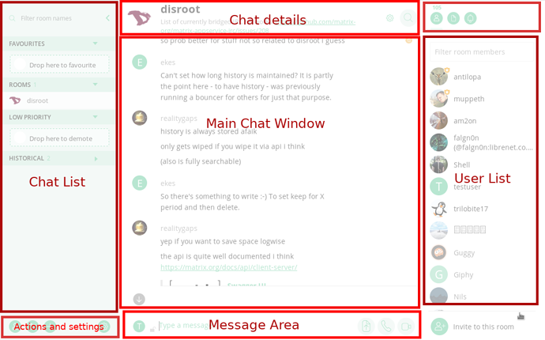
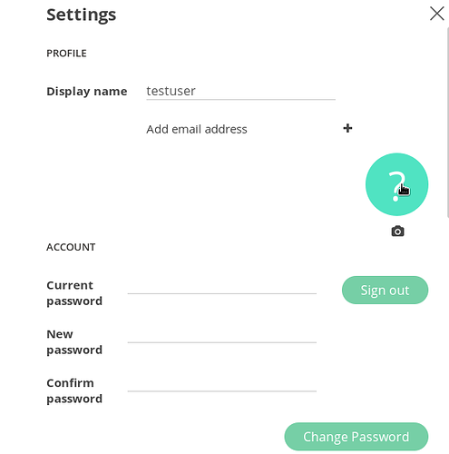
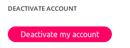
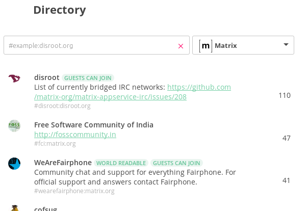
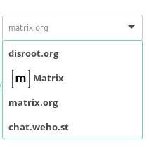
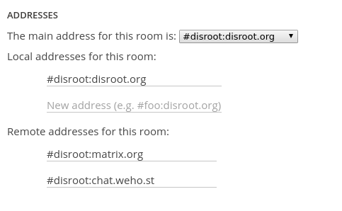
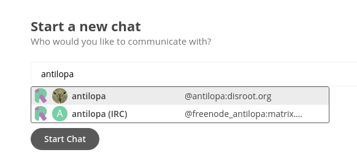

Riot is the main and most feature rich client (app) to use with matrix. It ships as a webchat, "native" desktop client, and mobile app (android, ios). In this tutorial we would like to guide you through the basic usage and show you few tricks here and there.

----------

# How to access Riot?
There are numerous ways you can interact with the network of Matrix through the client Riot.

## Webapp
The easiest way to access Riot on disroot is by going to <https://chat.disroot.org>. All you need is a supported web browser (Currently Mozilla Firefox and Chromium/Google Chrome are supported. Other browsers might also work, but there's no guarantee that all features will work perfectly.)

## Mobile app
For Android, we of course recommend using Riot shipped via [F-droid](https://f-droid.org/repository/browse/?fdfilter=riot&fdid=im.vector.alpha), though if you want to receive push notifications and your life depends on Google Services, you can also find Riot on Google's Play Store.

For iOS of course you don't have any alternatives and you must use their app store. Just search for "Riot".

## "Native" desktop app
We intentionally use "native" in quotes because it isn't a purely native solution. It is basically the webapp but run from your own computer. It however provides you with the best security as it does not rely on any third parties (not even disroot or any other server providing Riot). To get it up and running, follow this link: <https://riot.im/desktop.html>.

----------

# How to login/register an account
To register an account, go to <https://user.disroot.org>.

**TIP**: Currently your email address will be shared with a third party server at matrix.org in order to provide you with better contact discovery, as well as send you emails about forgotten passwords etc. This, however, is totally optional and if you're concerned with privacy and sharing information with matrix.org, you can skip it.

For disroot users - your email address is not filled in by default for the same reason. You should decide whether or not to trust matrix.org with your email address and you can add it at a later stage.

----------

# User Interface
The user interface is quite intuitive if you ever used a chat system such as IRC, Slack, or Rocket.chat.

For the purpose of this howto, we'll name some of the key elements of the interface to help you identify them later on:

 - **Chat List** - The place where you will find all the chatrooms and “Direct Chats” (chatrooms with exactly one person other than you) you participate in. You can sort these chatrooms in various categories (favorite, direct chats, low priority) by dragging the rooms into them.
 - **Chat Details** - This is where the room’s name, logo and topic are displayed. Additionally,  is for searching for keywords in the room’s history and  is for the room’s settings where you can e.g. change the topic, add and manage integrations, and adjust various room admin settings.
 - **Main window** - This is the main part of the application. Here you can see all the chat messages in the currently selected room or all the public rooms when going to the Room directory.
 - **Message area** - This is where you type your messages, upload files, start audio or video calls or conferences.
 - **User List** - Here you can see all the users currently participating in the room.
 - **Actions and settings** - Here you can start a new direct chat, create a new room, list all public rooms, as well as enter your user settings.

----------

# User Settings
First thing after you login for the first time is to customize your user settings. To do that click on  in **"Actions and settings"** area (bottom left). In this section you can setup various information about yourself, as well as setup behavior of notifications, enable extra interface features and check and verify list of connected devices.

## Profile

This section lets you add or change information about your profile.

 - You can change or upload your new profile picture
 - Change your display name
 - Add email address **(this is optional)**
 - Sign out
 - Change password **(users with disroot account should only change their password through https://user.disroot.org)**

## Notifications

Here you can change behavior of notifications for your account (note that this changes will affect all devices running Riot, hopefully in the future we will be able to change notifications settings per device).

## Devices
A list of devices connected to your account. You can view the devices ID, general information about the devices origin such as it's name, the url it connected to, operating system and browser name (if connected via the browser), it's IP and the time it last made the connection to your account. You can also delete devices you no longer use. If you see a suspicious device or IP you're never used it might mean your account has been compromised. You should  immediately logout (this will logout all devices), and change your password. Not logging out will not result in the compromised device logging back in. Be careful not to rush to conclusions too quickly! Study the list to be sure before you run around all paranoid.

## Deactivate account
On the bottom of your user settings you can deactivate your account.

----------

# Room Directory
The coolest thing about matrix is the fact that its totally federated. It means you can join any channel on any server. In Room directory you can search for and discover rooms on friendly servers we have listed (list will keep growing) as well as search for rooms on servers (if you know the servers URL). All public rooms of given server are listed in the main window.

Right dropdown menu lets you filter public rooms in of specific server, or simply add url of server that isn't yet listed.

The left input field is used to either type in the full room address (if you know it) or search for rooms using keyword.

----------

# Joining Channel
You can join a room in many ways.
The most straight forward way to join public rooms is to search for them in room directory. You can either choose a room from the list given by the predefined servers or search for the room on the server you know the address of.

You can also just click on the room address if someone shares it with you in the chat. The room address consist of #room_name:matrix_server for example #disroot:disroot.org This type of addresses are recognizable by Riot client and once clicked, will try to join the room automatically.

If you know the matrix room address or perhaps would like to join one of the IRC channels straight away without too much clicking, you can use this command: `/join #channel_name:server.url`  (for example `/join #disroot:disroot.org`). For syntax and list of currently IRC bridged networks, check this page: https://github.com/matrix-org/matrix-appservice-irc/issues/208

----------

# Creating rooms
To create new room simply click on the  and type desired name. You will automatically be logged into the new room and you can start inviting people to it by clicking on  button on the bottom right.

Clicking room's settings button  in the **"chat detail"** block (top),  will reveal some settings you might consider:

 - Who can access the room
 - Enable Encryption
 - Permissions to read rooms history
 - User permissions
 - additional aliases.

## Aliases
Remember when I said the rooms are federated? Since the room gets duplicated to other servers (whenever some user from other server joins the room), the rooms can continue living in the network even if the originating server is no longer available. This is the true power of decentralized and federated networks. They are immune to server shutdowns or censorship.
So since rooms "live in the network" you can easily add extra aliases to them. Usually those aliases refer to different servers (so that they they can be easily search-able and if permitted, listed in rooms directories on other servers), you can also add extra names you want your room to figure under. For example we want our disroot room to be accessible if someone tries to join room `#support:disroot.org` . We just simply add new alias to existing room.
**example:**

----------

# Starting private chats
If you want to start chatting with someone in private, you can do it in numerous ways:

The easiest way is to click on the  on the bottom of **"Action and Settings block**, and type the name of the person you would like to talk to. The autocompletion will give you suggestions based on the channels you are already in.

If you decided to upload your email and share you address book with riot, it will try to search through your address-book to provide you with names of you contacts that are already using matrix.

If you want to talk to someone that does not figure in one of the rooms or your address book, you need to know their matrixID. The user address is quite similar to the room address but has **@** symbol instead of **#** in the beginning (@username:server.url). And so the address of our beloved test users is: @testuser:disroot.org

Once you started new private room, you will notice it's not that much different then the ordinary matrix room. In fact it's pretty much the same thing. You can invite more people to it, change it's name, add user permissions, list it in room directory of the server, etc.

----------

# Enabling encryption
Since recently, matrix ships with end to end encryption. What does it mean? It means the messages are encrypted and decrypted on users computer without interference from the server side. This means administrators, or anyone "eavesdropping" on the conversation cannot read it. This quarantines privacy and protects your conversation from any dirty hands.

Matrix uses same technology for encrypting messages as OMEMO on xmpp, SIgnal or Whatsapp. Matrix's implementation of it is called: [Olm](https://matrix.org/blog/2016/11/21/matrixs-olm-end-to-end-encryption-security-assessment-released-and-implemented-cross-platform-on-riot-at-last/)
To enable encryption in your room go to room settings  and select

## Few things to be aware of when using Encryption
1. Encryption keys are created per device! This means you won't be able to read history of the conversation if you joined in at later stage with your device (eg. second laptop)
2. If you logout, or your browser (if using browser to connect) closes the session, your keys will be lost and newly created ones upon login will not be able to read history. This makes sense as in case your account is compromised, the history of your encrypted chats won't be view-able. We recommend therefor to use Riot mobile and native desktop versions and never hit the logout button (unless you want to loose your encrypted room history).
3. Once Encryption is enabled in the room, it cant be disabled.
4. You can't make use of any integration (linking to irc or slack or having rss bot for example).

## Trust and key verification
Once you enter the room with encryption switched on, you will notice people having  or  next to their messages.

-  Means the encryption key for the device the message has been sent from has not yet been verified by you.
-   means you have verified the device.

**What does it mean?**
If you truly want to be sure person you are talking with is the one you think it is, you need to have an option to verify that. By default all the encryption keys of any user are not verified and that's why you get  next to their messages as an indication. In order to make sure the communication channel is secure, you need to trust that device and the person. Each device used by a person you communicate with generates encryption keys. Each key has it's unique fingerprint (just like human fingerprints). When you click on the  you will be presented with all the information about the device, it's key and the fingerprint. You can just blindly trust it by clicking on "Verify" button, but that's not ensuring you in any way the person on the other side is the one you think it is.

The best way to verify the fingerprint is to use other means of communication (personally, email, other chat) to send each others fingerprints for verification. You can also ask some private questions in the chatroom in order to verify person you are talking to. It's up to you how you want to ensure you are safe and what's the level of security for your chat. Many other services (such as signal or whatsapp) seem to skip that point, or make it very easy (where your app trusts other persons encryption key by default) but that's what makes encryption less secure. In most cases when using other apps such as whatsapp by default you have no way of telling if someone's account has been tempered with (new encryption keys generated), and you need to manually enable such option.

Encryption is not a joke and basic understanding how it works is what makes your communication more secure.

----------

# Integrations
Integration is what makes matrix so strong. With integration you can easily extend the features of the room by adding bots, as well as joining chats on different networks (protocols/apps) unconnected to matrix.

To enable any of the integration, go to your room's Settings and click on "Manage integration" button.

## Bridges
At this moment you can easily bridge any room on several IRC networks. Slack and Gitter. There is more and more bridges being written so soon we will be able to easily integrate and link more networks with eachother. At the moment we are looking into integration with: xmpp muc, telegram, hangouts, libpurple, etc. If you are interested, ask us for more details.

## Other integrations

 - RSS bot - Updates posts based on RSS feed of chosen website.
 - Guggy and Giphy - Posts animated gifs based on keyword (eg. !guggy awesome)
 - Github - you can post issued form the channel directly to your github project

## Bots
We are working on deploying various bots you can invite to your room. Bots are there to basically serve you. From useful stuff such as, give you weather information on any given place, or distance between two cities, search wikipedia, loading RSS feeds, search the net, to useless things such as telling you a joke, or insult any give person. You can already now invite mijris (@mijris:chat.weho.st) form our friends at [weho.st](https://weho.st) to your channel. For more info type **!help** once mijris joins or ask us on our disroot channel for help.
