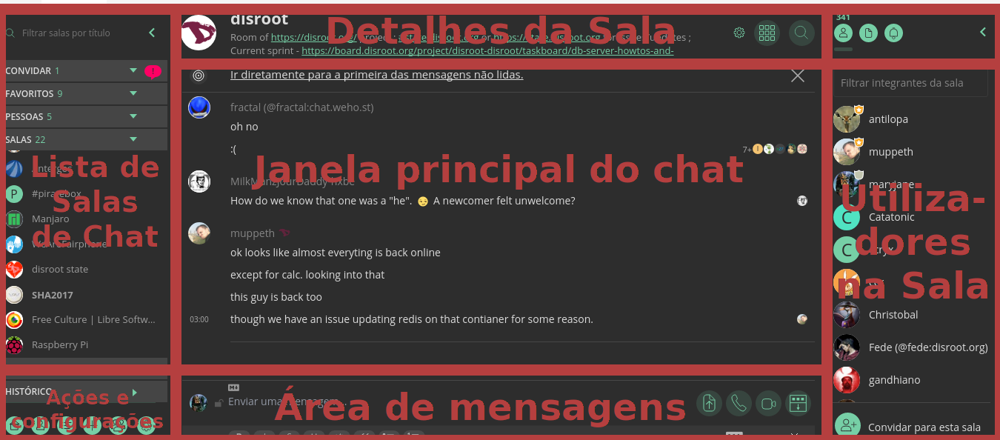
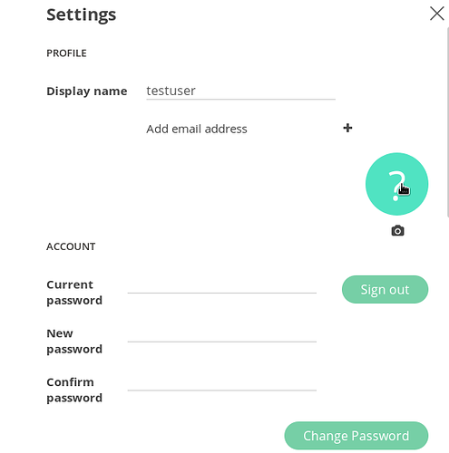
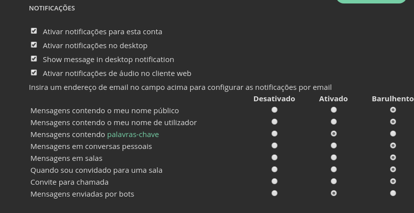
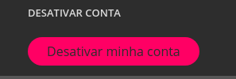
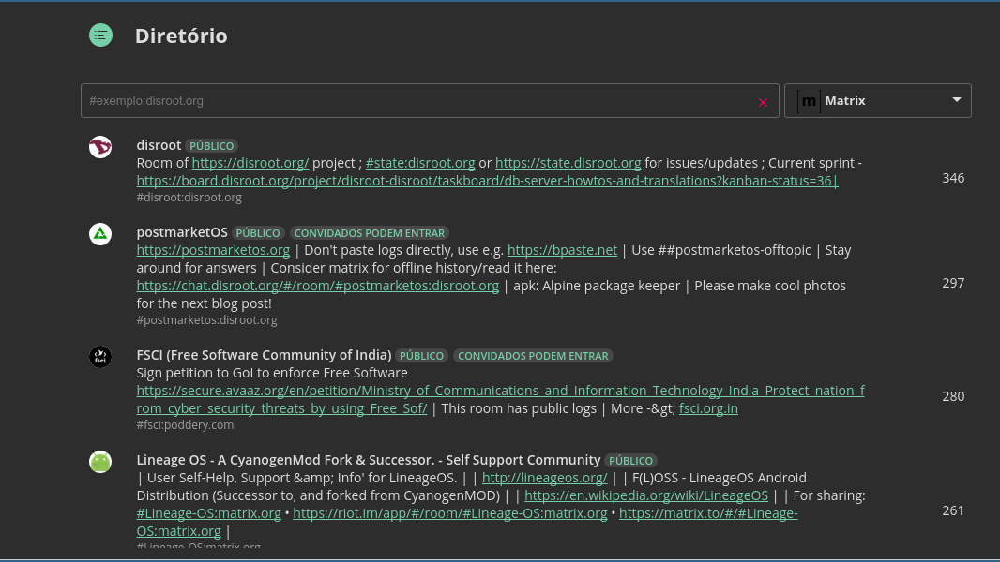
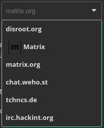
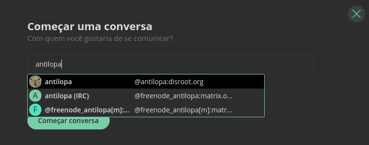

Riot é o cliente (app) principal e com mais funcionalidades para se usar com o matrix. Tem um webchat para aceder a partir de um browser, um cliente de desktop "nativo" e app para smarthphone (android e iOS). Neste tutorial gostaríamos de mostrar as funcionalidades básicas do Riot/Matrix e mostrar-lhe alguns truques.

----------

# Como aceder ao Riot
Existem várias maneiras através das quais pode usar a rede do matrix com um cliente Riot.
## Aplicação Web
A maneira mais fácil de aceder ao Riot no Disroot é indo a https://chat.disroot.org. A única coisa de que necessita é de um browser.
## Aplicação para smartphone
No caso do android recomendamos obviamente que instale o Riot via [F-droid](https://f-droid.org/repository/browse/?fdfilter=riot&fdid=im.vector.alpha), mas se quer receber notificações push e a sua vida depende dos serviços da google, também pode descarregar a app através da google play store.

No caso do iOS, claro que não há alterantiva e a única opção é usar a appstore deles. Basta procurar por "Riot".

## Aplicação de Desktop "Nativa"
Usamos a expressão "Nativa" entre aspas de propósito porque não é uma solução 100% nativa. É basicamente a aplicação web a funcionar a partir do seu computador para se ligar à rede matrix. No entanto é a solução mais segura pois não depende de terceiros (nem do Disroot ou qualquer outro servior que tenha a aplicação Riot). A a ter a funcionar no seu desktop siga um dos links na seguinte página: https://riot.im/desktop.html

----------

# Como fazer login / registar conta.
Para registar uma conta vá a https://user.disroot.org

**Dica**  Atualmente o seu email é partilhado por princípio com o servidor do matrix.org de modo a facilitar a descoberta de contactos e para ter um email para enviar um link de recuperação de password, emails, etc. Isto é opcional e se está preocupado com a sua privacidade e partilha de dados com o matrix.org pode saltar esta opção.

Para utilizadores do Disroot, o endereço de email não é enviado por predefinição exatamente questão de privacidade. Você deve decidir se confia ou não no matrix.org para terem o seu email e se quiser pode adicionar o seu email mais tarde.

----------

# Interface de utilizador
O interface de utilizador é bastante intuitivo caso já tenha utilizado antes sistemas de chat como por exemplo: IRC, Slack, Rocket.chat.

Para efeitos deste tutorial iremos apelidar alguns dos elementos principais do interface para nos ajudar a identificá-los mais em diante:

 - **Lista de Salas de Chat** - O sítio onde encontrará todas as salas de chat e conversas diretas nas quais participa. Pode organizar estas salas de chat em várias categorias (ex: favoritos, conversas diretas, baixa prioridade) arrastando as salas para cima e para baixo.
 - **Detalhes da Sala** - É onde está o nome da sala, o tópico e o logótipo da mesma. Para além disso  serve para procurar palavras chave no histórico da sala e   é onde pode alterar as várias configurações de administração da sala e gerir as integrações (se tiver direitos de administrador da sala).
 - **Janela principal do chat** - Esta é a janela principal da aplicação. Aqui pode ver todas as mensagens de chat da respetiva sala, ou ver todas as sala de chat públicas quando vai a "Lista de Salas".
 - **Área de mensagens** - é onde escreve as suas mensagens, faz upload de um ficheiro, inicia uma conversa pu conferência de vídeo ou áudio.
 - **Utilizadores na Sala** - (Ou Lista de utilizadores) é onde pode ver todos os utilizadores que estão a participar na sala.
 - **Ações e configurações** - Aqui pode começar novos chats diretos, com outros utilizadores, criar uma sala de chat nova, listar as salas públicas todas, editar/editar o seu perfil de utilizador(a).

----------

# Perfil/configurações de utilizador
A primeir coisa a afazer depois do primeiro login é costumizar o perfil/configurações de utilizador. Para isso carregue em   **"Configurações"** (em baixo, do lado esquerdo). Aqui pode inserir várias informações sobre si, bem como configurar como funcionarão as notificações, habilitar funcionalidades extra, verificar a lista de dispositivos ligados a esta conta.

## Perfil

Esta parte permite-lhe adicionar ou alterar as informações acerca do seu perfil.

 - Pode alterar ou carregar uma nova fotografia de perfil
 - Mudar o nome que aparece a outras pessoas
 - Adicionar um endereço de email **(isto é opcional)**
 - Fazer Logout
 - Alterar a palavra-passe **(utilizadores do Disroot para alterar a sua palavra-passe devem ir a: https://user.disroot.org)**

## Notificações

Aqui pode alterar o comportamento das notificações da sua conta (tenha em conta que alterações aqui irão afetar todos os seus dispositivos onde tem o Riot a funcionar), esperamos que de futuro seja possível ajustar estas definições por dispositivo.

## Dispositivos
A lista de dispositivos que se ligaram à sua conta. Pode ver a ID dos dispositivos, informação geral acerca dos dispositivos  origem, o url a que se ligou, sistema operativo, e o browser (caso se tenha ligado via browser), o IP e a última ligação feita à sua conta. Também pode apagar o registo de dispositivos que já não utilize. Se vir um IP suspeito que nunca tenha utilizado pode querer significar que a sua conta foi comprometida. Nesse caso deve fazer logout imediatamente (isto fará o logout de todos os seus dispositivos) e alterar a sua palavra-passe. Seja cuidadoso e não tire conclusões precipitadas! Estude a lista com cuidado para ter a certeza das suas conclusões antes de entrar em modo paranoico.

## Desativar a conta
Neste botão do seu perfil de utilizador pode desativar a sua conta.

----------

# Lista de Salas/Diretório
Uma das coisas mais fixes no matrix é que é completamente federado. O que significa que pode juntar-se a qualquer canal/chat independentemente do servidor onde esse canal está alojado. Na Lista de Salas pode procurar e descobrir salas/chat alojados em servidores "amigos" de outros grupos que temos listados (a lista continuará a crescer) bem como procurar salas em servidores (se souber o endereço URL da sala). Todas as salas de chat públicas de um servidor matrix estão listadas na janela principal.

O menu do lado direito permite-lhe filtrar as salas públicas de um servidor especifico, ou simplesmente adicionar um URL de um servidor que ainda não esteja listado.

O campo de pesquisas do lado esquerdo serve para ou pesquisar o endereço completo de uma sala (se o souber) ou para procurar sala usando palavras chave.

----------

# Entrar numa sala
Você pode entrar numa sala de chat de várias maneiras.
A maneira mais simples de entrar numa sala é procurar na Lista de Salas. Pode ou escolher uma sala que já esteja listada no servidor ou procurar a sala em causa, se souber o endereço dela.

Pode simplesmente carregar no endereço da sala (se alguém partilhar essa informação consigo). O endereço de uma sala consiste em #nome_da_sala:servidor_matrix, por exemplo: #disroot:disroot.org. Este tipode endereços são reconhecidos por qualquer cliente de matrix (Ex: o Riot) e quando carrega neles irá entrar na sala.

Se sabe o endereço de uma sala ou se quer juntar-se a a um dos canais de IRC imediatamente sem teer que carregar muitas vezes no rato pode usar este comando: `/join #channel_name:server.url`  (por exemplo `/join #disroot:disroot.org`). Para ter uma lista da sintaxe  e uma lista das salas matrix de ligadas a salas de IRC consulte esta página: https://github.com/matrix-org/matrix-appservice-irc/issues/208

----------

# Criar Salas
Para criar uma sala basta carregar em  e escrever o nome da sala que quer criar. Irá entrar automaticamente na nova sala e pode começar a convidar outros utilizadores para se juntarem à sala carregando no botão  no canto inferior direito.

Carregando no botão de configurações da sala  na zona **"Detalhes da Sala"** no topo da janela, irá ver algumas possibilidades de configuração da sala que talvez lhe interessem:

 - Quem pode acessar a esta sala
 - Habilitar criptografia
 - Permissões sobre quem pode ler o histórico da sala
 - Permissões dos utilizadores
 - Endereços adicionais para a sala

## Endereços
Lembra-se de termos dito que as salas são federadas? Como as salas são duplicadas para outros servidores (sempre que um utilizador de outro servidor matrix se junta a uma sala do servidor que você está a utilizar essa sala é duplicada no servidor do outro utilizador). Assim as salas podem continuar a existir na rede mesmo que os servidores matrix onde essas salas foram originalmente criadas já não existam. Esta é a verdadeira força de redes descentralizadas e federadas. São imunes a falhas de servidores e censura. 
Como as salas "vivem na rede" pode facilmente adicionar endereços extra para essa sala. Normalmente esses endereços referen-se a servidores diferentes (para que sejam fáceis de procurar e se permitido listadas na lista de Salas de outros servidores). Também pode adicionar nomes extra para a sua sala. Por exemplo se nós quisermos que a nossa sala Disroot seja acessível se alguém se tentar juntar à sala escrevendo `#support:disroot.org`. Simplesmente adicionamos o novo endereço à sala já existente.
**exemplo:**

----------

# Iniciar uma conversa direta/privada
Se quiser começar a conversar diretamente com outra pessoa pode fazê-lo de várias maneiras:

A mais fácil é carregar em   na secção **"Ações e Configurações**, no canto inferior esquerdo e escrever o nome de utilizador da pessoa com quer falar. O sistema de autocomple irá dar-lhe algumas sugestões de utilizadores com base nas salas/canais nos quais já participa.

Caso você tenha decidido inserir o seu endereço de email e partilhar a sua lista de endereços de email com o Riot, o cliente irá tentar procurar na sua lista de contactos de email para o informar de contactos de email seus que também são utilizadores do matrix (caso eles tenham partilhado os seus contatos de email nas suas informações de perfil).

Se quiser falar com alguém que não está listado numa sala ou que no seu livro de endereços de email então necessita de saber o matrixID dessa pessoa. O enderço do utilizador é bastante parecido com a estrutura de um endereço de uma sala mas tem o símbolo **@** em vez de **#** no início (@nome_de_utilizador:server.url). Por exemplo o endereço do nosso querido utilizador de testes é: @testuser:disroot.org

Assim que começar a conversar numa sala privada vai ver que não é muito diferente do que uma sala de chat pública. De fato é exatamente a mesma coisa. Pode convidar pessoas, alterar o nome da sala, alterar as permissões  de utilizadores, colocar a sala na Lista de Salas do servidor, etc.

# Habilitar encriptação
O matrix tem suporte para encriptação ponta a ponta. O que é que isso significa? Significa que as mensagens são encriptadas e desencriptadas nos computadores dos utilizadores sem interferência do servidor. Isso significa que os administradores ou qualquer pessoa que esteja "a escutar" a conversa não consegue ler o seu conteúdo. Isto garante a privacidade e proteje a sua conversa de terceiros.

O matrix usa a mesma tecnologia para encriptar as mensagens que o OMEMO no xmpp, Signal ou Whatsapp. A implementação de encriptação do Matrix chama-se: [Olm](https://matrix.org/blog/2016/11/21/matrixs-olm-end-to-end-encryption-security-assessment-released-and-implemented-cross-platform-on-riot-at-last/)
Para habilitar encriptação de uma sala do qual é administrador, vá às definições da sala e escolha 

## Algumas coisas a ter em conta quando usa encriptação
1. As chaves de encriptação são criadas por dispositivo! Isto significa que não será capaz de ler o histórico de conversas anteriores da sala se se juntar à sala a partir de outro dispositivo (i.e; um segundo computador)
2. Se fizer logout ou se o seu browser fechar a sessão (caso esteja a utilizar um browser para se ligar) irá perder as suas chaves de encriptação e serão criadas novas chaves, o que significa que não será capaz de ver o histórico de conversas encriptadas anteriores. Isto é útil, caso a sua conta seja comprometida, o histórico dos seus chats encriptados não será comprometido. Por isso recomendamos utilizar a aplicação de Desktop e de telemóvel do Riot e nunca carregar no botão de Logout/Sair (a não ser que queira "perder" o histórico da sua sala encriptada de propósito).
3. Uma vez que a encriptação esteja habilitada não pode ser desativada.
4. Não é possível utilizar nenhum tipo de integração (por exemplo: ligar a sala a uma sala de IRC, Slack, Telegram ou ter bots de RSS).

## Confiança e verificação de chaves
Assim que entra numa sala encriptada, irá ver que as pessoas que participam na sala tem nas suas mensagens um dos seguintes simbolos   ou .

-  Significa que a chave de encriptação do dispositivo a partir da qual a pessoa escreveu a mensagem foi enviada mas ainda não foi verificada por si.
-   significa que verificou o dispositivo.

**O que é que isto quer dizer?** 
Se você quer mesmo ter a certeza de que está a falar com uma determinada pessoa (e não alguém que intercetou a comunicação), então precisa de ter uma maneira de poder verificar isso. Por principio todas as chaves de encriptação aparecem como "não verificadas" e é por isso que aparece o símbolo  à esquerda das mensagens. De modo a poder certificar-se de que o canal de comunicação é seguro, necessita de "confiar/verificar" aquele dispositivo e a pessoa. Cada dispositivo diferente que uma pessoa utiliza para comunicar gera uma chave de encriptação diferente. Cada chave de encriptação tem uma impressão digital "Fingerprint", como se fossem impressões digitais humanas diferentes. Quando carrega em   ser-lhe-á apresentada informações acerca daquele dispositivo, a chave e a "Fingerprint". Pode simplesmente confiar cegamente na chave e carregar no botão "Verificar", mas isto não lhe vai assegurar que a pessoa no outro lado da conversa é mesmo quem você pensa que é.

A melhor maneira de verificar a "Fingerprint" de outra pessoa é usando outro meio de comunicação (pessoalmente, email, outro chat) e enviar as "Fingerprint" para verificação. Também pode fazer algumas perguntas privadas no chat para se certificar que a outra pessoa é mesmo quem diz ser. É uma opção sua a maneira de se certificar qual o nível de segurança que quer ter no seu chat. Muitos outros serviços (como o Signal ou o Whatsapp) parecem saltar esta parte, ou fazem isto de um modo muito fácil (onde a sua aplicação "confia" nas chaves de encriptação de outras pessoas por princípio) mas isso torna a encriptação menos segura. Em muitos casos quando utiliza outras aplicações, como por exemplo o whatsapp, por principio essa aplicação não tem maneira de verificar se a conta de alguém pode ter sido comprometida (com novas chaves de encriptação geradas), e (no caso do whatsapp) precisa de habilitar manualmente essa opção.

Encriptação não é um jogo ou uma piada e uma compreensão básica de como funciona ajuda a tornar as suas comunicações mais seguras.

----------

# Integrações
Integração é uma das coisas que torna o matrix tão forte. Com integrações pode adicionar funcionalidades à sua sala, adicionando bots, ligando a sua sala a outras salas que usam protocolos de comunicação diferentes do matrix (ex: IRC, Slack, Telegram)
Paraa habilitar qualquer tipo de integração basta ir a "Gerenciar Integrações" na barra do topo da sala.

## Bridges
Neste momento pode facilmente fazer uma bridge/ligação entre a sua sala e várias redes de IRC, Slack e Gitter (isto permite a quem está na sala de IRC, Slack, Gitter e na sua sala de matrix, comunicarem entre si, apesar de serem salas com protocolos de comunicação diferentes).
Existem cada vez mais bridges a serem escritas por isso em breve poderemos ligar e integrar cada vez mais redes entre elas. De momento estamos a avaliar integração com: xmpp muc, telegram, hangouts, libpurple, etc. Se está interessado em mais pormenores entre em contacto connosco.

## Outras integrações

 - RSS bot - Actualizações e feeds de RSS de um site escolhido por si.
 - Guggy e Giphy - Publicam posts com gifs baseados em palavras chave (ex: !guggy awesome)
 - Github - pode criar um issue a partir da sala para o seu projeto no Github

## Bots
Estamos a trabalhar em vários bots que pode convidar (como se fossem um utilizador) para a sua sala. Os Bots estão lá para trabalhar para si. Desde coisas úteis como, dar informação meteorológica de um local, ou a distancia entre duas cidades, procurar informação na wikipédia, feeds de RSS, pesquisas na net a coisas ínuteis como por exemplo contar anedotas, insultar uma pessoa. Se quiser pode para já convidar o mijris (@mijris:chat.weho.st) dos nossos amigos do [weho.st](https://weho.st) para o seu canal/sala. Para mais informações escreva **!help** depois de o mijris se juntar à sala ou peça ajuda no nosso canal do Disroot.
