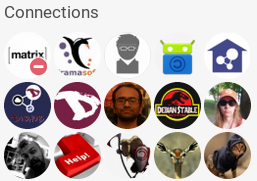

# How to start really quick?
1. Log in https://hub.disroot.org/ using your Disroot credential (**use the Disroot email, not just the username**)
2. Then, you have to **create a channel**. Indeed, you're not really an user on Hubzilla: you're a channel, or even several channels (a person, an organization, a theme, etc). That means that when you first log in with your Disroot account, you have to create a channel. [To create my channel](../channels/creation)
3. You will have to choose a **role for your channel**, that means a set of permissions. **Social - Mostly public** is the most typical one you may want to choose. [To know more about roles and permissions](../permissions)
4. When your new channel is created, you will have to **create a profile** for this channel. You can give as much informations about it as you want. Or as little as you want! You may even create different profiles for a same channel! [To know more about profiles](../channels/profiles)

**You're done!**

Now, you can **create post**:
 

[To know how](../posts)

Or you can **add friends** (called *connections* in hubzilla) that you can follow:
 

[To know how](../connections)

!!! There is a nice quick howto start [here](https://hub.disroot.org/help/en/tutorials/personal_channel#Create_a_new_channel)
