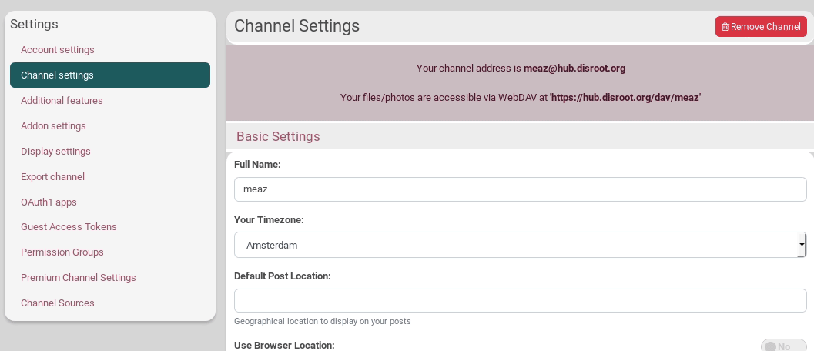

### What is it?
These permission limits (see previous section) can come in pre-configured sets to help you set them quickly. It is called **Channel permission roles**.
When you create a new channel, you will be asked to select a permission *role* based on how you envision using this channel. These create an entire family of permissions and privacy settings that are appropriate for that role. **Typical roles are "Social - mostly public", "Social - mostly private", "Forum - public"** and many others. These bring a level of simplicity to managing permissions. Just choose a role and appropriate permissions are automatically applied. For example, if you choose the "Social - Public" role, then your default permission limits set your posts to be public. So channel permission roles are primarily a way to reduce the complexity of setting all the default permission limits.

Advanced configurations (**'Custom/Expert mode'**) are available to let you adjust each of these parameters to your needs, but we've found that most people prefer to "set it and forget it".

### How to select a channel role?
Go to your **settings** page, click on the **Channel settings** tab then on **Security and Privacy Settings**. From there, you can see a drop-down menu under **Channel role and privacy**. You can choose between:
- Social:
 - Federation
 - Mostly public
 - Restricted
 - Private
- Forum:
 - Mostly public
 - Restricted
 - Private
- Feed:
 - Public
 - Restricted
- Special:
 - Celebrity/Soapbox
 - Group Repository
- Custom/Expert Mode

### What are the differences between these roles?

We highly recommend that you use the **"Social - Mostly Public"** settings when you create your first channel, as it allows others to communicate with you and help you out if you have difficulty. You will find that these settings allow you as much privacy as you desire - when you desire it; but also allow you to communicate in public if you choose to. You are free to use much more private settings once you have learned your way around.

[See this channel roles permissions table](../channel_roles)

#### Social
##### Federation
This is the most public setting. This role is not generally recommended unless you need to interact regularly with members of other federated social networks. But it is the best choise if you want to connect as good as it can with all the networks. **It's also the only setting that permits that everybody is able to comment on your public post from the public activity page**. The permission policies are similar to Twitter and mostly compatible with Diaspora and Mastodon.  
Privacy is a lower priority than ease of access and connecting with others.

What does it do?:
- You are listed in the directory.
- By default posts and published items are public, but you can over-ride this and restrict it.
- Anybody in the network can comment on your public posts, send you private mail and chat with you.
- Your online presence and connections are visible to others.
- Anyone can see your other connections.

##### Mostly Public
As a typical social networking profile, this is probably what most people want. The permission policies are similar to Facebook. But if you really want to public post it's still better to choose for *"Social - Federation"*

What does it do?:
- You are listed in the directory.
- By default posts and published items are public, but you can choose to restrict it.
- Only your connections can comment on your public posts, send you private mail and chat with you.
- Your online presence and connections are visible to others.   
- Anyone can see your other connections.

##### Restricted
In this role privacy is more important than the previous ones. This is what you want if you just prefer connect with others but still be able that others find you. You are still able to make public posts but interaction with others will be more difficult, as it requires that channel has to be connected with you.

What does it do?
- You are listed in the directory.
- By default all posts and published items are sent to your 'Friends' privacy group and not made public. New friends are added to this privacy group. you're still able to make posts more public if you want.
- Only your 'my "friends" privacy group' can comment on your public posts, send you private mail and chat with you.
- Your online presence (for chat) and your connections (friends) are visible to your profile viewers.   
- Anyone can see your other connections.

##### Private
Privacy is the most important for this role. You will have to handle more with permissions when you want more interactions with other channels. If others want to connect with you, they will need your full address (username@hub.disroot.org). So, if public activity is not your priority and only want to connect with people you know, than this is what you are searching for.

What does it do?
- You are listed in the directory.
- By default all posts and published items are sent to your 'Friends' privacy group and not made public. New friends are added to this privacy group. you're still able to make posts more public if you want.
- Only your 'my "friends" privacy group' can comment on your public posts, send you private mail and chat with you.
- Your online presence (for chat) and your connections (friends) is hidden.   
- Only your connections can see your other connections.

#### Forum
You can compare Hubzilla Forums as groups in Facebook. You can choose different privacy settings for that.

##### Mostly Public
This setting is for typical forum. Anyone can see channel posts. So as the name says, use it for public forum.

What does it do?
- The channel is visible in the directory.
- By default posts and published items are public.
- Members may post by !mention or wall-to-wall post and comment.
- Posting photos and other published items is blocked.
- Members are added automatically.

##### Restricted
The most important difference with the mostly public setting is that only connections are allowed to see the forum stream and posts.

What does it?
- The channel is visible in the directory.
- By default all posts and published items are sent to the channel's 'Friends' privacy group. New friends are added to this privacy group.
- Members may post by !mention or wall-to-wall post, but posts and replies may also be seen by other recipients of the top-level post who are not members.
- Members must be manually added by the forum owner.

##### Private
Here the most important difference with the restricted setting is that mentions are disabled, and only your connections can see your other connections.

What does it?
- The channel is NOT listed in the directory.
- By default all posts and published items are sent to your 'Friends' privacy group. New friends are added to this privacy group. The owner can over-ride this and create a public post or public item if desired. Members cannot.
- Your online presence is hidden. Members must be manually added by the forum owner.
- Posting by !mention is disabled. Posts can only be made via wall-to-wall posts, and sent to members of the 'Friends' privacy group. They are not publicly visible.   

#### Feed
##### Public
Similiar to Social - Mostly Public, but tailored for RSS feed sources. Items may be freely republished and sourced. Online presence is meaningless, therefore hidden. New connections are automatically approved.  

##### Restricted
Not listed in directory. Online presence is meaningless, therefore hidden. Feed is published only to members of the 'Friends' privacy group. New connections are automatically added to this privacy group. Members must be manually approved by the channel owner.

#### Special
##### Celebrity/Soapbox
Listed in directory. Communications are by default public. Online presence is hidden. No commenting or feedback of any form is allowed, though connections have the ability to "like" your profile.

##### Group Repository
A public forum which allows members to post files/photos/webpages.

#### Custom/Expert Mode
Set all the privacy and permissions manually to suit your specific needs.

---
