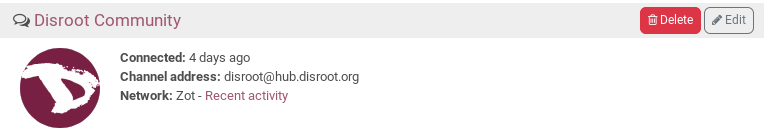
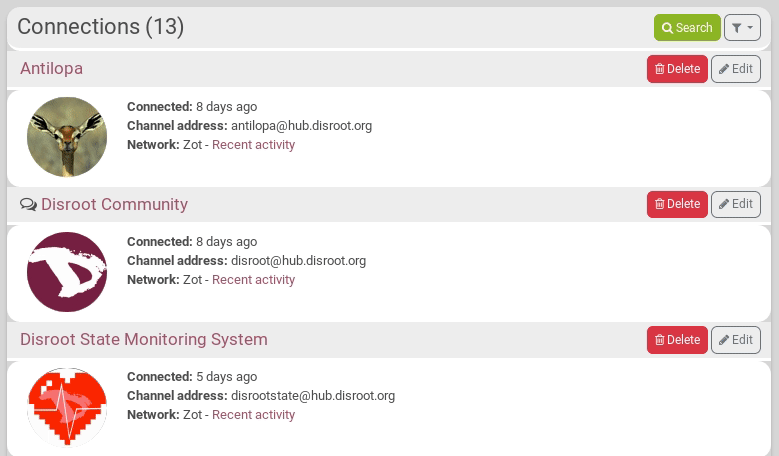
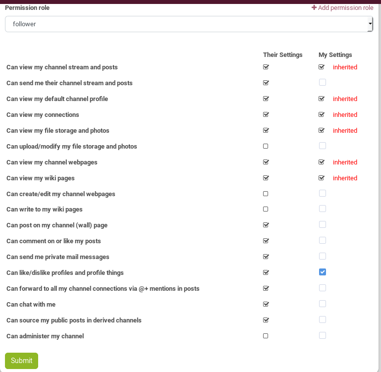
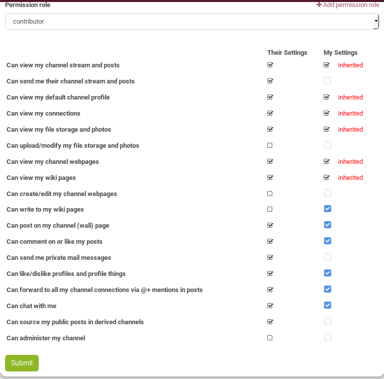
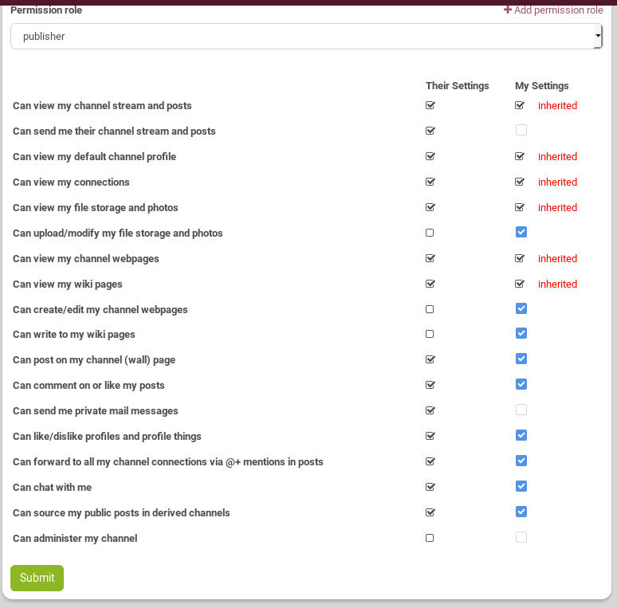
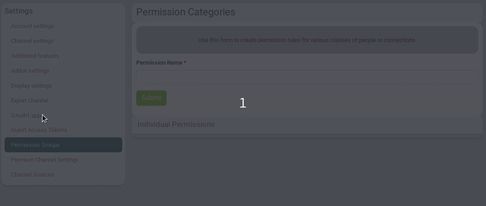
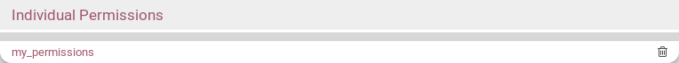

### What is it?
When you have chosen a channel permission role, any connection made to your channel is set according to this role. However, you can change those default permissions limits. These allow you to customize the permission limits for individual connections, and set some permissions for one channel, and some others for another one. For example, you can grant or deny permission to individual channels to send you their posts such that they will automatically appear in your "network stream".

### How to set different permissions limits for a connection?
If you want to change it, go on the **connection page** by clicking on the connection icon 

On the connection that you want to modify, click on *Edit*

Then, click on **Individual Permissions**. The list of the permissions you "give" to that connection can be seen under "My settings". Just check / uncheck the permissions there. Don't forget to click on *Submit* when you're done.

**Note:** You can see what permissions you "received" from the other channel under "Their settings".

### Permission categories / Permission roles for connections
#### What is it?
It is a set of permissions that you want to store in order to be able to use it quickly.

For example, there is a predefined *"follower"* permission category that denies the ability of a connection to send you their posts. You could choose this permission category as the one which is applied to new connections by default if you are the kind of person that does not want to clutter your network stream with the posts of all your connections and instead prefers to visit the channel pages of your connections individually to read their content.

#### What are the already-existing permission categories?
- **Default**: the permissions set automatically according to your channel role. But you can change your default settings if you want. See below.

- **Follower**:

- **Contributor**:

- **Publisher**:

You can always edit these settings directly in this connection's settings by checking / unchecking the permissions, within the flexibility allowed by your channel permission role.

#### How to create my own category?
Go to your **channel settings**, then click on **Permission groups** (this should be changed by "Permission Category" in next Hubzilla release).
Just choose a name for your category, then click on **Individual Permissions** and set your permissions by checking / unchecking what you want. Don't forget to click on *Submit*.

You can also use the **+ Add permission role** button directly from the connection Individual Permissions setting 

#### How to change or delete my categories?
You can change a category you created by simply clicking on its name, the on **Individual Permissions**.  Don't forget to click on *Submit*.

To delete it, just click on the trash icon next to its name.

#### How to use a personnal category of permissions with a connection?
Go on the **connection page** by clicking on the connection icon 

On the connection that you want to modify, click on *Edit*

Then, click on **Individual Permissions**. You have a drop-down menu that lets you choose the category you want and automatically apply the settings of this category to the connection.

#### How to make one of my category the default one?
If you want all your new connections to be set with a default set of permissions that you want, first create this set of permissions ("category"). Then, go on your **channel settings**, in the **Security and Privacy Settings** tab. In the **Default Permissions Group** parameter, just choose your category.

----------
