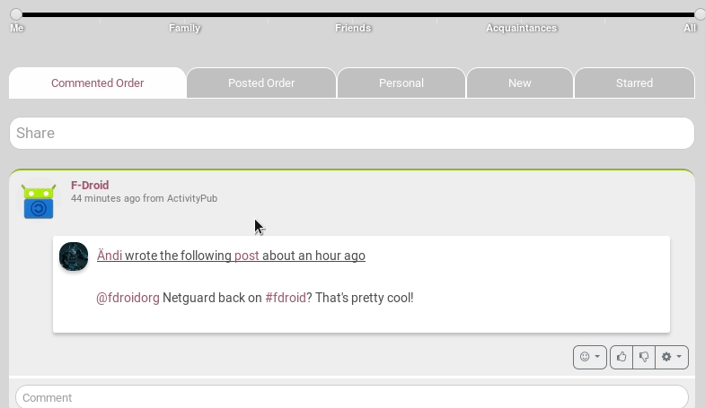
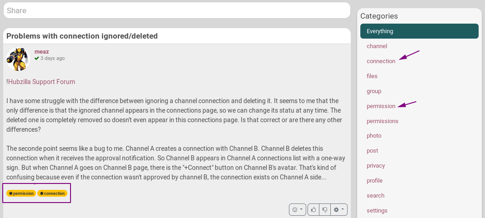
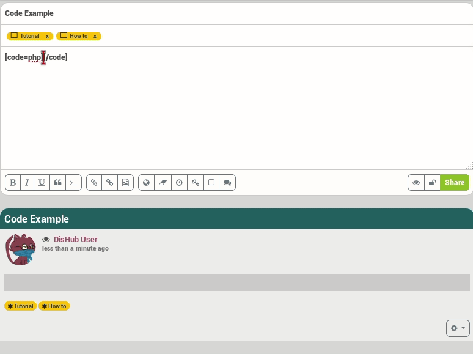
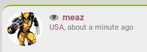
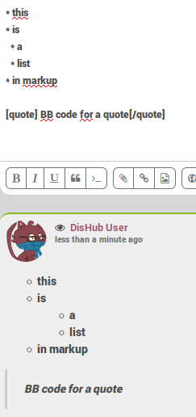

## Basic composing
If you want to share something, just click on the **share bar**  that you can find on the top of the **your Channel page**, your **Activity/Network page** and on most of the **others channels pages** (except if not allowed).

This is what you will happen:

The first thing you probably want to do is setting a **title**. It's not obligatory, so it's up to you if you want to set one or not. However, it is a good practice to set one as it makes your post more visible.

The same thing is for the **categories** part. Here you can add one or more categories, "tags", just separate each words/sentences you add by a comma. For example **How to, hubzilla**.
Here again, it's a good practise to use categories as it helps people to find your posts easier. Indeed, when there is a **Categories widget** on the channel that you visit, you can click on the category you're interested in so that if filters all the channel's posts that have been composed with this tag.

Now the first basic options you have when composing your post are **Bold, Italic, Underline, Quote and Code**.
So when composing you want for example to write some text in bold, you click on the bold button and put the text you want in between the **[b]** tags. Or you can write your text first, then select what you want to change (for example select your text and click on **B** to set it bold).

And here is the result

---

## Code button
This one needs some explanation.  
If you have trouble with for example **bbcode**, and want to ask someone advise or maybe you want to give advise on how to write something, then you can the **code** button. It allows to show what you write in between **[code]my text[/code]** without it being rendered. Without this tag only the rendered version will be shown.

Here is an example
  
As you an see, you can add the type of code you're writing. For example here, it is php: **[code=php]**

---

## Adding something to the post

With the next three buttons you can easily **attach a file** from your device, **insert a weblink** or **embed an image** from your photo album (the photo has to be in your folder before it can be added).  
  
They are pretty self explanatory, so don't need further explanation.

**Note**: If you want to embed an image without having to upload it first on one of your albums you can use the attach button and select an image from your device. If you're on a computer, you can also simply add your picture by dragging it directly in your post.

---

## Options

You can find the options on the next group of buttons.  
  

### The options are:
* **Set your location**: you are able to share your location with others. A popup opens asking you to set the location you want, so it's not using geolocalization 
* **Set expiration date**: the post will auto destruct on the date set.
* **Set publish date**: the post will be published in a future date.
* **Encrypt text**: this let's you encrypt text. Therefore you need to set a passphrase and make sure the ones that you want to share with know the passphrase.
* **Toggle voting**: If you want others to vote for something. They will have those options  on your post when clicking on this icon.
* **Disabling comments**: if you don't want comments on your post.

 ---

## Before sharing

Before clicking on the **Share** button you may want to check the permissions and preview you post. These option are next to the **Share** button.
  

### These options are:
* **Preview**: let you see a preview of your post. This preview appears just under your actual post.
* **Permission settings**: Here you choose with whom you share the post. Most of the time, you won't even click on that button as it is automatically set according to your channel role. However, you change who can see your post: to the public, to a group, more groups, or only one connection. You can also set it that one or several connections or groups are not allowed to view the post. YOU CAN'T CHANGE IT ONCE POSTED!
For more information it's recommended to visit [the permissions](../../permissions) section.

---

## Markup languages
You can use BBcode or Markdown when composing a post or in a comment. You can also combine the codes.  
Here is an example.

  

If you want to know more about bbcode you can visit the [Hubzilla help page](https://hub.disroot.org/help/en/member/bbcode).

---

## Who can see my posts and where?
Well, it depends on a few things: your channel role, the permission settings of the post, the permissions you set for your connections, etc.

Depending of these permissions:
- **Public** may see your posts in the **Public stream** or by visiting **your channel**.
- **Connections** may also see your posts in their **Network stream**.

---
