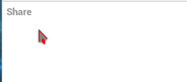

Like many other platforms, Hubzilla uses a special notation inside messages to indicate "tags" or contextual links to other entities.

## Mentions
You can mention a person in a post, so that the mentioned channel receives a notification. Using @mentions will reproduce a copy of your post on the profile specified, as though you posted on the channel wall.

!!! In the permission settings, **Can forward to all my channel connections via @+ mentions in posts.** must be allowed by a channel to be able to mention it.

To use mention, simply add **@** before the channel name you want to mention. For example **@dishubuser**.

You can mention someone using another protocol. For example to mention someone on mastodon: **@{username@mastodon.instance}**

If you write the channel's name manually, if there are only one space in the channel's name, there will be no problem. So, **@Robert Johnson** will tag **Robert Johnson**. If there are more than one space, for example **Blind Lemon Jefferson**, you have to enclose the entire name in double quotes or change the spaces to underscores, **@"Blind Lemon Jefferson"** or **@Blind_Lemon_Jefferson**.

---

## Deliverable Mentions
The deliverable mention is only used for forums or special channel. This means that when you use the deliverable mention your post will be posted on that channel's wall, but also to this Forum or Channel "network" (e.g. send to all the forum members; if you have permission to do so).

The deliverable mention is done by adding **!** before the channel name, for example **!disroot+516**. Here to the auto-complete box will show.  

---

## Private Mentions
Like already seen in the [Composing](../composing) part, you can choose to restrict the viewing of a post to a single person or a number of people. You can do this by selecting channels or privacy groups from the privacy tool. But if you prefer you can also just tag them with a privacy tag.

A **privacy tag** is an username preceded by the two characters **@!**, for example **@!dishubuser**.

In addition to tagging these channels, this will also change the privacy permissions of the post so that only the mentioned channels will have permission to see the post.

You can have more than one privacy tag, for instance @!bob and @!linda will send the post only to Bob and Linda. This mechanism over-rides the privacy selector.  

**Forums** may be mentioned also by adding **!!** before the forum name. For example **!!dishub** will post to the Dishub forum privately. The forum will redeliver the post to all the forum members, but your own followers will not see the post unless they are also members of the Dishub forum.

You may also **tag privacy groups** which are "public" with **@!Name_of_the_group**. When you create or edit a privacy group, there is a checkbox to allow the group members to be seen by others. If this box is checked for a group and you tag (for instance) **@!Friends**, the post will be restricted to the Friends group. Check that the group is public before doing this, as there is no way to take back a post except to delete it. The group name will appear in the post and will alert members of that group that they are members of it.    

---

## Mentions in comments
You can use mentions in comments.

But using Deliverable or Private mentions has **no effect**, except that the mentioned channel may receive notification if they were already included as a recipient in the conversation. **TO BE CHECKED**

---

## Topical Tags (also known as Hashtags)
You can set one or more topical tags. This will help others search for a specific topic. This is easily done by adding **#** before the topic. For example **#tutorial**

**Note**: Topical tags are generally a minimum of three characters in length.  Shorter search terms are not likely to yield any search results, although this depends on the database configuration.

Topical tags are also not linked if they are purely numeric, e.g. #1. If you wish to use a numeric hashtag, please add some descriptive text such as **#2018-photos**
