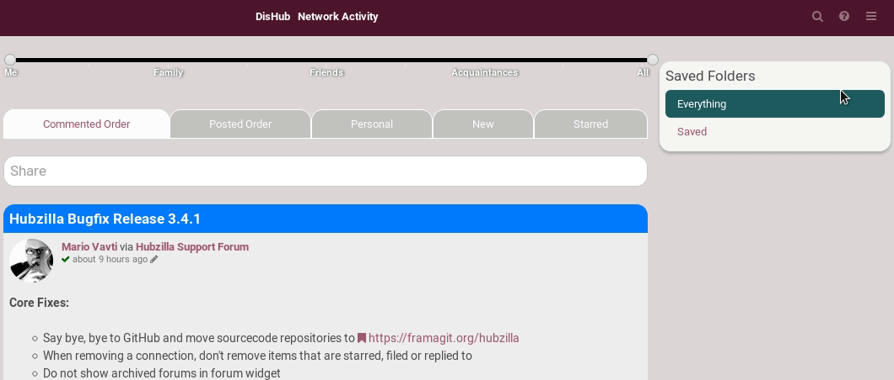
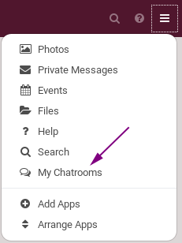
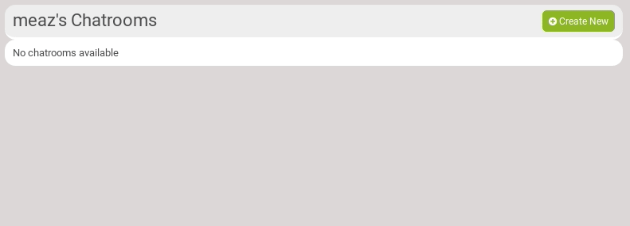
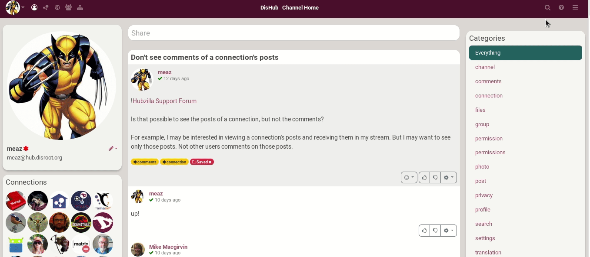
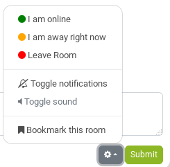
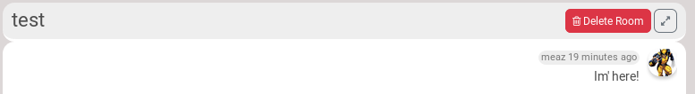

## What is it?
Well, that's pretty obvious! You can create a chatroom in which you may want to chat with friends.

## How to active the chat feature?
Click on the hamburger menu, choose **Add Apps**. Find **My Chatrooms** and activate it by clicking on the star.

It is now available in your apps list.

## How to create a chatroom?
Go on your chatrooms page by clicking on its icon in the apps list.
From there, simply click on **Create New**. Set a **Chatroom name** and an **Expiration** time limit (applies to the messages, not to the chatroom). You can change the visibility by clicking on the lock icon. Click on *Submit* when you're done.

!!! **Expiration time limit**: the chats (messages) that are already on the screen aren't deleted, but if one enters the room, the expired chats (messages) are deleted and won't be shown. SO THIS OPTION IS NOT TO DELETE A CHAT ROOM, JUST ITS MESSAGES.

## How to chat?
Go on the chat you want to talk in. It can be on your channel, but it may be on another channel, for example if a friend told you that he/she has created a chat he/she wants you to come talking in.

Either way, you have to click on the chatroom icon in the channel apps list. Then, click on the chatroom name you want to enter.

In there, you simply write your message and click on *Submit*.

There are a few options:
- **B, I, U** to get your text in bold, italic or underline.
- **''** to set your text as a quote
- **>_** to set your text as code
- Add an **url**.
- Add an **encrypted** text.

You have a couple of other options when you click on the wheel:

## How to delete a chat?
Enter in the chatroom you want to delete. At the top right, there is a **Delete Room** button.

