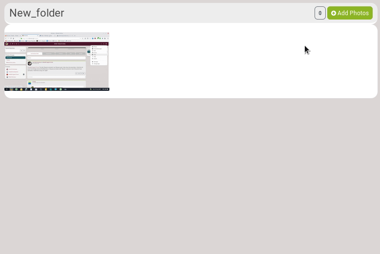
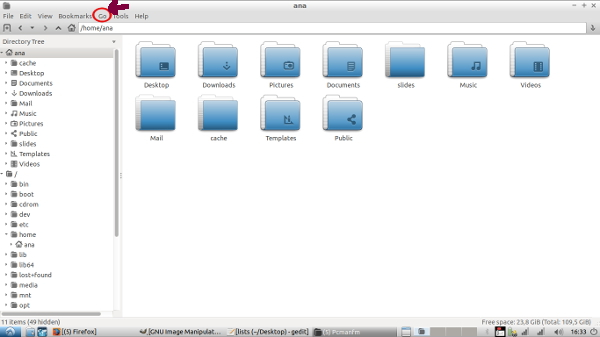
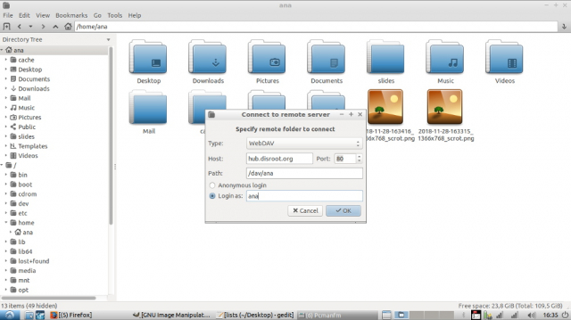
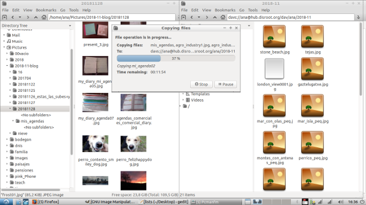
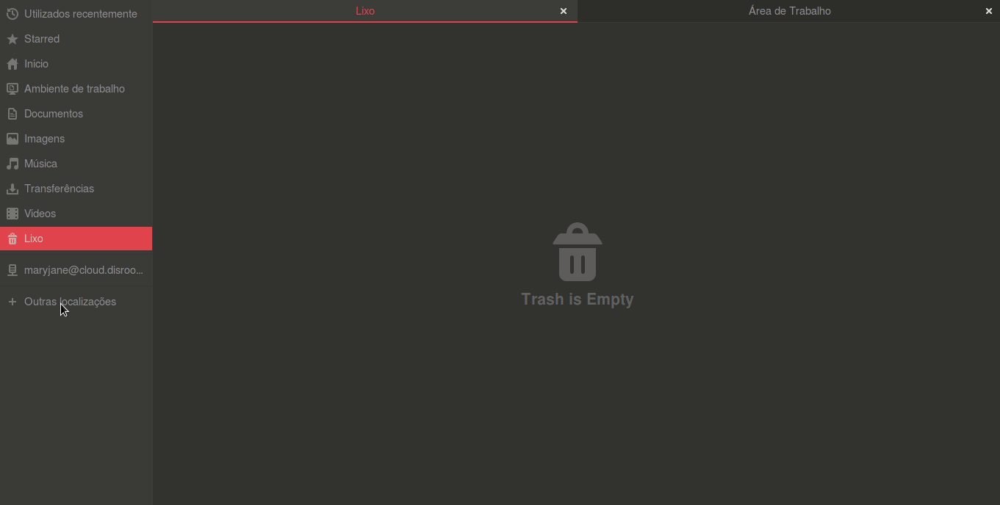
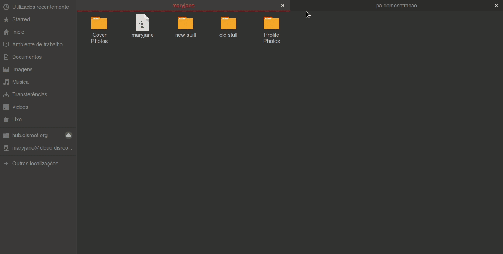

# What is it used for?
Photo album is a tool that allows to create albums of pictures that you want to share with others.

# How to see a photo album?
Click on the hamburger menu, and choose **Photos**.

Then, the default page is this one:

- On the main page, you see your most **Recent Photos**.
- On the bottom left, you can see **Photo Albums**: it is list of your albums.
- In this **Photo Albums** list, you can see that there are three folders that are automatically created:
  - **Recent Photos**
  - **2018-05**: when you add a photo in a post, it is automatically added in a folder that is created using the year and month at the time of the post.
  - **Profile photos**: when you add a photo into your profile, it is automatically added in this folder.

# How to add photos?

You have two ways of adding fotos:
 - Via Dishub's web interface
 - With a File Manager using Webdav

## Via Dishub's web interface

Click on the album you want to add photo into and click on **Add Photos**.

There are a few options:
- **Enter an album name**: it is automatically the name of the folder you're into. But you can change it and choose to create a new folder.
- **Title (optional)**: photo's name
- **Create a status post for this upload**: that means that a post will be created on your channel with this photo.
  - **Description (optional)**: it will be added into the post that goes with your photo.
- **Locker**: to set the permissions, meaning who will be able to see your photo.

Click on **Upload** to choose a photo.

## With a File Manager using Webdav
WebDAV is especially useful if you use a Gnu/Linux operating system like Ubuntu/Debian. Different File Managers might have different ways of setting up a Webdav folder

Using Lubuntu File Manager:

On the file browsing application (which in windows is called “file explorer”; different desktop environments have a different one, but it is the graphical interface you can use to browse through the files and folders in your computer) you go to “Go”, in the menu.

- **Type:** WebDAV
- **Host:** hub.disroot.org_
- **Port:** (leave as is, or 80)
- **Path:** /dav/your_user_name_on_hub
- **Login as:** your_username_on_hub

Your user name is the one you chose in hub.disroot.org , but when you are asked for the password, it is the one you chose for your email account (your_username@disroot).

If you get one, maybe two messages, saying the location has been moved and/or it has not been mounted.

It is because on the address bar, it needs to be: davs://username@etc

Once you input that “s” manually it allows to see your folders and from there you can drag more folders and pictures that will then show on the page.

Using Files (Nautilus)/Nemo/Caja File Managers

- Use the network locations option in your File Manager
- On the lower bar type the path of the webdav folder
- Fill your credentials
- Press connect

Webdav path and credentials:
- **Path:** davs://hub.disroot.org/dav/YOUR_HUBZILLA_NAME
- **Username:** Your_DisHub_login_name
- **Password:** Your_login_password

**Adding photos and Albums via File Manager**

When you open your Dishub folder in your File Manager you will see Folders with your Profile and cover photos and the folders of your photo albums.
To add a picture to and existing album just copy/paste the pictures to the album you want. To create a new album just create the folder and copy/paste the pictures there.
When you refresh your Dishub web interface, or login again you will see the new images and albuns you added.

To remove a picture just dele it, to delete an album delete the folder

# How to edit a photo?
If you click on a photo, you then have access to the **Photo tools**.

There are a few options:
- Use as a profile photo
- Use as cover photo
- Edit photo

Click on **Edit photo**.

You can change its name (**Title**), add a tag in order to find it easier, move it to another album, rotate it, etc.

It is also there that you can **Delete** it.

# How to create an album?
Aa explained above, when you add a photo, you can choose in what folder you want to save it into. But in **Enter an album name**, if you choose the name of a folder that doesn't exist, it will be created.

# How to change the default folder name for posts?

Go in your **Channel settings**. There, you can change **Default photo upload folder** to whatever you want. Don't forget to save.
