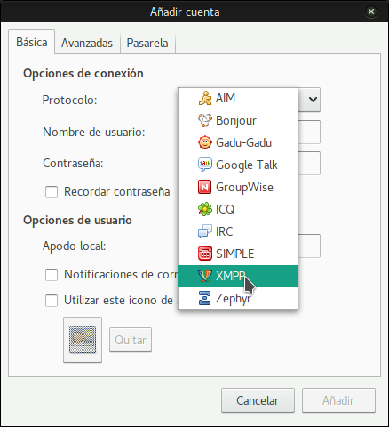
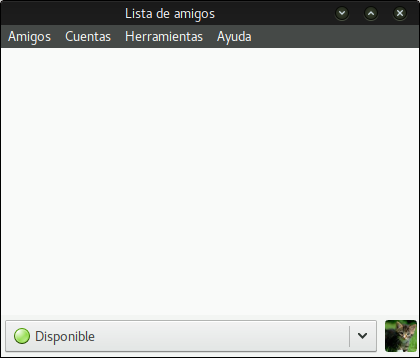

Pidgin es una aplicacion de mensajeria multiplataforma (corre en la mayoría de sistemas operativos) y multiprotocolo. Soporta muchos protocolos de mensajeria diferentes como: xmpp, skype, AIM, TOX, WhatsApp, Facebook, etc, asi que puedes tener toda tu mensajería en una sola app.

1. **Instala Pigdin.**
Si usas windows/macOS pincha en[página de Pidgin](http://pidgin.im/download/)y descarga tu versión.
Si eres usuario de GNU/Linux, comprueba tu paquete de repositorios y obtenlo (mira si hay algunos plugins adicionales mientras buscas).

2. **Inicialo.**
Serás recibido con un mensaje de bienvenida como este:

Para continuar, necesitamos **añadir una cuenta**.
Si no es la primera vez que usas Pidgin deberías usar este menú:

3. **Configura la cuenta**
Lo primero de todo, elige el protocolo xmpp de la lista desplegable:

Después completa la información necesaria:

¡Nota! Si deseas usar avatar (opcional) puedes seleccionar " Usar este icono de amigo para esta cuenta" y navega por tu sistema local de archivos (ordenador) para escoger la foto que quieras usar.

4. Dale a **Añadir** y ¡está hecho!
Ahora ya estás listo para empezar a sermonear a la gente para que abandone las apps corporativas malignas y dé el salto a la "nave" de la federación.

**Todos tus contactos se sincronizarán entre todos los clientes, por lo que puedes usar el chat de Disroot en todos los dispositivos al mismo tiempo.**
